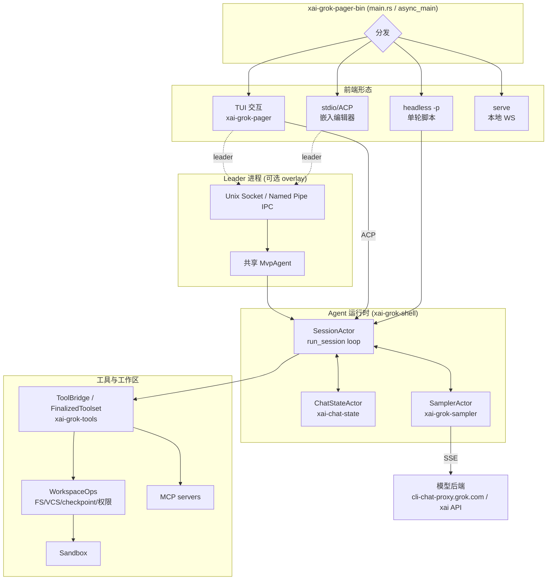

# Grok Build 项目架构分析

> 本文档基于对仓库源码的静态分析整理，覆盖项目核心功能、技术栈、整体架构与核心调用链路。
> 适用版本：见仓库根目录 `SOURCE_REV`。

## 目录

- [一、项目定位与核心功能](#一项目定位与核心功能)
- [二、技术栈](#二技术栈)
- [三、整体架构](#三整体架构)
- [四、运行模式](#四运行模式)
- [五、核心调用链路](#五核心调用链路)
  - [1. 启动分发](#1-启动分发main--运行模式)
  - [2. Agentic Loop（核心）](#2-agentic-loop一次对话-turn-的核心链路)
  - [3. 工具执行链路](#3-工具执行链路)
  - [4. 工作区、沙箱与持久化](#4-工作区沙箱与持久化)
  - [5. 上下文压缩](#5-上下文压缩compaction)
- [六、关键 crate 速查](#六关键-crate-速查)
- [七、关键文件索引](#七关键文件索引)

---

## 一、项目定位与核心功能

**Grok Build（`grok`）** 是 xAI/SpaceXAI 出品的**终端 AI 编码代理**（terminal-based AI coding agent），全 Rust 实现，从 xAI monorepo 定期同步而来（根目录 `SOURCE_REV` 记录源提交 SHA）。它本质上是一个"能理解代码库并自主动手改代码"的 agentic CLI，与 Claude Code / Codex CLI / opencode 属同类产品。

官方二进制名为 `xai-grok-pager`，正式安装包分发为 `grok`。

核心能力：

| 能力 | 说明 |
|------|------|
| 全屏 TUI 交互 | 基于 `ratatui` 的滚动区、输入框、模态框、工具审批 |
| 代码库理解与编辑 | 读文件、搜索替换、grep、LSP、codebase graph 索引 |
| Shell 命令执行 | 持久 PTY shell 会话，前台/后台/超时/流式输出 |
| Web 搜索/抓取 | 走 xAI Responses API 联网搜索、抓取 URL |
| 多媒体生成 | 图片生成/编辑、图生视频（xAI Imagine） |
| 子代理（subagent） | `task` 工具派生 explore/plan/general 等子代理并行工作 |
| 长任务管理 | 后台任务、调度器（定时/循环）、todo 列表 |
| 多种运行形态 | 交互 TUI、headless 脚本（`-p`）、stdio/ACP（嵌入编辑器）、leader 共享进程、WebSocket serve |
| 扩展生态 | MCP 服务器、Skills、Plugins、Hooks、自定义 sandbox |
| 安全沙箱 | OS 级隔离（Landlock/Seatbelt/bwrap + seccomp 子进程断网） |

---

## 二、技术栈

**语言/构建**：Rust edition 2024，Cargo workspace（约 **70+ 个 crate**），protoc via DotSlash 做 proto 代码生成，Apache-2.0 许可。

> 根 `Cargo.toml` 是自动生成的，视为只读；应编辑各 crate 自己的 `Cargo.toml`。

| 领域 | 关键依赖 |
|------|----------|
| 异步运行时 | `tokio`（full）、`futures`、`tokio-stream` |
| 终端 UI | `ratatui` / `crossterm` / `termwiz` / `vte` / `alacritty_terminal` / `portable-pty`（+ 自研 `xai-ratatui-inline`、`xai-ratatui-textarea`） |
| HTTP/网络 | `reqwest`（rustls）、`reqwest-middleware`、`eventsource-stream`（SSE）、`tokio-tungstenite`（WebSocket）、`axum`（serve）、`tonic`/`prost`（gRPC/proto） |
| LLM 接口 | `async-openai`（responses）+ 自研 sampler；三种后端协议：ChatCompletions / Responses / Messages(Anthropic 兼容) |
| 序列化/Schema | `serde`、`serde_json`、`schemars`（JSON Schema）、`ts-rs`、`jsonschema` |
| Git/VCS | `gix`、git2 混合、Jujutsu(jj) 支持 |
| 存储 | JSONL（会话历史）+ SQLite FTS（搜索索引）、`xai-sqlite-journal` |
| 可观测性 | `tracing` / `opentelemetry`(OTLP) / `fastrace` / `prometheus` / Mixpanel / crash handler |
| 沙箱 | `nono`(Landlock/Seatbelt)、`nix`(seccomp/namespaces)、bwrap |
| MCP | `rmcp`（隔离在 `xai-grok-mcp` 内）、OAuth2 |
| 文档/渲染 | `pulldown-cmark`、`syntect`（语法高亮）、vendored **Mermaid→SVG** 栈（`third_party/`：mermaid-to-svg + dagre_rust + graphlib_rust + ordered_hashmap） |
| 内存分配 | `jemalloc`（release-dist，带 profiling） |

**仓库分层**：

- `crates/codegen/xai-grok-*`：CLI 主体闭包（pager/shell/tools/workspace/config/mcp/...）
- `crates/common/xai-*`：共享叶子 crate（tool-runtime/tool-protocol/computer-hub/tracing/...）
- `prod/mc/`、`third_party/`：外部/vendored 代码

---

## 三、整体架构



前端与 agent 之间统一走 **ACP（Agent Client Protocol）** 类型化通道，区别只在传输层（进程内 / IPC socket）。

---

## 四、运行模式

`main`（`xai-grok-pager-bin/src/main.rs`）建 tokio runtime → `async_main` 按 clap 解析结果分发：

- 有子命令 `grok agent/leader/login/mcp/...` → 对应 handler
- 无子命令 + `-p/--prompt-*` → `headless::run_single_turn`（进程内单轮，**不走 leader**）
- 其余（含 `grok` / `grok "prompt"`）→ `xai_grok_pager::app::run`（TUI）

| 模式 | 触发 | 用途 | 入口函数 / 文件 |
|------|------|------|------|
| **TUI 交互**（默认） | `grok` / `grok "prompt"` / `grok dashboard` | 全屏多轮对话、工具审批、会话管理 | `xai_grok_pager::app::run` → `event_loop::run`（`xai-grok-pager/src/app/mod.rs`, `event_loop.rs`） |
| **Headless 单轮**（`-p`） | `-p`/`--single`/`--prompt-json`/`--prompt-file` | CI/脚本：单轮 prompt → stdout → 退出 | `headless::run_single_turn`（`xai-grok-pager/src/headless.rs`） |
| **Stdio / ACP** | `grok agent stdio` | IDE/desktop 经 stdin/stdout JSON-RPC 驱动 | `run_stdio_agent`（`xai-grok-shell/src/agent/app.rs`） |
| **Headless relay** | `grok agent headless` / `grok agent` | 持久 headless agent，经 grok.com WebSocket relay 接远程 prompt | `run_headless`（`agent/app.rs`） |
| **Serve** | `grok agent serve` | 本机暴露 WebSocket agent 服务（默认 `127.0.0.1:2419`） | `run_agent_server`（`agent/server.rs`） |
| **Leader 进程** | `grok agent leader`（通常自动 spawn） | 单机唯一 leader，托管共享 `MvpAgent`，服务多 client | `run_leader`（`agent/app.rs`） |
| **CLI 管理命令** | `grok login/logout/mcp/plugin/memory/sessions/...` | 认证与各类管理 | 各 `*_cmd::run`（`main.rs`） |

### Leader / Client 架构

Leader 是可选的 **overlay 层**：TUI / stdio / headless agent 可运行在 leader 之上，`-p` 和 `agent leader`/`serve` 不走 client 侧 leader 连接。

- **Leader ↔ Client**：Unix domain socket（Windows 用 Named Pipe `\\.\pipe\grok-leader-<hash>`），默认 `~/.grok/leader.sock`，可用 `GROK_LEADER_SOCKET` / `--leader-socket` 覆盖。传输本地 ACP JSON 消息。
- **Leader ↔ grok.com Relay**：WebSocket（`tokio-tungstenite`），承载远程 headless prompt。
- Leader 持有唯一 `MvpAgent`（共享会话/工具/MCP），用文件锁保证单实例；client 侧 `connect_or_spawn` 会按需自动拉起 leader 子进程（`grok agent leader --no-exit-on-disconnect --relay-on-demand`）。

相关文件：`xai-grok-shell/src/leader/{mod,server,protocol,transport}.rs`。

---

## 五、核心调用链路

### 1. 启动分发（`main` → 运行模式）

```
main (xai-grok-pager-bin/src/main.rs)
  └─ run_and_shutdown(runtime, async_main())
       └─ async_main
            ├─ 子命令 match → run_agent_command / run_leader_mgmt / 各 CLI handler
            ├─ HeadlessPrompt (-p) → headless::run_single_turn
            └─ 默认 → xai_grok_pager::app::run (TUI)
```

启动前还会拦截 **Mermaid 渲染子进程**（`GROK_MERMAID_RENDER=1` 触发，`app/mermaid_worker.rs`）。

### 2. Agentic Loop（一次对话 turn 的核心链路）

这是项目最核心的调用链，全部在 `xai-grok-shell` 的 `SessionActor` 内：

```
run_session                                   [session/acp_session_impl/run_loop.rs:33]
  └─ SessionCommand::Prompt → queue_input → maybe_start_running_task
       └─ AgentTask::new_prompt → run_task    [tasks_cancel.rs]
            └─ handle_prompt                   [turn.rs:210]
                 ├─ push_user_message → ChatStateActor
                 └─ process_conversation_turn  [turn.rs:1693]
                      loop {                    ← Agentic loop [turn.rs:1799]
                        ① check_auto_compact_needed        (超阈值先压缩上下文)
                        ② build_request                    (ChatState 组装 ConversationRequest)
                        ③ run_turn_via_sampler             [sampler_turn.rs:860]
                             └─ SamplerHandle::submit_and_collect
                                  └─ run_request_task → SamplingClient (SSE 流式) → 模型
                        ④ handle_sampling_event (并行 drainer)
                             Text/Reasoning → ACP chunk 推给 UI；ToolCallDelta → 累积
                        ⑤ 解析 response.tool_calls()
                        ⑥ 无 tool → TurnOutcome::Completed  (退出 loop)
                        ⑦ 有 tool → execute_tool_calls
                             └─ 并行 dispatch_tool → push_tool_result 回灌 ChatState
                        continue → 回到 loop 顶
                      }
```

要点：

- **模型通信一律 SSE 流式**，经 sampler 三层：HTTP client → L2 stream transform（按 `ApiBackend` 选 chat/responses/messages）→ `SamplingEvent`。
- **默认入口是 `cli-chat-proxy.grok.com/v1`**（OAuth/会话 token，自动注入 `X-XAI-Token-Auth` 等头）；BYOK/API key 模型可配置直连 xAI API。
- **循环终止条件**：模型不再返回 tool call 且通过 TodoGate / interjection 校验；或权限拒绝 / 用户取消；或达 `max_turns`；或 structured output 校验完成。
- **三种 API 后端**（`xai-grok-sampling-types` 的 `ApiBackend`）：`ChatCompletions`（默认，`POST /v1/chat/completions`）、`Responses`（`POST /v1/responses`）、`Messages`（Anthropic 兼容 `POST /v1/messages`）。
- Sampler 内置重试：empty response / rate limit / HTTP 错误重试 + doom-loop 检测重采样。

### 3. 工具执行链路

```
模型 tool_call
  → ToolBridge::call(client_name, params, call_id)
    → FinalizedToolset::call → LocalRegistry
      → Tool::execute(ctx, typed_args)   [xai-tool-runtime::Tool trait]
        → ToolStream[Progress*, Terminal]
  → push_tool_result 回灌下一轮
```

- 工具核心抽象是 `xai_tool_runtime::Tool` trait（关联类型 `Args: JsonSchema` + `Output`），配合 `ToolMetadata`（分类 `ToolKind` / 描述 / 只读性）。
- **输入输出 schema 由 Rust 类型 + `schemars` 自动生成**（JSON Schema Draft-07）；MCP 工具用 runtime `input_schema` override。
- `ToolRegistryBuilder::new()` 一次性注册 50+ 内置工具，`finalize(config, ctx)` 按 `ToolServerConfig` 过滤/重命名/参数覆盖，并注入 `SessionContext`（terminal backend、文件系统、cwd、MCP），产出 `FinalizedToolset`。

内置工具（多命名空间）：

| 命名空间 | 代表工具 |
|----------|----------|
| `GrokBuild`（主集） | `run_terminal_cmd`、`read_file`、`search_replace`、`list_dir`、`grep`、`task`（subagent）、`web_search`、`web_fetch`、`lsp`、`todo_write`、`update_goal`、`ask_user_question`、`monitor`、`image_gen`/`image_edit`/`image_to_video`、`scheduler_*`、`memory_search`/`memory_get`、`search_tool`/`use_tool`（MCP 发现与调用）、`kill_task`/`wait_tasks`/`get_task_output` 等 |
| `GrokBuildConcise` | `read_file`、`search_replace`、`run_terminal_cmd`（精简变体） |
| `GrokBuildHashline` | `hashline_read`、`hashline_edit`、`hashline_grep` |
| `Codex` | `apply_patch`、`list_dir`、`grep_files`、`read_file` |
| `OpenCode` | `bash`、`read`、`edit`、`write`、`grep`、`glob`、`todowrite`、`skill` |
| `MCP`（动态） | `server__tool` 形式，运行时注册 |

### 4. 工作区、沙箱与持久化

- **Workspace**（`xai-grok-workspace`）是宿主边界：`AsyncFileSystem` 抽象（本地/客户端/ACP FS）、Git/jj VCS、权限审批、**Checkpoint/Rewind**（按 `prompt_index` 快照 FS + hunk + git，支持回退）。工具不直接 spawn shell，而是通过注入的 `TerminalBackend` / `AsyncFileSystem` 间接访问。
- **Sandbox**（`xai-grok-sandbox`）两层隔离：
  - 进程级 `nono`（Linux Landlock / macOS Seatbelt）限制 `tokio::fs` 读写路径，`apply()` 不可逆；
  - 子进程 seccomp 断网（`child_net`），主进程网络保持开放（需连 LLM API）；
  - Linux 额外用 bwrap 建 mount namespace；
  - profile：`workspace` / `devbox` / `read-only` / `strict` / `off` + 自定义（`.grok/sandbox.toml`）。
- **持久化**：会话状态由 `xai-chat-state` actor 管理，落盘为 **JSONL**——`chat_history.jsonl`（模型对话历史）+ `updates.jsonl`（ACP/UI 更新流），存于 `~/.grok/sessions/{encoded_cwd}/{session_id}/`，另有 `summary.json`、`plan.json`、`rewind_points.jsonl` 等。**SQLite 仅用于 FTS 搜索索引**（`session_search.sqlite`），非主存储。

### 5. 上下文压缩（Compaction）

策略来自 `xai-grok-agent/src/compaction.rs` 的 `CompactionPolicy`（默认 `auto_compact_threshold_percent = 85`），执行逻辑在 `xai-grok-shell/src/session/compaction.rs`。

触发时机：

| 时机 | 函数 |
|------|------|
| 每轮采样前（token 使用率 ≥ 阈值） | `check_auto_compact_needed` |
| 工具执行后（预估溢出 context window） | `check_preflight_overflow` |
| API 报错（如 context exceeded） | `handle_sampling_failure` → `run_compact_only` |
| 模型切换后（新 window 更小） | `maybe_compact_on_model_switch` |

流程：取全量 conversation → 调压缩模型生成 summary → `chat_state` replace history；支持 two-pass 预压缩（`run_prefire_pass1`）。压缩模式有 `Summary`（默认）/ `Transcript` / `Segments`。

---

## 六、关键 crate 速查

| Crate | 职责 |
|------|------|
| `xai-grok-pager-bin` | 二进制组合根，`main`/`async_main` 分发 |
| `xai-grok-pager` | TUI（滚动区、输入、模态、渲染）、CLI 定义、ACP 连接、headless |
| `xai-grok-shell` | **agent 运行时核心**：SessionActor、turn loop、tool 编排、leader/stdio/headless/serve、compaction、session 存储 |
| `xai-grok-agent` | 静态 Agent 定义（system prompt、tool bridge、compaction policy） |
| `xai-grok-sampler` | 模型采样 actor：HTTP+SSE、三后端、重试/doom-loop 恢复 |
| `xai-chat-state` | 对话状态 actor + JSONL 持久化 + 请求组装 |
| `xai-grok-tools` / `xai-tool-runtime` | 工具实现 + `Tool` trait / 注册 / 分发 |
| `xai-tool-protocol` / `xai-tool-types` | 工具协议、描述与 subagent 类型 |
| `xai-grok-workspace` | 宿主 FS/VCS/权限/checkpoint/MCP bridge |
| `xai-grok-sandbox` | OS 级沙箱 |
| `xai-grok-mcp` | MCP 客户端（隔离 rmcp 依赖）、OAuth |
| `xai-grok-config` / `xai-grok-models` / `xai-grok-auth` | 配置、模型目录、OAuth 认证 |
| `xai-grok-mermaid` + `third_party/mermaid-to-svg` 等 | Mermaid 图渲染栈 |
| `xai-acp-lib` | Agent Client Protocol 库 |

---

## 七、关键文件索引

| 文件 | 作用 |
|------|------|
| `crates/codegen/xai-grok-pager-bin/src/main.rs` | 二进制入口、`async_main` 分发 |
| `crates/codegen/xai-grok-pager/src/app/cli.rs` | Clap CLI 定义 |
| `crates/codegen/xai-grok-pager/src/app/mod.rs` | TUI 入口 `run()`、leader 解析 |
| `crates/codegen/xai-grok-pager/src/app/event_loop.rs` | TUI 事件循环 |
| `crates/codegen/xai-grok-pager/src/headless.rs` | `grok -p` 单轮 headless |
| `crates/codegen/xai-grok-pager/src/acp/mod.rs` | ACP 连接（direct / via leader） |
| `crates/codegen/xai-grok-shell/src/agent/app.rs` | `run_stdio_agent` / `run_headless` / `run_leader` |
| `crates/codegen/xai-grok-shell/src/agent/server.rs` | `run_agent_server`（serve 模式） |
| `crates/codegen/xai-grok-shell/src/agent/relay.rs` | grok.com WebSocket relay |
| `crates/codegen/xai-grok-shell/src/agent/config.rs` | 端点/推理 URL 解析（cli-chat-proxy 默认） |
| `crates/codegen/xai-grok-shell/src/leader/{mod,server,protocol,transport}.rs` | Leader IPC 架构 |
| `crates/codegen/xai-grok-shell/src/session/acp_session_impl/run_loop.rs` | `run_session` 主循环 |
| `crates/codegen/xai-grok-shell/src/session/acp_session_impl/turn.rs` | `handle_prompt` / `process_conversation_turn`（agentic loop） |
| `crates/codegen/xai-grok-shell/src/session/acp_session_impl/sampler_turn.rs` | `run_turn_via_sampler` |
| `crates/codegen/xai-grok-shell/src/session/acp_session_impl/tool_calls.rs` | 工具执行、`handle_sampling_event` |
| `crates/codegen/xai-grok-shell/src/session/compaction.rs` | 上下文压缩 |
| `crates/codegen/xai-grok-shell/src/session/storage/jsonl/mod.rs` | JSONL 会话持久化 |
| `crates/codegen/xai-grok-sampler/src/{handle,client}.rs` + `actor/request_task.rs` | 采样 actor + HTTP/SSE |
| `crates/codegen/xai-grok-tools/src/registry/types.rs` | `ToolRegistryBuilder` 注册 |
| `crates/common/xai-tool-runtime/src/tool.rs` | `Tool` trait |
| `crates/codegen/xai-grok-workspace/src/session/checkpoint.rs` | Checkpoint/Rewind |
| `crates/codegen/xai-grok-sandbox/src/lib.rs` | 沙箱入口 |
| `crates/codegen/xai-grok-mcp/src/servers.rs` | MCP 传输与工具调用 |
