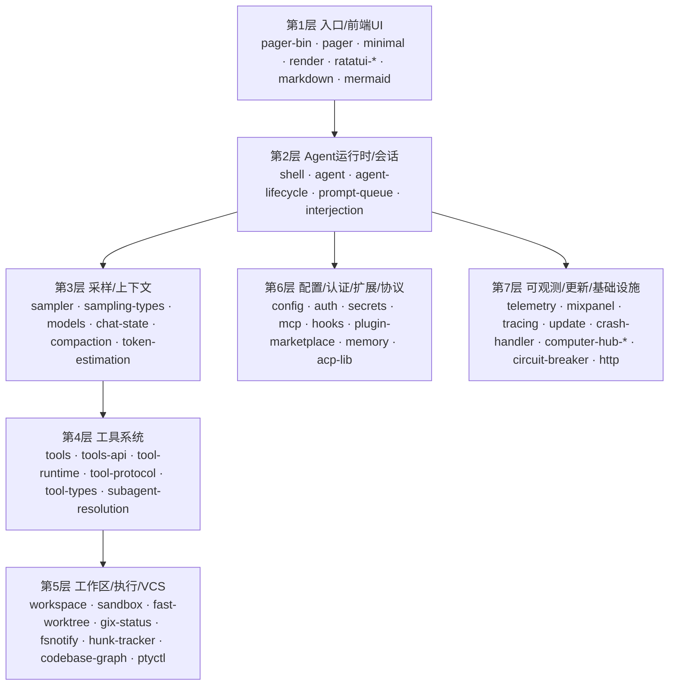

# Grok Build 工程模块详解

> 本文逐层拆解 Grok Build 的 ~70 个 crate：每个模块的**职责**、**实现功能**与**对应代码**（关键文件/类型/函数）。
> 与 `grok-build-架构分析.md`（宏观架构与调用链）配套阅读。路径除注明外相对仓库根。

## 目录

- [分层总览](#分层总览)
- [第 1 层：入口与前端 UI](#第-1-层入口与前端-ui)
- [第 2 层：Agent 运行时与会话](#第-2-层agent-运行时与会话)
- [第 3 层：模型采样与上下文](#第-3-层模型采样与上下文)
- [第 4 层：工具系统](#第-4-层工具系统)
- [第 5 层：工作区 / 执行 / VCS](#第-5-层工作区--执行--vcs)
- [第 6 层：配置 / 认证 / 扩展 / 协议](#第-6-层配置--认证--扩展--协议)
- [第 7 层：可观测性 / 更新 / 基础设施](#第-7-层可观测性--更新--基础设施)
- [第三方 vendored 栈](#第三方-vendored-栈)

---

## 分层总览

设计模式贯穿全局：**Actor 模型**（session / chat-state / hunk-tracker / codebase-graph 等各持单线程 actor + handle）、**trait seam 解耦**（auth / compaction / persistence / tool 均以 trait 隔离宿主）、**类型库拆分**（`*-types` crate 只放 serde wire 类型，避免循环依赖并加速编译）。

---

## 第 1 层：入口与前端 UI

### `xai-grok-pager-bin` — 二进制组合根
- **职责**：唯一可执行文件 `xai-grok-pager`（发行为 `grok`）；`main` 装配全局 allocator/crash handler/rustls，再按 CLI 分派到 TUI / headless / agent / leader。
- **实现功能**：模式分发、jemalloc profiling、Mermaid 渲染子进程拦截、tracing 初始化。
- **对应代码**：`crates/codegen/xai-grok-pager-bin/src/main.rs`（`main`→`async_main`；L2010 `app::run`、L1951 `headless::run_single_turn`）、`build.rs`（版本/commit 注入）。

### `xai-grok-pager` — TUI 主体
- **职责**：交互式全屏/inline TUI，管理 ACP 会话、事件循环、scrollback 渲染、输入与模态框。
- **实现功能**：事件编排 + 纯同步 dispatch 状态机 + 渲染分离；`grok -p` headless 单轮。
- **对应代码**：
  - `src/app/mod.rs` `run()`、`src/app/event_loop.rs`（`tokio::select!` 主循环）
  - `src/app/app_view.rs` `AppView`（`handle_input`/`draw`）、`src/app/dispatch/mod.rs` `Action`/`Effect`
  - `src/scrollback/`（`ScrollbackState`/`EntryRenderer`）、`src/views/prompt_widget/mod.rs`
  - `src/acp/mod.rs` + `acp/spawn.rs`（`spawn_grok_shell`）、`src/headless.rs`（`run_single_turn`）

### `xai-grok-pager-minimal` — 极简滚动模式
- **职责**：`--minimal` 回退到终端原生 scrollback（`insert_before`），底部固定 live 区。
- **对应代码**：`src/lib.rs`（`draw`/`install`）、`src/commit.rs`（块提交 frontier）、`src/live.rs`、`src/overlay.rs`。通过 `minimal_hook` 反向被 pager 调用（避免循环依赖）。

### `xai-grok-pager-render` — 呈现原语层
- **职责**：主题、终端能力探测、低层绘制、剪贴板、Kitty 图像。
- **对应代码**：`src/render/draw.rs`（`PagerTerminal`/`draw_frame`）、`src/theme/mod.rs`（`Theme`）、`src/terminal/mod.rs`（`HyperlinkCapabilities`/`KeyboardCapabilities`）、`src/appearance/mod.rs`。

### `xai-ratatui-inline` / `xai-ratatui-textarea` — ratatui 扩展
- **inline**：inline viewport，在固定底部区之上向原生 scrollback 追加内容 + OSC8 超链接。代码：`src/terminal.rs`（`Terminal<B>`/`insert_before`）、`src/scrollback.rs`、`src/resize.rs`。
- **textarea**：多行输入组件（grapheme 编辑、软换行、paste chip）。代码：`src/textarea.rs`（`TextArea`/`TextAreaState`）、`src/editor.rs`（`EditBuffer`/`EditCommand`）、`src/wrapping.rs`。

### `xai-tty-utils` — TTY 安全工具
- **职责**：子进程脱离 controlling TTY、进程组 kill、stderr 重定向防污染 TUI。
- **对应代码**：`src/lib.rs`（`detach_command`/`ProcessGroup`/`redirect_native_stderr`/`is_wsl`）、`src/process_scope.rs`（会话级子进程树 kill）。

### `xai-grok-markdown` / `xai-grok-markdown-core` — Markdown 渲染
- **markdown**：面向 TUI 的流式渲染（checkpoint 冻结稳定块、syntect 高亮、LaTeX→Unicode、表格、Mermaid ASCII 回退）。代码：`src/streaming.rs`（`StreamingMarkdownRenderer`）、`src/lib.rs`（`render_markdown_ratatui_full`）、`src/checkpoint.rs`、`src/mermaid.rs`。
- **markdown-core**：无 UI 依赖的 headless 分析（元素统计 + 结构性渲染失败检测）。代码：`src/lib.rs`（`analyze`→`MarkdownAnalysis`、`parser_options`）。

### `xai-grok-mermaid` — Mermaid→PNG
- **职责**：可插拔 `MermaidEngine`（默认纯 Rust dagre + resvg 光栅化），子进程超时隔离。
- **对应代码**：`src/engine.rs`（`MermaidEngine` trait/`render_checked`）、`src/pure.rs`（`PureRustEngine`）、`src/raster.rs`、`src/subprocess.rs`（超时 kill）、`src/mmdc.rs`（可选外部 mmdc）。pager 侧消费在 `xai-grok-pager/src/app/mermaid_worker.rs`。

---

## 第 2 层：Agent 运行时与会话

### `xai-grok-shell` — Agent 运行时核心（最大 crate）
- **职责**：agent 运行时中枢——SessionActor、turn 循环、工具编排、leader/stdio/headless/serve 入口、会话存储、认证管理、compaction 触发。
- **实现功能**：
  - **运行模式**：`src/agent/app.rs`（`run_stdio_agent`/`run_headless`/`run_leader`）、`src/agent/server.rs`（`run_agent_server`）、`src/agent/relay.rs`（grok.com WebSocket relay）
  - **Agentic loop**：`src/session/acp_session_impl/run_loop.rs`（`run_session`）、`turn.rs`（`handle_prompt`/`process_conversation_turn`，L1799 工具循环）、`sampler_turn.rs`（`run_turn_via_sampler`）、`tool_calls.rs`（工具执行 + `handle_sampling_event`）
  - **Leader IPC**：`src/leader/{mod,server,protocol,transport}.rs`（Unix socket / Windows Named Pipe，`connect_or_spawn`）
  - **会话存储**：`src/session/storage/jsonl/mod.rs`（`chat_history.jsonl`/`updates.jsonl`）、`storage/search_fts.rs`（SQLite FTS 索引）
  - **认证**：`src/auth`（`AuthManager`、`grok login`/logout、`auth.json`）
  - **配置解析**：`src/util/config/`（`load_effective_config`、系统提示/工具集/权限/compaction 解析）
  - **compaction 触发**：`src/session/compaction.rs`（`check_auto_compact_needed`/`run_compact_inner`）
- **对应代码**：`crates/codegen/xai-grok-shell/src/**`（约 400 个源文件）。

### `xai-grok-shell-base` / `xai-grok-shell-session-support` — shell 支撑库
- **base**：共享基础（环境/gateway、CPU profiling、grok home）。代码：`src/env.rs`（`GrokBuildEnvironment`/`parse_gateway_url`）、`src/cpu_profile.rs`、`src/util/grok_home.rs`。为并行编译从 shell 拆出。
- **session-support**：Managed MCP OAuth 凭据解析、gateway tool catalog 缓存与 proactive refresh。代码：`src/managed_mcp.rs`（`ManagedMcpCache`/`fetch_managed_configs`/`spawn_cache_refresh_task`）。

### `xai-grok-agent` — 静态 Agent 定义
- **职责**：Agent 定义（system prompt、tool bridge、compaction policy、hosted tools）。
- **对应代码**：`src/agent.rs`（`Agent`/`hosted_tools`）、`src/builder.rs`（`AgentBuilder::build`）、`src/compaction.rs`（`CompactionPolicy`，默认阈值 85%）。

### `xai-agent-lifecycle` — 生命周期扩展点
- **职责**：宿主无关的 turn/session 起止、turn 输入片段、slash 命令扩展点；分 send（异步）与 local（同步）两套 registry。
- **对应代码**：`src/send/registry.rs`（`ExtensionRegistryBuilder`）、`src/send/contributors/turn_lifecycle.rs`（`on_turn_start`/`on_turn_done`/`on_turn_abort`）、`command.rs`（`CommandContributor`）。

### `xai-prompt-queue` — Prompt 队列类型
- **职责**：shell/pager 共享的 prompt 队列 wire 类型（`x.ai/queue/changed` 通知）。
- **对应代码**：`src/types.rs`（`QueueEntryMeta`/`QueueEntryWire`/`QueueChanged`）。

### `xai-interjection-core` — 轮次插话
- **职责**：轮次中途「插话」缓冲，格式化为 synthetic user message。
- **对应代码**：`src/buffer.rs`（`InterjectionBuffer`/`drain_formatted`）、`src/format.rs`（`format_interjection`/`user_query`）。

---

## 第 3 层：模型采样与上下文

### `xai-grok-sampler` — 采样 Actor
- **职责**：模型采样中枢：HTTP+SSE 流式、三后端转换、重试与 doom-loop 恢复。
- **对应代码**：`src/handle.rs`（`SamplerHandle::submit_and_collect`）、`src/actor/mod.rs`（`SamplerActor::spawn`）、`src/actor/request_task.rs`（`run_request_task`/`run_one_attempt`）、`src/client.rs`（`chat_completion_stream`，SSE）、`src/events.rs`（`SamplingEvent`）。

### `xai-grok-sampling-types` — 采样类型
- **职责**：`ConversationRequest`/`ConversationResponse`/`ApiBackend`/`SamplerConfig` 等 wire 类型。
- **对应代码**：`src/types.rs`（`ApiBackend::{ChatCompletions,Responses,Messages}`，L1013）。

### `xai-grok-models` — 模型目录
- **职责**：内置模型定义（编译期嵌入 `default_models.json`）、默认模型 ID、能力/上下文窗口。
- **对应代码**：`src/lib.rs`（默认模型 ID 解析，L46–70）。

### `xai-chat-state` — 对话状态 Actor
- **职责**：管理 conversation、token 用量、持久化、构建 `ConversationRequest`、压缩模式。
- **对应代码**：`src/actor/mod.rs`（`ChatStateActor::spawn`）、`src/handle.rs`（`push_user_message`/`build_conversation_request`/`replace_conversation`）、`src/actor/request_builder.rs`（图像压缩 + tool pruning + memory 注入）、`src/persistence.rs`（`ChatPersistence` trait）、`src/compaction_mode.rs`（`Summary`/`Transcript`/`Segments`）。

### `xai-grok-compaction` — 压缩引擎
- **职责**：传输无关的上下文压缩：grok-build 全量替换、Grok chat 轮内/轮间压缩，trait seam 解耦宿主。
- **对应代码**：`src/code_compaction/compact.rs`（`apply_full_replace_compaction`）、`src/intra_compaction/compact.rs`、`src/inter_compaction/compact.rs`、`src/item.rs`+`sampler.rs`+`select.rs`（trait seam）。

### `xai-token-estimation` — Token 估算
- **职责**：全局统一 token 估算（bytes/4 启发式、用量百分比、auto-compact 阈值判定）。
- **对应代码**：`src/lib.rs`（`estimate_tokens`/`usage_percentage`/`exceeds_threshold`，`BYTES_PER_TOKEN=4`、`IMAGE_TOKEN_ESTIMATE=765`）。

---

## 第 4 层：工具系统

### `xai-tool-runtime` / `xai-tool-protocol` / `xai-tool-types` — 工具抽象
- **runtime**：核心 `Tool` trait（关联类型 `Args:JsonSchema`+`Output`）、流式执行、`ToolDispatch`。代码：`src/tool.rs`（`Tool`/`ToolDyn`）、`src/dispatch.rs`。
- **protocol**：Computer Hub JSON-RPC 协议、注册 payload、`ToolId`、capabilities。代码：`src/methods.rs`（`tools.list`/`tool.call`）。
- **types**：`ToolDescription`、参数 schema 工具、subagent 输入输出类型。代码：`src/task.rs`（内置 subagent 类型）。

### `xai-grok-tools` — 工具实现（50+ 内置工具）
- **职责**：全部内置工具实现 + `ToolRegistryBuilder` 注册 + `FinalizedToolset` 运行时管理。
- **实现功能**：多命名空间工具集（`GrokBuild`/`GrokBuildConcise`/`GrokBuildHashline`/`Codex`/`OpenCode`）+ MCP 动态注册。
- **对应代码**：
  - `src/registry/types.rs`（`ToolRegistryBuilder::new`/`finalize`、`generate_schema`）
  - `src/implementations/grok_build/`（`bash`/`read_file`/`search_replace`/`grep`/`task`/`web_search`/`web_fetch`/`lsp`/`todo`/`scheduler`/`image_gen`/`video_gen`/`monitor` 等）
  - `src/implementations/{codex,opencode,grok_build_concise,grok_build_hashline}/`
  - `src/implementations/{search_tool,use_tool}/`（MCP 发现/调用）、`src/implementations/memory/`
  - `src/types/tool_metadata.rs`（`ToolMetadata` trait/`ToolKind`）

### `xai-grok-tools-api` — 工具 gRPC/常量 API
- **职责**：gRPC proto（`GrokToolsService`）、slash 命令常量、`default_client_name()`。
- **对应代码**：`grok-tools.proto`、`src/lib.rs`（`default_client_name`，L98–109）。

### `xai-grok-subagent-resolution` — Subagent 解析
- **职责**：spawn 前纯解析——persona/role/model/capability/isolation 优先级合并 + resume 身份校验。
- **对应代码**：`src/overrides.rs`（`resolve_effective_overrides`：显式>role>persona>parent）、`src/config.rs`（`SubagentRole`/`SubagentPersona`/`PersonaIOField`）、`src/resume.rs`（`validate_resume_identity`）。

---

## 第 5 层：工作区 / 执行 / VCS

### `xai-grok-workspace` — 宿主边界
- **职责**：宿主 FS/VCS/权限/checkpoint/命令执行/MCP bridge，local 与 proxy 双模式。
- **对应代码**：
  - `src/workspace_ops.rs`（`WorkspaceOps`/`call_tool`/`bind_local_session`）
  - `src/file_system/`（`AsyncFileSystem`/`local_fs`/`content`/`index`）
  - `src/session/git.rs` + `jj.rs`（VCS）、`src/worktree/`（隔离 worktree）
  - `src/session/checkpoint.rs`（`RewindCheckpoint`：FS+hunk+git 快照）、`checkpoint_store.rs`
  - `src/permission/`（shell/MCP/文件审批、auto-mode 分类器）、`src/mcp.rs`（`QualifiedMcpToolHandler`）

### `xai-grok-workspace-client` / `xai-grok-workspace-types` — 远程 workspace
- **client**：经 hub 的 `workspace_rpc` 类型化客户端。代码：`src/lib.rs`（`WorkspaceClient`/`WorkspaceClientError`）。
- **types**：纯 wire 类型（RPC/请求/事件/领域 struct）。代码：`src/rpc/mod.rs`（`WorkspaceRpc` trait/`WORKSPACE_RPC_TOOL_ID`）、`src/rpc/{git,fs,worktree,hunks}.rs`、`src/events/workspace.rs`（`WorkspaceEvent`）。

### `xai-grok-sandbox` — OS 级沙箱
- **职责**：进程级 `nono`（Landlock/Seatbelt）限制 FS + 子进程 seccomp 断网 + Linux bwrap namespace。
- **对应代码**：`src/lib.rs`（`SandboxManager::apply`/deny glob 展开）、`src/profiles.rs`（`workspace`/`devbox`/`read-only`/`strict`/`off`）、`src/child_net`（seccomp 网络过滤）、`should_auto_allow_bash`。

### `xai-fast-worktree` — 高性能 worktree
- **职责**：CoW 并行拷贝、BTRFS/overlay 快照、worktree 池同步。
- **对应代码**：`src/api.rs`（`WorktreeBuilder`/`WorkingTreeMode`/`BtrfsDelegate`）、`src/copy/{engine,cow}.rs`、`src/git/worktree.rs`、`src/sync.rs`。

### `xai-gix-status` — git 状态线程预算
- **职责**：为 gix status 计算安全线程数，避免 `RLIMIT_NPROC` 下 panic→abort。
- **对应代码**：`src/lib.rs`（`compute_gix_status_thread_limit`/`with_budgeted_thread_limit`，`GROK_GIX_STATUS_THREADS` 覆盖）。

### `xai-fsnotify` — 文件监听
- **职责**：单根 OS 文件监听 → 语义化 `FsEvent` 广播；进程级 watcher 复用。
- **对应代码**：`src/source.rs`（`FsEventSource`/`shared`）、`src/event.rs`（`FsEvent`：FilesChanged/GitMetaChanged/GitOperation*）、`src/state.rs`（git lock 状态机）。

### `xai-hunk-tracker` — 变更 hunk 追踪
- **职责**：Actor 追踪 diff hunk，区分 Agent/External 来源，支持 accept/reject/stage。
- **对应代码**：`src/actor/mod.rs`（`HunkTrackerActor::spawn`）、`src/handle.rs`（`record_agent_write`/`hunk_action`/`get_all_hunks`）、`src/types.rs`（`HunkId`/`Hunk`/`HunkAction`）、`src/diff.rs`。

### `xai-codebase-graph` — 代码库索引
- **职责**：tree-sitter scope graph 索引，goto-def/ref、全量/增量重建、mmap 缓存。
- **对应代码**：`src/index_manager.rs`（`IndexManager::spawn`/`FileEvent`）、`src/manager/{builder,cache}.rs`、`src/scope_graph/graph.rs`、`src/languages/mod.rs`、`src/navigation.rs`（`Navigator::goto_definition`）。

### `ptyctl` / `ptyctl-cli` — PTY 控制
- **ptyctl**：无头 PTY 控制器（spawn/发键/读屏/等待条件），HTTP/WebSocket 暴露。代码：`src/session.rs`（`PtySession::start`/`WaitCondition`）、`src/server.rs`（Axum `/send`/`/screen`/`/wait`）。
- **ptyctl-cli**：命令行封装。代码：`src/main.rs`（`Run`/`Send`/`Screen`/`Wait`/`Stop`/`List`）。

### `xai-file-utils` — 数据采集/上传
- **职责**：会话级 turn 事件追踪、上传队列、经 cli-chat-proxy 的 GCS/S3 存储客户端 + 熔断。
- **对应代码**：`src/events/tracker.rs`（`EventTracker`）、`src/storage_client.rs`（`StorageClient`）、`src/queue.rs`、`src/lib.rs`（`sha256_hex`）。

---

## 第 6 层：配置 / 认证 / 扩展 / 协议

### `xai-grok-config` / `xai-grok-config-types` — 配置
- **config**：多层 TOML（managed/user/requirements/MDM）加载、合并、校验、路径解析。代码：`src/loader.rs`（`deep_merge_toml`/`expand_env_vars_in_toml`）、`src/paths.rs`（`grok_home`）、`src/validation.rs`（`validate_requirements`）、`src/signed_policy.rs`（Ed25519 签名校验）。
  - **优先级**（低→高）：`/etc/grok/managed_config.toml` < `$GROK_HOME/managed_config.toml` < `config.toml` < `requirements.toml` < `/etc/grok/requirements.toml` < macOS MDM。
- **config-types**：共享 serde 类型（避免循环依赖）。代码：`src/lib.rs`（`RemoteSettings`：CCP `/v1/settings` 远程开关）、`src/mcp.rs`、`src/permission.rs`、`src/flags.rs`（`BoolFlag::resolve` 优先级链）。

### `xai-grok-auth` — 认证 seam
- **职责**：出站 HTTP 认证的**依赖倒置 trait seam**（非完整 OAuth；实现在 shell `AuthManager`）。
- **对应代码**：`src/auth_provider.rs`（`AuthCredentialProvider`/`CredentialSnapshot`）、`src/retry_middleware.rs`（401 自动 refresh）、`src/visibility.rs`（`HttpAuth::apply`）。

### `xai-grok-secrets` — 脱敏
- **职责**：日志/遥测中的密钥脱敏（regex + URL query）。
- **对应代码**：`src/sanitizer.rs`（`redact_secrets`/`redact_url`/`redact_json_string_values`；内置 API key/AWS/GitHub/JWT/PEM/Bearer 模式）。

### `xai-grok-mcp` — MCP 客户端
- **职责**：隔离 `rmcp`；MCP server 生命周期、OAuth、`$GROK_HOME/mcp_credentials.json`。
- **对应代码**：`src/servers.rs`（`McpState`/transport/tool 调用，`server__tool` 命名）、`src/credentials.rs`（`McpCredentialStore`）、`src/oauth.rs`（`authenticate_mcp_server_dedup`）、`src/mcp_http_client.rs`（SSE 重连退避）。

### `xai-grok-hooks` / `xai-hooks-plugins-types` — Hooks
- **hooks**：从 `~/.grok/hooks/` 与项目 `.grok/hooks/` 发现 JSON，按事件 dispatch（command/http）。代码：`src/discovery.rs`（`load_hooks`）、`src/dispatcher.rs`（`dispatch_pre_tool_use` 唯一可 deny）、`src/event.rs`（`HookEventName`）、`src/trust.rs`。
- **hooks-plugins-types**：hooks/plugins/mcp/marketplace 的 ACP 扩展 wire DTO。代码：`src/lib.rs`（`HookInfo`/`PluginInfo`/`MarketplaceListResponse`/`ActionOutcome`）。

### `xai-grok-plugin-marketplace` — 插件市场
- **职责**：解析 `[[marketplace.sources]]`、git clone 缓存、扫描 catalog、安装/更新/信任。
- **对应代码**：`src/config.rs`（`load_sources`/`load_require_sha`）、`src/git.rs`（`sync_source_cache`）、`src/installer.rs`（`install_from_marketplace`）、`src/index.rs`（`plugin-index.json`）。

### `xai-grok-memory` — 跨会话记忆
- **职责**：Markdown 记忆存储 + SQLite FTS+向量索引 + hybrid search + dream consolidation。
- **对应代码**：`src/storage.rs`（`MemoryStorage`/`MemoryScope`）、`src/index.rs`（sqlite-vec）、`src/search.rs`（`hybrid_search`）、`src/dream.rs`（`check_dream_gates`）、`src/backend.rs`（实现 tools 的 `MemoryBackend`）。
  - 布局：`~/.grok/memory/MEMORY.md`、`{workspace_hash}/MEMORY.md`、`.../sessions/*.md`。

### `xai-acp-lib` — ACP 底层库
- **职责**：Agent Client Protocol typed message/channel/gateway/stdin reader。
- **对应代码**：`src/message.rs`（`AcpClientMessage`/`AcpAgentMessage`/`AcpMethod`）、`src/channel.rs`（`acp_channels`/`acp_send`）、`src/gateway.rs`、`src/stdin_reader.rs`。

### 路径/环境/HTTP/共享辅助
- **xai-grok-paths**：UTF-8 路径新类型（`AbsPathBuf`/`RelPathBuf`/`normalize_lexically`）——与 grok home 无关。
- **xai-grok-env**：编译期后端 endpoint preset（`GrokBuildEndpoints`：cli-chat-proxy/relay/gateway URL）。
- **xai-grok-http**：进程级 reqwest 客户端池（`shared_client`/`with_auth_retry`/`send_with_retry_escaping_pool`）。
- **xai-grok-shared**：shell/pager 共用轻量工具（`session::Info`/`UiConfig`/clipboard/stderr）。

---

## 第 7 层：可观测性 / 更新 / 基础设施

### `xai-grok-telemetry` — 遥测引擎
- **职责**：统一产品事件、Mixpanel、Sentry、OTEL、结构化日志（debug/sampling/hooks firehose）。
- **对应代码**：`src/client.rs`（`TelemetryClient`/`track`）、`src/events.rs`（100+ 事件 struct）、`src/otel_layer/mod.rs`、`src/external/mod.rs`、`src/debug_log.rs`（`install_firehose`）、`src/sampling_log.rs`、`src/hooks_log.rs`。

### `xai-mixpanel` / `xai-tracing` / `xai-tracing-macros`
- **mixpanel**：轻量 Mixpanel HTTP 客户端（`Mixpanel::track`/`engage`，先 scrub 再注入 token）。
- **tracing**：项目级 tracing（`TracedHttpClient`、gRPC span、fastrace OTLP、`dispatcher_active`）。
- **tracing-macros**：过程宏（`tprintln!`/`teprintln!` 时间戳日志、`timed!` 耗时测量）。

### `xai-grok-update` / `xai-grok-version` / `xai-grok-announcements`
- **update**：自动更新（版本检查、npm/gh-release/GCS 多源、后台/阻塞更新、重启）。代码：`src/auto_update.rs`（`check_update_status`/`run_update`/`restart_grok`）、`src/minimum_version.rs`（`enforce_minimum_version_or_exit`）。
- **version**：版本常量（`GROK_VERSION` env 优先）。
- **announcements**：公告类型/持久化/过滤（`~/.grok/announcements.json`）。

### `xai-crash-handler` / `xai-system-power` / `xai-grok-voice`
- **crash-handler**：跨平台崩溃捕获、符号化、上次崩溃检测。代码：`src/lib.rs`（`install`/`check_previous_crash`）、`src/handler.rs`、`src/symbolicate.rs`。
- **system-power**：跨平台休眠/唤醒通知（避免 sleep 中丢 token refresh）。代码：`src/{macos,windows,linux}.rs`。
- **voice**：CLI 语音输入（麦克风→xAI 流式 STT→`VoiceEvent`）。代码：`src/pipeline.rs`（`run_voice_pipeline`）、`src/stt/`、`src/audio/capture.rs`（cpal）。

### Computer Hub（工具运行时底座）
- **xai-computer-hub-core**：Transport 授权/调用、ToolRegistry、CompoundResolver（local 优先 shadow remote）。代码：`src/transport.rs`（`Transport` trait）、`src/resolver.rs`（`CompoundResolver`）、`src/{local,remote}.rs`。
- **xai-computer-hub-sdk**：Tool Server 与 Harness 双端 SDK（WebSocket 连接池、帧 demux、会话 refcount、重连 replay）。代码：`src/server.rs`（`ToolServer`）、`src/harness.rs`（`ToolHarness`/`LocalRegistry`）、`src/pool.rs`、`src/connection.rs`。
- **xai-computer-hub-mcp-adapter**：MCP server → Computer Hub 桥接。代码：`src/bridge.rs`（`McpBridge::connect`）、`src/transport.rs`（`McpTransport` trait）。

### 其它基础设施
- **xai-circuit-breaker**：HTTP 熔断器（滑动窗口 + Closed/Open/HalfOpen）。代码：`src/breaker.rs`（`CircuitBreaker`）、`src/config.rs`、`src/registry.rs`。
- **xai-sqlite-journal**：按文件系统类型选 SQLite journal mode（本地 WAL / 网络 TRUNCATE），避免 NFS SIGBUS。代码：`src/lib.rs`（`for_db_path`/`is_network_fs`/`open`）。
- **xai-proto-build**：统一 protobuf 代码生成（tonic + 可选 pbjson）。代码：`src/lib.rs`（`XaiProtoBuilder`）、`src/find_protoc.rs`。
- **cli-chat-proxy-types**（`prod/mc/`）：cli-chat-proxy sandbox/session/feedback/storage 的 wire 类型。代码：`src/{sandbox,session,feedback,deployment_config,storage}_types.rs`。
- **xai-grok-test-support** / **xai-test-utils**：测试脚手架（mock、fixture、LSP runtime 等）。

---

## 第三方 vendored 栈

`third_party/` 下为 Mermaid 图渲染的纯 Rust 移植栈（见 `third_party/NOTICE`）：

| Crate | 职责 |
|-------|------|
| `mermaid-to-svg` | Mermaid 语法解析 + 各图种（flow/sequence/class/state/er/gantt/pie/…）→ SVG |
| `dagre_rust` | dagre 有向图自动布局（rank/order/position） |
| `graphlib_rust` | 图数据结构与算法（dfs/postorder/preorder） |
| `ordered_hashmap` | 保序 hashmap |

被 `xai-grok-mermaid` 的 `PureRustEngine` 使用，实现无外部依赖的 Mermaid→PNG。

---

## 附：跨 crate 典型数据流

1. **输入→回复**：pager `AppView` →（ACP）shell `SessionActor.run_session` → `process_conversation_turn` 循环 → `chat-state.build_request` → `sampler` SSE 调模型 → `SamplingEvent` 回流渲染 → `tool_calls` 执行 → `push_tool_result` → 下一轮。
2. **文件变更**：`fsnotify.FsEvent` → workspace 转 `WorkspaceEvent` → `hunk-tracker`/`codebase-graph` 增量更新 → pager diff 视图。
3. **上下文压缩**：`token-estimation` 判阈值 → shell `compaction.check_auto_compact_needed` → `grok-compaction` 生成 summary → `chat-state.replace_conversation`。
4. **工具调用**：模型 tool_call → `tool-runtime.Tool::execute` →（本地）workspace `TerminalBackend`/`AsyncFileSystem` 或（远程）`computer-hub` harness/server →（MCP）`mcp-adapter` 桥接。
