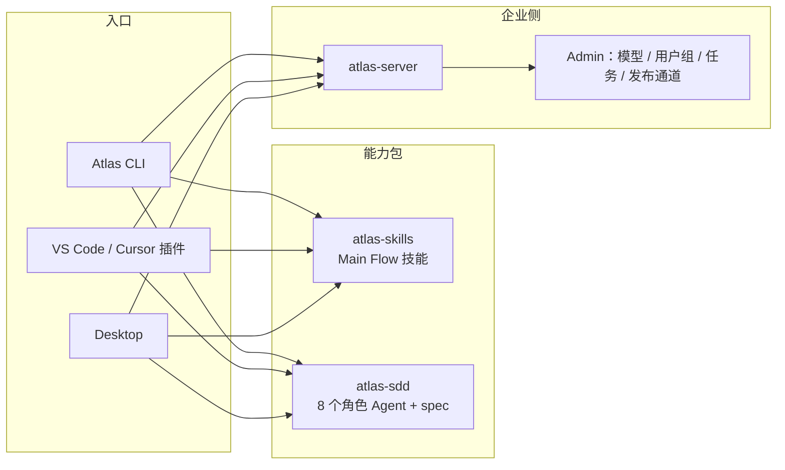
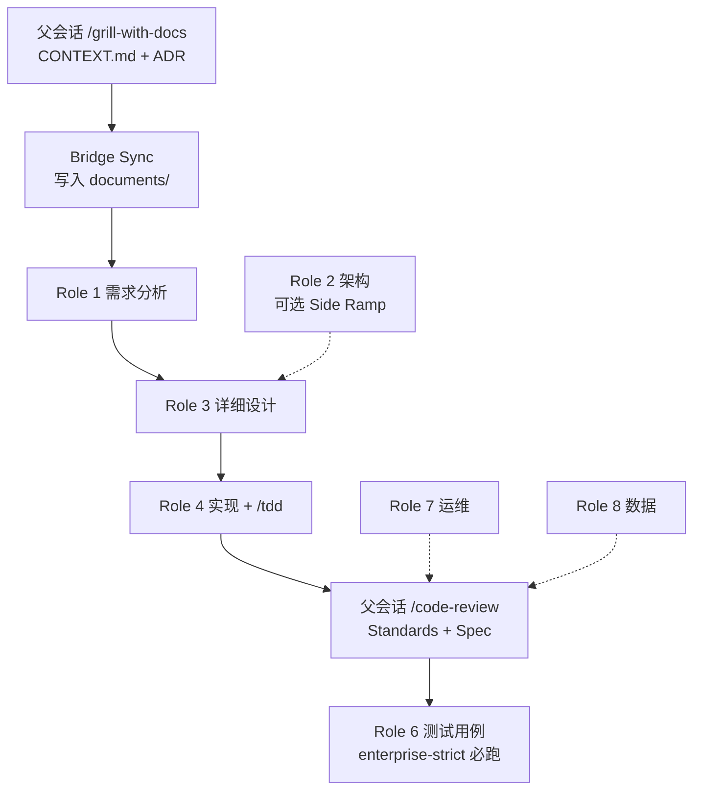
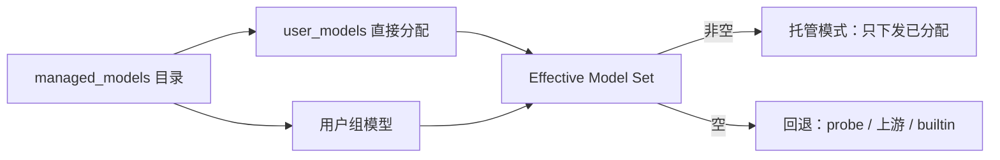
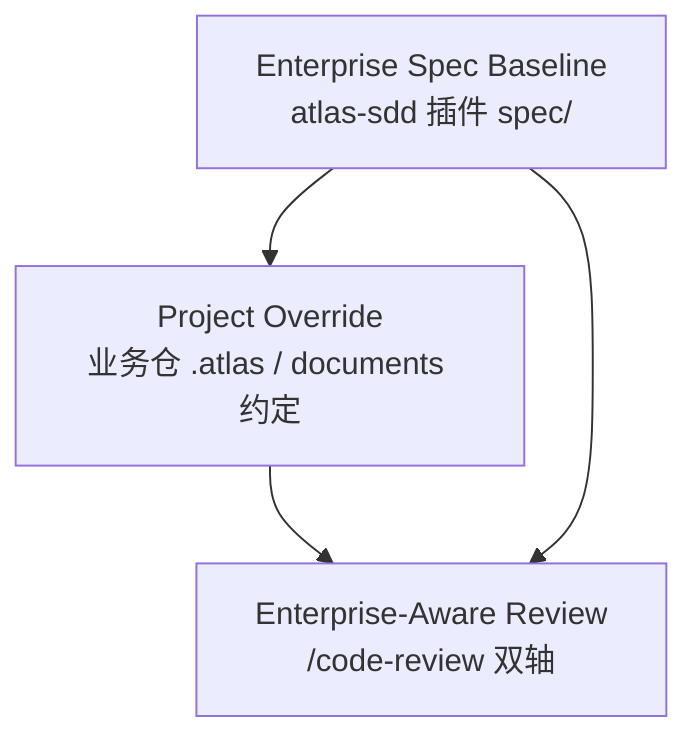

# Atlas 企业级系统开发 · PPT 素材

> 用途：面向管理层 / 研发效能 / 质量保障的宣讲稿。每节对应 1～3 张幻灯片。  
> 口径：基于现网 **Atlas CLI、VS Code/Cursor 插件、Desktop、atlas-sdd / atlas-skills 插件、atlas-server** 的真实能力，不虚构未上线产品。  
> 更新日期：2026-08-18（含云端模型控制、CLI/Desktop/插件自动更新）

---

## 0. 建议目录（约 28 页）

| 页 | 标题 | 目的 |
|----|------|------|
| 1 | 封面 | 定位一句话 |
| 2 | 企业要解决什么 | 痛点 |
| 3 | 产品矩阵 | CLI / 插件 / Desktop / Server |
| 4 | 一条主干，不跑双流程 | 架构原则 |
| 5–8 | 开发流程 | Grill → 文档契约 → 实现 → 评审 |
| 9–11 | 云端模型控制 | 目录、按人/组下发、加密落盘 |
| 12–13 | 自动更新 | CLI / Desktop / 插件 marketplace |
| 14–16 | 规范体系 | 企业基线 / 项目覆盖 / 合规模式 |
| 17–19 | 数据收集 | 通道、字段、落点 |
| 20–22 | 数据度量 | 组织 / 个人 / 质量看板 |
| 23–25 | 人员技能评定 | 用现有数据做能力画像 |
| 26 | 落地路径 | 安装 → 模型 → 更新 → 门闩 → 看数 |
| 27–28 | 附录：术语与演示 | 备用页 |

---

## 1. 封面

**标题：** 企业级系统开发：流程、规范、模型治理、持续更新与人员能力  
**副标题：** Atlas 运行时 + SDD 角色插件 + 云端模型控制 + 企业侧数据闭环  
**一句话：** 把「怎么做」写进插件，把「用什么模型」收进云端，把「做了什么」变成可复盘的指标。

演讲备注：强调五件事同时成立——统一入口、统一规范、统一模型、统一版本、统一数据。

---

## 2. 企业要解决什么

**页标题：** AI 编码进企业，缺的不是模型，是工程治理

| 痛点 | 没有 Atlas 时 | 有 Atlas 后 |
|------|---------------|-------------|
| 流程各写各的 | 有人直接写代码、有人跳过设计 | 主干流程 + 企业角色链，名词映射阶段而非捷径 |
| 规范在 Wiki 里睡觉 | Review 凭感觉 | 插件 `spec/` 是企业基线，评审双轴对照 |
| 产出不可追溯 | 聊天记录即文档 | `documents/` 契约 + `CONTEXT.md` / ADR |
| 用了多少、谁在用、用得好不好 | 只能看 Token 账单 | Task Report / Session Signals / Admin 看板 |
| Key 和模型满天飞 | 每人自配 API Key、路由名对不上 | 云端托管目录、按人/组下发、Key 不落明文 |
| 客户端和技能各升各的 | 有人旧 CLI、有人旧 SDD | 企业通道自动更新 CLI/Desktop；会话启动自动更新插件 |
| 人员能力靠印象 | 年终拍脑袋 | 用角色覆盖、成功率、评审轴、产物类型做画像 |

金句：**模型提供智力，运行时提供纪律，云端管模型和版本，服务端留下证据。**

---

## 3. 产品矩阵

**页标题：** 一套运行时，三种入口，两类插件，一个大脑



| 组件 | 用户看到的名字 | 作用 |
|------|----------------|------|
| CLI | `atlas` / `atlas.exe` | 对话、工具、插件、自动更新；工程真相源 |
| 编辑器扩展 | Atlas for VS Code | 侧边栏聊天；ACP 拉起同一套 CLI |
| Desktop | Electron 桌面端 | 同一套 UI 与配置，独立窗口 |
| atlas-skills | `/ask-atlas` 等 | 想法 → 实现的主干技能 |
| atlas-sdd | 8 个 Role Executor | 需求 / 设计 / 实现 / 测试 / 运维 / 数据 |
| atlas-server | `/atlas` | 登录、托管模型、用户组、遥测、CLI/Desktop 发布通道 |

演讲备注：插件和 Desktop **不能离开 CLI**。企业分发时先装 CLI，再装 VSIX，再装两个 marketplace 插件。模型与版本都从同一台 atlas-server 出。

---

## 4. 一条主干，不跑双流程

**页标题：** Light Coupling：技能包与 SDD 角色分开，路由器只有一个

- **Main Flow（ask-atlas）**：拷问 →（可选 to-spec / to-tickets）→ 实现（TDD）→ 双轴 code-review
- **Role Executor（atlas-sdd）**：按阶段执行企业规范，**不是**第二套主干
- **Documents Contract**：正式交接只认业务仓 `documents/…`
- **Role-Scoped Skill Invocation**：角色可以 *调用* `/tdd` 等技能，但 **禁止把技能正文抄进 Agent**
- **Side Ramp**：架构 / 运维 / 数据仅用户点名才上，不默认插入每条需求

避免写进 PPT 的反模式：

- SDD 当总路由器
- 技能与 Agent 合成一个超级插件
- 「需求文档」当成跳过拷问的捷径

---

## 5. 开发流程（总览）

**页标题：** 从想法到可审计交付：默认链 1 → 3 → 4 → 关闭



**用户口令 → 阶段（不是捷径）：**

| 用户说 | 实际阶段 |
|--------|----------|
| 需求文档 | Role 1 |
| 设计文档 / 详细设计 | Role 3 |
| 实现代码 | Role 4，然后父会话评审 |
| 架构 / 架构设计 | 仅此时才 Role 2 |

演讲备注：架构不强制。多数需求已有系统骨架，每条需求再出一份架构会拖慢门闩。

---

## 6. 开发流程（三种工作包）

**页标题：** 按工作包选路径，而不是永远走满角色链

| 工作包 | 路径 | 何时用 |
|--------|------|--------|
| 修缺陷 | `/ask-atlas` → `/diagnosing-bugs` 或 `/tdd` → `/code-review` | 不跑需求/架构角色 |
| 小功能（一会话说清） | 必要时拷问 → `/implement` 或 `/tdd` → 评审 | Compliance Mode = standard |
| 企业需求/设计再实现 | 拷问 → 1 → 3 → 4 → 评审（strict 再加 6） | 新系统、合规项目、要审计文档 |

**合规模式（按仓库配置，不是全局一刀切）：**

- **standard**：已有等价详细设计时可直接实现；拷问与 to-spec 可留在 Main Flow
- **enterprise-strict**：拷问之后强制 **1 → 3 → 4 → 6**；Role 2 仍然可选

---

## 7. 开发流程（角色与技能对照）

**页标题：** 8 个企业角色，各自调用对应工程技能

| 角色 | 产出（Documents Contract） | 优先技能 |
|------|----------------------------|----------|
| 1 需求分析 | `documents/requirements-analyst/` | domain-modeling, research |
| 2 架构设计 *可选* | `documents/architecture-design/` | codebase-design, prototype, wayfinder |
| 3 详细设计 | `documents/detailed-design/` | codebase-design, prototype |
| 4 软件实现 | 代码 + 测试 | **tdd**, diagnosing-bugs |
| 5 硬件/嵌入式 | 按 `spec/embedded/` | tdd（弱） |
| 6 测试 | `documents/test-cases/` | 写用例；关闭评审仍在父会话 |
| 7 运维 *可选* | 部署/监控/故障 | wizard |
| 8 数据 *可选* | 数仓 / ETL / SQL | — |

金句：**拷问只在父会话发生一次；角色负责形式化，不再二次访谈用户。**

---

## 8. 开发流程（入口体验）

**页标题：** 终端、编辑器、桌面：同一套斜杠与同一套登录

- 登录：企业设备码 `atlas login --device-auth`（Web 先登录 atlas-server）
- 配置家目录：`~/.atlas`（工程目录 `.atlas/`）
- 会话斜杠（三端一致）：`/ask-atlas`、`/grill-with-docs`、`/tdd`、`/code-review`、`/model`
- SDD 阶段命令：`/1-requirement-analyst` … `/6-qa-engineer`（未拷问不得当跳过键）
- 编辑器额外 UI：新会话、Agent / Plan / Auto accept
- 模型：服务端按账号下发托管目录（catalog id），客户端解密后选用；详见第 9–11 页

---

## 9. 云端模型控制（目录与分配）

**页标题：** 模型是企业资产，不是个人配置

Admin：`/atlas/admin/models` + `/atlas/admin/groups`

| 能力 | 说明 |
|------|------|
| 托管目录 | 在服务端登记 catalog id、上游路由名、Base URL、Backend、API Key、上下文窗口、启用/停用 |
| 直接分配 | 把模型挂到某个用户；可指定该用户默认模型 |
| 用户组分配 | 扁平用户组；组内模型只贡献「能看见」，**不设置默认模型** |
| 生效集合 | Direct Assignment ∪ 所属各组 Group Assignment（仅 enabled） |
| 托管模式 | 生效集合非空 → `/atlas/v1/models` **只返回托管条目** |
| 回退模式 | 生效集合为空 → probe / 上游 / 内置（避免一上组功能就把老人锁死） |



金句：**取消分配即收回可见性；关掉 enabled 即全员不可选，不必改客户端。**

---

## 10. 云端模型控制（安全与落盘）

**页标题：** Key 不出明文：线上加密、磁盘仍加密、篡改即丢弃

| 环节 | 行为 |
|------|------|
| 入库 | 明文写入时服务端自动包成 `ENC(...)`；密钥 `ATLAS_MODEL_SECRET_KEY`（有默认值） |
| 下发 | ListModels 里 **catalog id、路由名、api_key** 均为 `ENC(...)`；库内 id/model 仍明文便于 Admin |
| 客户端 | 与服务端同常量解密；`id`/`model` 非 ENC 或解密失败 → **丢弃该条**（防中间人改目录） |
| 落盘 toml | `~/.atlas/config.toml` 的 `[model.<明文 catalog id>]`，`model`/`api_key` 保持 ENC，`managed = true` |
| 缓存 | `models_cache.json` 在托管模式下 `api_key` 与路由名 At-Rest ENC；Unix `0o600` |
| 手写段 | 无 `managed` 的用户自建 `[model.*]` **不被覆盖** |
| 收回 | 取消分配后删除对应托管段 |

刷新：`/model` Online 会使 models 缓存失效再拉网并同步 toml。磁盘缓存约 **5 分钟**；鉴权变化也会重拉。

演讲备注：PPT 上画「Admin 配一次 → 全端同一 catalog id」；Task Report 的 model 列已统一用 catalog id，才能和分配表对账。

---

## 11. 云端模型控制（运维动作）

**页标题：** 管理员一周内常做的四件事

1. **上新模型**：登记 catalog id + 路由名 + Key → 分配给试点组 → 用户重登或等缓存  
2. **换 Key / 换上游**：只改服务端条目；客户端下次拉目录自动换 ENC 落盘  
3. **按岗隔离**：研发组看代码模型，分析组看长上下文；默认模型只在直接分配上设  
4. **应急停用**：`enabled=false` 或从组里摘掉；空集合的账号会回退，**不要把回退当成授权**

配套：远程 settings（`GET /atlas/v1/settings`）可推 `default_model`、准入 `allow_access` 等；本地 config / 环境变量优先于远程。

不要写进 PPT：客户端把 API Key 发给同事、用路由名当主键做报表。

---

## 12. 自动更新（三层版本）

**页标题：** 运行时、桌面、技能包分开升，但都走企业源

```mermaid
flowchart TB
  REL[atlas-server releases/<br/>通道指针 + 二进制 + latest.yml]
  REL --> CLI[CLI 启动检查<br/>/atlas/cli/{channel}]
  REL --> DESK[Desktop electron-updater<br/>latest.yml / latest-mac.yml]
  MKT[企业 Git marketplace<br/>atlas-plugins] --> PLG[会话启动自动更新已装插件]
  MKT --> MAN[atlas plugin update]
```

| 层 | 源 | 何时更新 | 管理手段 |
|----|----|----------|----------|
| CLI | `GROK_CLI_BASE_URL` / `cli_update_base_url` → `/atlas/cli` | 启动检查；`[cli] auto_update` 默认开 | 通道 `stable` / `alpha` / `enterprise`；`required_minimum_version` 可拒绝过旧版本启动 |
| Desktop | 与 CLI **同一基址** 的 `latest.yml` | 打包应用内 electron-updater | 删掉 `latest.yml` 可立刻停 Windows 自动更新 |
| 插件 | Git marketplace（如 GitLab `atlas-plugins`） | **新开会话时后台检查 `update_available` 并自动安装** | `atlas plugin marketplace update`；`atlas plugin update [name]` |
| 编辑器 VSIX | 内网扩展市场或管理员包 | 需装新 VSIX（`--force`） | 与 CLI 解耦，先保证 CLI 版本 |

金句：**规范改在 `atlas-sdd` 里发一版，员工下次开会话就会跟上，不必每台机器拷文件。**

---

## 13. 自动更新（插件与安装器细节）

**页标题：** 企业插件像应用商店，但信任和生效有门闩

**安装（企业脚本已尽量做）：**

```text
atlas plugin marketplace add <企业 Git 地址>
atlas plugin install atlas-sdd --trust
atlas plugin install atlas-skills --trust
```

失败只告警、不阻断 CLI 安装（`GROK_SKIP_ATLAS_SDD=1` / `GROK_SKIP_ATLAS_SKILLS=1` 可跳过）。

**自动更新路径（现网已有）：**

1. 会话开始 → 拉 marketplace 列表  
2. 已装且状态为 `update_available` → 逐个执行 Update  
3. 成功则通知 UI（`PluginUpdatesInstalled`：插件名、旧版本、新版本）  
4. **新开一个 CLI / 编辑器会话** 后，斜杠技能正文才是新版  

**运维注意：**

- 用户目录 `~/.atlas/plugins/` 自动信任；项目内 `.atlas/plugins/` 需 `--trust`  
- marketplace git 缓存有 TTL；强制刷新用 `atlas plugin marketplace update`  
- 技能发现优先级：cwd / 仓库 / 用户目录 / `[skills].paths` 覆盖插件同名技能  
- 不要把技能拷进每台机器的 `~/.atlas/skills` 当主通道（ADR 0003）

演讲备注：演示「改 atlas-sdd 版本号并 push → 新开会话弹出已更新」比讲架构更有说服力。

---

## 14. 规范体系（三层权威）

**页标题：** 企业基线 → 项目覆盖 → 评审落地



1. **企业基线**：插件内 `spec/`，角色产出格式与工程约定的默认权威  
2. **项目覆盖**：业务仓对同一主题的本地标准，必须记录，禁止静默漂移  
3. **评审落地**：Standards 轴读企业 spec + 项目覆盖 + Fowler 气味基线；Spec 轴对照需求/设计/票据

演讲备注：Wiki 规范若未进插件或未进仓库，评审轴看不到，等于不存在。

---

## 15. 规范体系（文档契约）

**页标题：** 正式产物只有一棵树，聊天不是交付物

| 路径 | 谁写 | 是否门闩 |
|------|------|----------|
| `CONTEXT.md` / ADR | 父会话拷问 | 上游草稿，须 Bridge Sync |
| `documents/requirements-analyst/` | Role 1 | 角色链必有 |
| `documents/architecture-design/` | Role 2 | **可选**，Role 3 引用或确认跳过 |
| `documents/detailed-design/` | Role 3 | 实现前的设计门闩 |
| `documents/test-cases/` | Role 6 | strict 必有 |
| 代码与测试 | Role 4 + `/tdd` | 红绿切片 |
| 票据 / Issue | to-tickets 等 | 上游，不能替代 `documents/` |

**Bridge Sync：** 阶段边界把拷问结论写入契约目录，再 spawn 角色。技能草稿在同步前不算正式交付。

---

## 16. 规范体系（双轴评审）

**页标题：** 质量门闩：Standards ≠ Spec

| 轴 | 问的问题 | 典型发现 |
|----|----------|----------|
| Standards | 是否符合企业/项目编码标准与气味基线 | 命名、重复、散弹枪修改、过早抽象 |
| Spec | 是否实现了需求/设计要求的行为 | 漏实现、范围蔓延、实现偏了 |

- 两轴 **并行子 Agent**，互不污染上下文，报告并排，不合并排序  
- QA 角色写用例，**不代替** `/code-review`  
- 仓库已有文档标准覆盖气味基线；工具已强制的项不再人工重复

PPT 配图建议：左右两栏「标准符合度 / 需求符合度」，底部一行汇总。

---

## 17. 数据收集（通道总览）

**页标题：** 四条通道，门控分开，企业可关可留

| 通道 | 路径（示意） | 门控 | 内容性质 |
|------|----------------|------|----------|
| Task Reports | `POST /atlas/v1/task-reports` | 默认开；`GROK_DISABLE_TASK_REPORT=1` 可关 | **研发过程主账本** |
| Session Signals | `POST …/sessions/{id}/signals` | `telemetry_enabled` | 会话级周转、工具、错误 |
| Events | `…/events` | `telemetry_enabled` | 产品事件 |
| Trace 产物 | GCS/S3/proxy 上传 | `trace_upload_enabled` | 会话 trace 文件，**不是**总开关 |

金句：**关掉 trace 上传 ≠ 关掉全部上报。** 要尽量停：`telemetry_enabled=false` + `trace_upload_enabled=false` + `GROK_DISABLE_TASK_REPORT=1`。

身份口径（Task Report）：**Report User 取自报文 `userId`/`email`**，不解析 JWT。缺用户记 `anonymous`。这是内部遥测，不是鉴权。

---

## 18. 数据收集（Task Report 字段）

**页标题：** 每一笔任务：谁、用哪个角色、哪个模型、做了什么、结果如何

**人与端**

- `userId` / `email` / `teamId`
- `clientVersion` / `clientIp`
- `cwd` / `worktreePath`

**过程**

- `subagentType`（主会话如 `grok-build:plan`、子 Agent 如 `explore`、SDD 角色名）
- `model`（**catalog id**，与模型选择器一致）
- `prompt`（截断 4096）/ `description`（截断 256）
- `parentSessionId` / `childSessionId` / `subagentId`

**结果**

- `status` / `success` / `error`
- `durationMs` / `toolCalls` / `turns` / `tokensUsed`
- `artifacts[]`（path + kind：code / doc / other）+ `artifactCount`
- `startedAt` / `completedAt`

Admin：`/atlas/admin/task-reports` 可点「最近任务」看单笔全部字段。

---

## 19. 数据收集（Session Signals）

**页标题：** 会话快照补齐「这一场怎么用」

- `totalTurns` / `toolCallCount` / `errorCount`
- `primaryModelId`（建议与 catalog id 对齐解读） / `clientType`
- 全文 JSON 入库，便于以后加字段而不改表结构

与第 9–11 页交叉：Task Report 的 `model` 已是 catalog id，可直接对账「谁被分配了哪条模型、实际跑的是不是它」。

---

## 20. 数据度量（组织层 KPI）

**页标题：** 先看组织健康，再看个人

Admin 整体汇总（`/atlas/admin/api/task-reports?from=&to=`）已有：

| 指标 | 字段 | 管理含义 |
|------|------|----------|
| 任务量 | `totalTasks` | 活跃度 |
| 成功率 | `successCount / totalTasks` | 一次做对的比例 |
| 失败 / 取消 | `failedCount` / `cancelledCount` | 卡点与中断 |
| 产物量 | `totalArtifacts` | 是否留下代码/文档 |
| Tokens | `totalTokens` | 成本 |
| 活跃用户 | `uniqueUsers` | 覆盖面 |
| 模型数 | `uniqueModels` | 模型治理是否收敛 |
| 按 Agent | `agents[]` | 角色链是否真的在跑 |
| 按 Model | `models[]` | 哪条模型在扛生产 |
| 按人排行 | `users[]` | 谁在用、用多少 |

**建议的派生指标（PPT 可画目标值，现网用明细即可算）：**

- 规范遵循率 = 走完 1→3→4（strict 含 6）的需求数 / 应走角色链的需求数  
- 文档覆盖率 = 有 `documents/` 产物的任务 / 企业需求类任务  
- 评审闭环率 = 实现后出现 `/code-review` 的比例（可用 subagentType / 描述辅助）  
- 单位产物 Token = `tokensUsed / artifactCount`  
- 模型合规率 = 使用已分配 catalog id 的任务 / 全部任务  
- 运行时新鲜度 = `clientVersion` ≥ 企业通道指针的用户占比

---

## 21. 数据度量（个人与质量）

**页标题：** 个人视图：Agent 分布 + Model 分布 + 最近 50 条明细

下钻一位用户后可看：

- 该用户各 **角色/Agent** 的任务数、产物、Token  
- 该用户各 **模型** 的同上  
- 最近任务：描述、Agent、Model、状态、产物路径、耗时、客户端版本、时间  
- 点击单笔：Prompt、Error、Session、CWD、Worktree、产物清单

**质量解读口径（避免唯 Token 论）：**

| 看起来 | 可能含义 | 不要直接结论 |
|--------|----------|----------------|
| Token 高、产物少 | 空转、反复试错 | 一定低效（也可能在调研） |
| 成功率低 | 环境/权限/任务过难 | 一定能力差 |
| 取消多 | 需求变了或门闩拦住 | 一定不认真 |
| 只有 explore、没有 Role 1/3 | 跳过企业链 | 在 standard 小改动上可能合理 |
| 产物 kind=doc 多、code 少 | 停在设计 | 可能卡在评审或等待决策 |

---

## 22. 数据度量（看板怎么讲）

**页标题：** 三张图讲完一周研发

1. **漏斗：** 拷问 → 需求文档 → 详细设计 → 实现 → 评审 → 测试用例  
2. **热力：** 横轴角色（1/3/4/6/explore/plan），纵轴人，颜色 = 成功任务数  
3. **成本：** 模型 catalog id × Token × 成功率（气泡图）

配套管理动作：

- 漏斗在 Role 3 断裂 → 检查是否误跑架构、或详细设计规范过重  
- 热力全是 plan/explore → 企业链未启用或插件未装  
- 气泡图某模型 Token 高成功率低 → 调分配或换模型，而不是先怪个人

Admin 入口：`/atlas/admin/task-reports`（日期区间、今天、刷新、用户下钻、单笔详情）。

---

## 23. 人员技能评定（原则）

**页标题：** 用过程证据做能力画像，而不是另做一套考试系统

现网 **没有**独立的「技能考试模块」；评定建立在已采集数据 + 文档契约 + 双轴评审上。

原则：

1. **多证据，少单指标** — 成功率、角色覆盖、产物类型、评审轴、周期一起看  
2. **对岗位，不对「会不会用 AI」** — 需求岗看 Role 1 文档质量；开发岗看 4 + TDD + 评审  
3. **先看是否走对流程，再看快不快** — 跳过门闩的高产出，企业场景里算负分  
4. **匿名/缺字段要降权** — `anonymous`、空 model、空产物不参与排名  
5. **人工抽检 Prompt 与文档** — 指标筛人，专家读 `documents/` 与单笔详情做校准

---

## 24. 人员技能评定（能力模型）

**页标题：** 五维能力，全部能从现有数据或产物映射

| 维度 | 权重建议 | 数据来源 | 高分样子 |
|------|----------|----------|----------|
| A 流程纪律 | 25% | `subagentType` 是否覆盖应走角色；strict 仓是否有 1/3/4/6 | 该走企业链时不跳步 |
| B 交付质量 | 25% | `success`、`error`、产物 kind、`/code-review` 两轴残留问题 | 一次成功、代码+测试、评审无硬伤 |
| C 领域深度 | 15% | Role 1/3 文档、Prompt 是否引用 CONTEXT/ADR | 术语稳定、决策进 ADR |
| D 工程效率 | 20% | `durationMs`、`turns`、`toolCalls`、单位产物 Token | 同等难度下更短、更少空转 |
| E 工具熟练 | 15% | 客户端版本、入口（CLI/插件/Desktop）、模型选用、explore vs 主会话 | 版本新、选对 catalog 模型、会用工兵角色 |

**岗位切片：**

- 需求分析：加重 A + C（Role 1 文档、拷问是否充分）  
- 软件开发：加重 B + D（Role 4、TDD、评审 Spec 轴）  
- 架构：仅统计明确的 Role 2 任务，不因没出架构而扣分  
- QA：Role 6 用例完整性 + 评审 Standards 轴协助  
- 全栈/骨干：五维均衡，且能在小改动路径与企业链之间选对

---

## 25. 人员技能评定（评分卡示例）

**页标题：** 季度评分卡（示例，可按权重改）

对某用户、某区间：

| 指标 | 计算 | 示例阈值 |
|------|------|----------|
| 企业链完成率 | 含 Role 1 且后续有 3、4 的需求包 / 应走链的包 | ≥ 80% |
| 任务成功率 | `successCount / count` | ≥ 70% |
| 文档产物比 | kind=doc 的任务 / 需求与设计类任务 | ≥ 90%（角色 1/3） |
| 代码产物比 | kind=code / 实现类任务 | ≥ 90%（角色 4） |
| 空转指数 | `tokensUsed / max(artifactCount,1)` 相对团队中位数 | ≤ 1.5× 中位数 |
| 评审债 | 抽检 code-review 硬违反数 / 实现次数 | 趋近 0 |
| 模型合规 | 使用已分配 catalog id 的任务占比 | 100% |

**等级建议：**

- L1 试用：会登录、会 `/ask-atlas`、有成功任务  
- L2 独立开发：小功能路径闭环，评审无硬违反  
- L3 企业交付：strict 链跑通，文档契约完整  
- L4 教练：能给他人纠流程（可看其带教会话/角色分布），空转低于团队中位  

PPT 可视化：雷达图五维 + 右侧 3 条最近失败任务（点进详情）。

---

## 26. 落地路径（90 天）

**页标题：** 先装齐并控模型，再把门闩打开，最后用数据开会

| 阶段 | 动作 | 验收 |
|------|------|------|
| 第 1–2 周 | 企业通道装 CLI / VSIX / Desktop；marketplace 装 `atlas-sdd` + `atlas-skills`；设备码登录 | `atlas plugin list` 有两插件；启动能打到 `/atlas/cli/{channel}` |
| 第 3–4 周 | Admin 建托管模型 + 用户组分配；确认托管模式下列表只有授权条目 | `/model` 看到 catalog id；Task Report 的 model 能对上分配表 |
| 第 5–6 周 | 试点仓 Compliance Mode = standard；强制拷问 + 关闭评审 | Admin 能按人看到 Agent/Model |
| 第 7–10 周 | 核心仓 enterprise-strict；Documents Contract 进 Git；走发布脚本升 CLI/插件 | 漏斗 1→3→4→6 不断；新会话能自动升插件 |
| 第 11–12 周 | 评分卡校准会：抽检文档、失败详情、模型合规与客户端版本 | 第一版人员画像，不当作 HR 终局 |

配套治理：

- 插件升级只走企业 marketplace，避免每人一份私有 Agent  
- 规范改动进 `atlas-sdd` spec，而不是只改 Wiki  
- CLI/Desktop 只从 atlas-server `releases/` 出，不指向公网 CDN  
- `required_minimum_version` 用于切断过旧运行时  
- 遥测策略书面化（可关哪些、保留哪些、匿名怎么处理）

---

## 27. 附录 A · 术语（备用页）

| 术语 | 一句话 |
|------|--------|
| Main Flow | ask-atlas 从想法到交付的主干 |
| Role Executor | atlas-sdd 按阶段执行规范的子 Agent |
| Light Coupling | 技能与角色分包装，只在路由器和文档契约处衔接 |
| Documents Contract | `documents/` 是唯一正式交接树 |
| Bridge Sync | 阶段边界把草稿写入契约目录 |
| Side Ramp | 架构/运维/数据，点名才上 |
| Enterprise Spec Baseline | 插件 `spec/` |
| Project Override | 业务仓覆盖基线且必须记录 |
| Catalog id | 模型选择器 / Task Report 使用的模型主键 |
| Effective Model Set | 直接分配 ∪ 所属用户组分配（仅 enabled） |
| Managed Catalog Mode | 生效集合非空时只下发托管模型 |
| At-Rest ENC | 磁盘上路由名与 api_key 保持 `ENC(...)` |
| 企业更新通道 | `/atlas/cli/{stable\|alpha\|enterprise}` + Desktop `latest.yml` |

---

## 28. 附录 B · 现场演示脚本（备用页）

1. 浏览器打开 atlas-server 登录 → 设备码完成 CLI 登录  
2. Admin `/atlas/admin/models`：展示目录、把模型分给当前用户或用户组  
3. 客户端 `/model`：列表只有被分配的 catalog id（无 Key 明文）  
4. 项目根目录 `atlas` 或打开 VS Code / Desktop  
5. `/ask-atlas` 说「要需求文档」→ 按提示 `/grill-with-docs`  
6. 观察 `documents/requirements-analyst/` → 详细设计 → 实现 → `/code-review`  
7. 新开一个会话：若 marketplace 有新版本，提示插件已自动更新  
8. Admin Task Reports：按人下钻 → 点击最近任务 → catalog id、prompt、产物、客户端版本  

---

## 使用说明（给做 PPT 的同事）

- 每节标题可直接做幻灯片标题；表格可原样贴。  
- Mermaid 图用 draw.io / PPT SmartArt 重绘即可。  
- 不要写「一键生成系统」；正确表述是 **门闩式人机协同**：决策在人（拷问），形式化与实现在角色，证据在服务端。  
- 人员技能评定页请标明 **「基于现网过程数据的画像框架」**，避免被理解成已上线的绩效考核产品。  
- 数字阈值是示例，试点两周后用中位数校准。  
- 模型页不要画「空分配 = 禁止使用」：现网空集合会回退 probe/上游，这是有意设计。  
- 插件自动更新发生在 **新会话启动**；当场改完 marketplace 必须新开会话才能看到技能正文变化。  
- VSIX 不是会话级自动更新，和 CLI/插件分开讲。
