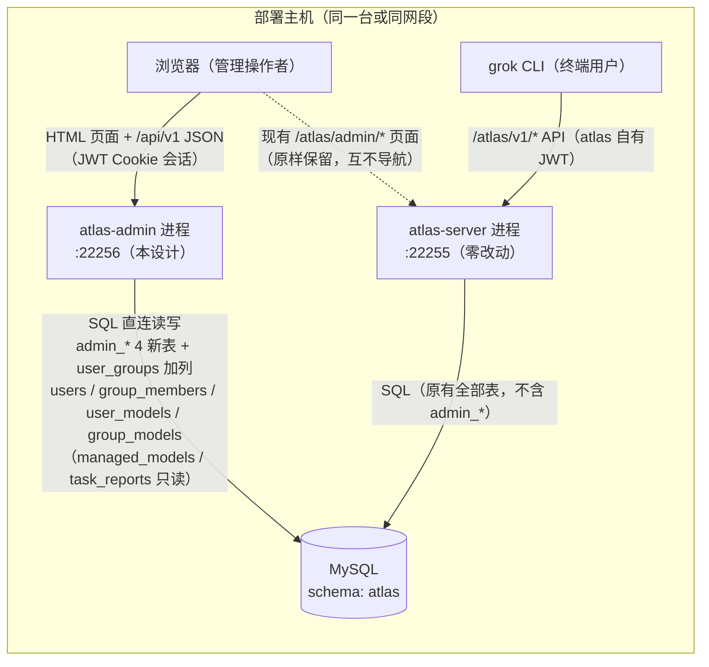
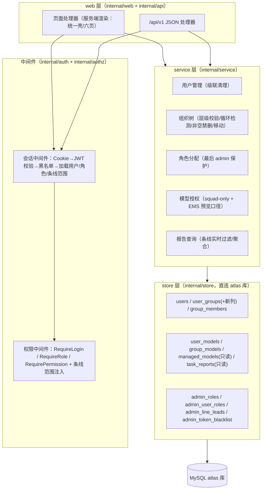
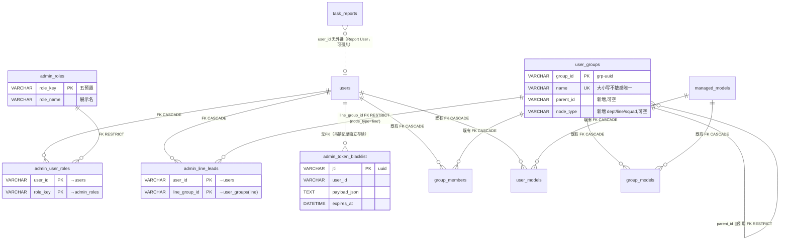

# atlas-admin 管理系统 — 详细设计文档

| 项 | 内容 |
|---|---|
| 需求编号/名称 | atlas-admin 管理系统（需求基线 v1.1，FR-001~FR-031 + NFR-001~NFR-009） |
| 设计版本 | v1.0 |
| 创建日期 | 2026-08-20 |
| 输入基线 | `documents/requirements-analyst/atlas-admin-requirements-analysis-2026-08-20.md`（唯一事实来源） |
| 参考输入 | `services/atlas-server/CONTEXT.md`（领域词典，术语权威）、`docs/adr/0005-user-groups-org-tree.md`（ADR-0005）、`docs/atlas-admin-redesign.md`（共识文档）、atlas-server 现有代码（§3.4 事实核对表） |
| 遵循规范 | atlas-sdd `spec/design/`：API 设计指南（统一响应格式、分页参数、HTTP 状态码、业务错误码分段）、数据库设计指南（命名小写下划线、索引命名、幂等/索引原则）；Redis 指南不适用（本系统无 Redis，见 §16 冲突说明） |
| 术语 | 全文使用 CONTEXT.md 词典术语：Org Node / User Group（条线分组，squad 层叶子）/ Group Membership / Group Assignment / Direct Assignment / Effective Model Set / Managed Catalog Mode / Task Report / Report User / Client Version |

---

## 1. 需求概述

atlas-admin 是全新独立的管理工程（独立仓库、独立进程 `:22256`），与 atlas-server 同 MySQL 实例同 schema（`atlas` 库）直连读写，提供：独立登录会话（bcrypt + JWT Cookie 24h + 黑名单）、用户管理、三层组织架构管理（dept→line→squad，存量待归类）、固定五角色分配与条线负责人范围映射、模型授权（沿用 `user_models`/`group_models` 语义 + Effective Model Set 预览）、任务报告（明细/条线实时过滤/详情/稽核统计）。atlas-server 一行代码不改；唯一表结构变更为 `user_groups` 加列（ADR-0005），由 `scripts/migrate.sql` 手工执行。

设计目标：31 条 FR + 9 条 NFR 全覆盖、可追溯（§13 追溯矩阵）；所有业务规则（权限矩阵、squad-only、非空禁删、级联清理、条线实时过滤）在服务端强制执行。

---

## 2. 系统架构设计

### 2.1 部署形态与进程关系



要点：

- 双进程并存，端口 22256（atlas-admin）/ 22255（atlas-server），互不调用、互不导航（NFR-002/NFR-004）。
- 身份与数据同源：atlas-admin 实时直读 `users` 表，无镜像、无同步任务（NFR-001）。
- 权限 enforcement 全部在 atlas-admin 进程内完成（FR-005）；atlas-server 侧不感知角色。

### 2.2 逻辑架构分层



### 2.3 技术选型（与 atlas-server 依赖对齐）

依据 `services/atlas-server/go.mod`（module `github.com/atlas-build/atlas-server`，go 1.25.0）核对，atlas-admin 采用同款依赖家族：

| 依赖 | 版本基线 | 用途 | 对齐说明 |
|---|---|---|---|
| `github.com/go-chi/chi/v5` | v5.2.1 | HTTP 路由与中间件 | 与 atlas-server `internal/server/server.go` 同款（`middleware.RequestID/RealIP/Logger/Recoverer`） |
| `github.com/go-sql-driver/mysql` | v1.10.0 | MySQL 驱动 | 同款；DSN 形态 `parseTime=true&charset=utf8mb4` |
| `github.com/golang-jwt/jwt/v5` | v5.2.1 | JWT 签发/校验 | atlas-server 已用于 CLI JWT；atlas-admin 用于会话 token |
| `golang.org/x/crypto/bcrypt` | v0.54.0 | 密码哈希 | 与 `store.HashPassword/CheckPassword` 同算法同 cost（`bcrypt.DefaultCost`） |
| `github.com/google/uuid` | v1.6.0 | jti、group_id 生成 | group_id 沿用 `"grp-" + uuid.NewString()` 格式 |
| `github.com/pelletier/go-toml/v2` | v2.4.3 | 配置文件解析 | 与 atlas-server `internal/config` 同款（默认值→文件→环境变量） |
| 标准库 `html/template`、`net/http`、`embed` | — | 页面渲染、静态资源内嵌 | 无前端框架（NFR-003）；模板经 `go:embed` 打进单一二进制 |

模板与静态资源用 `go:embed` 内嵌（atlas-server 为磁盘 `ServeFile` 方式；atlas-admin 改用 embed 以满足"单一 Go 服务"部署形态，运行期无需携带 web 目录，属工程增强，风格不变）。

### 2.4 关键架构决策（对应共识/决议，不可推翻）

| # | 决策 | 依据 |
|---|---|---|
| AD-1 | 页面为服务端渲染 HTML（统一壳、导航按角色渲染），列表与弹窗交互由页面内原生 JS 以 `fetch` 调用 `/api/v1/*` JSON 接口完成 | NFR-003 + atlas-server 管理页风格（原生 JS + 弹窗 + fetch） |
| AD-2 | JWT 只承载身份（`sub/email/jti/iat/exp`），**不携带角色**；角色与条线范围每个请求从库中加载 → 角色变更实时生效 | FR-020 |
| AD-3 | 吊销黑名单按 `jti` 精确匹配查询（主键点查）；过期记录由启动清理 + 定时器清理 | FR-004 |
| AD-4 | 删除用户的级联清理依赖数据库外键 `ON DELETE CASCADE`（既有 `group_members`/`user_models` + 新表同口径），service 层事务包裹并做残留校验 | FR-009 + 代码事实（既有 CASCADE） |
| AD-5 | `admin_line_leads` 对 `user_groups` 外键 `ON DELETE RESTRICT`，数据库层兜底 Q5 决议（有条线负责人映射的 line 禁删） | Q5 |
| AD-6 | 模型授权写路径完全复用 atlas-server 语义（`SetUserModels(userID, modelIDs, defaultID)` / `SetGroupModels(groupID, modelIDs)` 的 delete+insert 事务模式），不改表结构 | FR-024/FR-025、OS-1 |
| AD-7 | Effective Model Set 预览 SQL = `ListModelsForUser` 的 enabled 过滤口径 + `ListEffectiveModels` 的来源标注合体（见 §6.6.4） | FR-026 与 CONTEXT.md 词典口径 |
| AD-8 | 条线过滤一律为查询期实时 JOIN 推导，不写任何冗余字段 | FR-028、OS-1 |

---

## 3. 仓库与目录结构设计

新仓库 `E:\work\mygit\architechure\atlas-admin`，Go module `github.com/atlas-build/atlas-admin`：

```
atlas-admin/
├── cmd/
│   └── atlas-admin/
│       └── main.go                 # 入口：config.Load → store.OpenMySQL → web/authz 装配 → http.ListenAndServe(:22256)
├── internal/
│   ├── config/
│   │   └── config.go               # 配置加载：默认值 → atlas-admin.toml → ATLAS_ADMIN_* 环境变量（NFR-005）
│   ├── auth/
│   │   ├── token.go                # JWT 签发/解析（HS256，claims: sub/email/jti/iat/exp）
│   │   ├── cookie.go               # Cookie 读写（HttpOnly/SameSite/Secure/Max-Age）
│   │   └── handler.go              # GET/POST /login、POST /logout
│   ├── authz/
│   │   ├── roles.go                # 五角色常量、角色名映射（与 admin_roles 预置一致）
│   │   ├── matrix.go               # 权限矩阵：资源动作 → 角色集合（代码化，§6.2.1）
│   │   ├── session.go              # SessionIdentity（用户+角色+条线范围）构造与上下文注入
│   │   ├── middleware.go           # RequireLogin / RequireRole / RequirePermission / 条线范围检查
│   │   └── scope.go                # 条线可见范围解析：可见 squad 集、可见 user_id 集、SQL 片段构造
│   ├── service/
│   │   ├── usersvc.go              # 用户 CRUD、级联删除事务、归属（membership）维护
│   │   ├── orgsvc.go               # 组织树加载、创建/重命名/归类/移动/删除的全部校验规则
│   │   ├── rolesvc.go              # 角色+条线映射保存（含最后 admin 保护）
│   │   ├── authzsvc.go             # 直挂/分组授权写入前校验（squad-only、条线范围、目录 enabled）
│   │   └── reportsvc.go            # 报告查询编排（明细/详情/统计，条线过滤）
│   ├── api/
│   │   ├── response.go             # 统一 JSON 响应（{code,message,data,timestamp}）+ 错误码映射
│   │   ├── users.go                # /api/v1/users*
│   │   ├── org.go                  # /api/v1/org/*
│   │   ├── roles.go                # /api/v1/users/{id}/roles、/api/v1/roles
│   │   ├── authz.go                # /api/v1/catalog/models、users/{id}/models、effective-models
│   │   └── reports.go              # /api/v1/task-reports*
│   ├── web/
│   │   ├── render.go               # 模板执行、统一壳数据（导航按角色渲染）
│   │   ├── pages.go                # 六页 + 详情页 + 403/404/500 页处理器
│   │   ├── templates/              # go:embed
│   │   │   ├── layout.html         # 统一壳（左侧导航 + 顶栏）
│   │   │   ├── login.html
│   │   │   ├── users.html  org.html  roles.html  modelauth.html
│   │   │   ├── reports.html  report_detail.html
│   │   │   └── error.html
│   │   └── static/                 # go:embed
│   │       ├── admin.css           # 蓝色系 #1976d2 家族、卡片+表格（延续现有管理页风格）
│   │       └── common.js           # fetch 封装、弹窗/行内校验/分页组件（原生 JS）
│   ├── server/
│   │   └── server.go               # chi 路由树装配（中间件链 + 页面路由 + /api/v1 组）
│   └── store/
│       ├── mysql.go                # OpenMySQL（连接池 25/5/30min，对齐 atlas-server）、isMySQLDuplicate
│       ├── users.go                # users 表 CRUD/搜索分页/事务删除
│       ├── orgtree.go              # user_groups 树查询、计数聚合、存在性检查
│       ├── members.go              # group_members 增删查
│       ├── assignments.go          # user_models/group_models 读写 + EMS 预览查询
│       ├── catalog.go              # managed_models 只读列表（不含 api_key_enc）
│       ├── adminauth.go            # admin_roles / admin_user_roles / admin_line_leads
│       ├── blacklist.go            # admin_token_blacklist 增删（按 jti/exp）
│       └── reports.go              # task_reports 列表/详情/聚合（含条线 JOIN 与日期过滤）
├── scripts/
│   ├── migrate.sql                 # 幂等迁移：4 张 admin_ 表 + user_groups 加列 + 预置 + 首管理员示例
│   └── rollback.sql                # 回滚：删 admin_* 表 + 删两列
├── atlas-admin.toml.example
├── go.mod / go.sum
└── README.md                       # 构建、配置、迁移与首个管理员引导说明（FR-019 部署文档落点）
```

分层职责：`web/api` 只做协议转换；`service` 承载全部业务规则与校验；`store` 只做 SQL，不含业务判断；`authz` 是横切能力（会话/权限/范围）。禁止跨层调用（api 不得直连 store）。

### 3.1 代码事实核对表（设计引用的全部既有事实）

| 事实 | 来源 | 设计影响 |
|---|---|---|
| `users`：`user_id VARCHAR(64) PK`、`email VARCHAR(255) NOT NULL UNIQUE`、`password_hash VARCHAR(255)`、`first_name/last_name`、`principal_type/principal_id`、`machine_code VARCHAR(32) NULL UNIQUE`、`created_at/updated_at` | `internal/store/mysql.go` Migrate | 用户 CRUD 字段口径；登录按 email 小写化查询 |
| `HashPassword/CheckPassword`：`bcrypt.GenerateFromPassword / CompareHashAndPassword`，`bcrypt.DefaultCost` | `internal/store/mysql.go` | FR-001 同算法要求 |
| `CreateUser` 将 email `strings.ToLower(TrimSpace)`，`principal_type` 默认 `User`、`principal_id` 缺省=user_id | `internal/store/mysql.go` | atlas-admin 创建用户保持同规范化 |
| `user_groups`：`group_id VARCHAR(64) PK`、`name UNIQUE (uk_user_groups_name)`（排序规则不区分大小写） | `internal/store/user_groups.go`、`mysql.go` | 重名检测依赖唯一键；`group_id = "grp-"+uuid` |
| `group_members`/`user_models` 对 `users` 有 `ON DELETE CASCADE` | `mysql.go` migrateUserGroups/migrateManagedModels | FR-009 级联靠既有 FK + 新表同口径 |
| `user_models(user_id, model_id, is_default)` PK、`SetUserModels(userID, modelIDs, defaultID)` delete+insert 事务 | `internal/store/managed_model.go` | 直挂授权写路径复用该模式（AD-6） |
| `group_models(group_id, model_id)` PK、`SetGroupModels` delete+insert 事务 | `user_groups.go` | 分组授权写路径复用 |
| `ListModelsForUser`（运行时 /v1/models 语义）：direct ∪ group 后 `INNER JOIN managed_models ... WHERE mm.enabled=1`，`is_default DESC, mm.id` 排序 | `managed_model.go` | EMS 预览必须同样过滤 enabled（AD-7） |
| `ListEffectiveModels`：来源标注 direct/group，**未** join enabled 过滤 | `user_groups.go` | 预览 SQL 需将两者合并（§6.6.4） |
| `task_reports`：`user_id VARCHAR(64) NULL`（无外键）、`email/team_id/.../prompt MEDIUMTEXT/error TEXT/artifacts JSON/client_version` 等 26 列；索引 `idx_reports_user_created(user_id,created_at)`、`idx_reports_email_created`、`idx_reports_agent`、`idx_reports_created` | `internal/store/task_report.go`、`mysql.go` | Report User=user_id/email 报告体字段；删除用户报告成孤儿照旧展示（Q1） |
| 日期过滤惯例：`DATE(created_at) >= ? AND <= ?`，参数为 `2006-01-02` 本地日字符串 | `task_report.go` `reportDateWhere` | 报告筛选沿用（避免 go-sql-driver 时区问题） |
| `managed_models`：`id VARCHAR(128) PK`、`enabled TINYINT(1)`、`api_key_enc TEXT`（敏感） | `mysql.go` | 目录只读且**绝不返回 api_key_enc**（§10） |
| collation 实践：新表 `COLLATE` 与 `users.user_id` 检测值一致（默认 utf8mb4_unicode_ci） | `mysql.go` migrateUserGroups 注释 | migrate.sql 的 collation 前置校验（§5.4.1） |
| 路由/中间件风格：chi + RequestID/RealIP/Logger/Recoverer；管理 API 为 `/admin/api/*` JSON | `internal/server/server.go` | atlas-admin 采用同风格，API 前缀为 `/api/v1`（规范要求带版本） |
| 管理页风格：中文、#1976d2、table、dialog-overlay 弹窗、原生 JS fetch | `web/admin/users/index.html` | 页面视觉与交互延续（§8） |
| 配置风格：默认值 → TOML（`ATLAS_CONFIG` 或候选路径）→ 环境变量覆盖 | `internal/config/config.go` | atlas-admin 配置加载同构（§9） |

---

## 4. 数据库详细设计

### 4.1 总体 ER（新表 + 加列 + 引用关系）



设计约定（与数据库设计指南的关系见 §16）：表名/列名小写下划线；本系统按项目决策采用 `admin_` 业务前缀（对应指南"业务前缀区分模块"原则）；既有表命名风格（`users`/`user_groups` 等，VARCHAR 自然主键、无 `is_deleted` 软删）为不可推翻的存量事实，新表保持同风格以兼容外键与 collation；索引命名 `idx_表名_字段`、唯一键 `uk_表名_字段`、外键 `fk_表名_字段`。

### 4.2 新表 DDL（落入 `scripts/migrate.sql`）

#### 4.2.1 `admin_roles`（预置五角色，仅展示与 FK 引用）

```sql
CREATE TABLE IF NOT EXISTS admin_roles (
    role_key    VARCHAR(32)  NOT NULL COMMENT '角色标识：admin/line_lead/developer/tester/ba',
    role_name   VARCHAR(64)  NOT NULL COMMENT '展示名：管理员/条线负责人/开发人员/测试人员/BA',
    description VARCHAR(255) NOT NULL DEFAULT '' COMMENT '角色定位说明',
    created_at  TIMESTAMP    NOT NULL DEFAULT CURRENT_TIMESTAMP COMMENT '创建时间',
    PRIMARY KEY (role_key)
) ENGINE=InnoDB DEFAULT CHARSET=utf8mb4 COLLATE=utf8mb4_unicode_ci
  COMMENT='atlas-admin 预置权限角色（固定五条，应用不提供增删，OS-3）';

-- 预置数据（幂等：重复执行仅刷新展示名/描述）
INSERT INTO admin_roles (role_key, role_name, description) VALUES
  ('admin',      '管理员',   '全量管理：用户、组织、模型授权、任务报告、角色分配'),
  ('line_lead',  '条线负责人','管辖范围由 admin_line_leads 映射决定，与成员关系解耦'),
  ('developer',  '开发人员', '最小自助查看：自己、组织只读、授权只读、自己报告'),
  ('tester',     '测试人员', '只读观察：组织、全部任务报告'),
  ('ba',         'BA',       '只读观察：组织、全部任务报告')
ON DUPLICATE KEY UPDATE role_name = VALUES(role_name), description = VALUES(description);
```

#### 4.2.2 `admin_user_roles`（用户↔角色，多对多）

```sql
CREATE TABLE IF NOT EXISTS admin_user_roles (
    user_id    VARCHAR(64) NOT NULL COMMENT '→ users.user_id',
    role_key   VARCHAR(32) NOT NULL COMMENT '→ admin_roles.role_key',
    created_at TIMESTAMP   NOT NULL DEFAULT CURRENT_TIMESTAMP COMMENT '分配时间',
    PRIMARY KEY (user_id, role_key),
    KEY idx_admin_user_roles_role (role_key),
    CONSTRAINT fk_admin_user_roles_user FOREIGN KEY (user_id)  REFERENCES users(user_id)        ON DELETE CASCADE,
    CONSTRAINT fk_admin_user_roles_role FOREIGN KEY (role_key) REFERENCES admin_roles(role_key) ON DELETE RESTRICT
) ENGINE=InnoDB DEFAULT CHARSET=utf8mb4 COLLATE=utf8mb4_unicode_ci
  COMMENT='atlas-admin 用户↔角色映射（一人多角色=多行；删用户级联清理 FR-009）';
```

- `idx_admin_user_roles_role` 支撑"最后 admin 计数"（`WHERE role_key='admin'`）与按角色反查。
- `ON DELETE CASCADE`（用户）满足 FR-009；`RESTRICT`（角色）+ 应用层无删除入口共同实现 OS-3。

#### 4.2.3 `admin_line_leads`（条线负责人范围映射）

```sql
CREATE TABLE IF NOT EXISTS admin_line_leads (
    user_id       VARCHAR(64) NOT NULL COMMENT '→ users.user_id（负责人）',
    line_group_id VARCHAR(64) NOT NULL COMMENT '→ user_groups.group_id（业务逻辑要求 node_type=\'line\'）',
    created_at    TIMESTAMP   NOT NULL DEFAULT CURRENT_TIMESTAMP COMMENT '映射时间',
    PRIMARY KEY (user_id, line_group_id),
    KEY idx_admin_line_leads_line (line_group_id),
    CONSTRAINT fk_admin_line_leads_user FOREIGN KEY (user_id)        REFERENCES users(user_id)          ON DELETE CASCADE,
    CONSTRAINT fk_admin_line_leads_line FOREIGN KEY (line_group_id) REFERENCES user_groups(group_id)  ON DELETE RESTRICT
) ENGINE=InnoDB DEFAULT CHARSET=utf8mb4 COLLATE=utf8mb4_unicode_ci
  COMMENT='条线负责人↔业务条线映射（与 Group Membership 解耦，一人可多条线 FR-021/FR-022）';
```

- "目标必须为 line 节点"无法用 FK 表达（跨表条件约束不存在），由 service 层校验（§6.5.2），DDL 注释固化口径。
- `ON DELETE RESTRICT`（line 节点）为 Q5 决议的数据库兜底：仍被映射的 line 无法删除；应用层先给出友好错误。
- `idx_admin_line_leads_line` 支撑 Q5 检查（按 line 反查负责人数）。

#### 4.2.4 `admin_token_blacklist`（JWT 吊销黑名单）

```sql
CREATE TABLE IF NOT EXISTS admin_token_blacklist (
    jti         VARCHAR(64) NOT NULL COMMENT 'JWT ID（uuid v4），精确匹配查询',
    user_id     VARCHAR(64) NOT NULL COMMENT '签发对象（审计用，不做外键：吊销记录独立存续）',
    payload_json TEXT       NOT NULL COMMENT '登出 token 的 claims 序列化（审计用）',
    expires_at  DATETIME    NOT NULL COMMENT 'token 原始 exp，过期即可清理',
    created_at  TIMESTAMP   NOT NULL DEFAULT CURRENT_TIMESTAMP COMMENT '吊销时间',
    PRIMARY KEY (jti),
    KEY idx_admin_token_blacklist_expires (expires_at)
) ENGINE=InnoDB DEFAULT CHARSET=utf8mb4 COLLATE=utf8mb4_unicode_ci
  COMMENT='atlas-admin JWT 吊销黑名单（登出写入 FR-004；过期记录定时清理）';
```

- 校验路径只走 `PRIMARY KEY(jti)` 点查；`expires_at` 索引服务于清理任务（`DELETE WHERE expires_at < NOW()`）。
- 不建 user_id 外键：被删用户的已吊销 token 记录无需联动（jti 已失效或已过期，自然被清理）。

### 4.3 `user_groups` 加列（ADR-0005）

```sql
-- 增量加列（均带默认 NULL，存量行不迁移，显示为"待归类" FR-012）
ALTER TABLE user_groups
    ADD COLUMN parent_id VARCHAR(64) NULL DEFAULT NULL COMMENT '父节点 group_id；自引用；NULL=待归类' AFTER name,
    ADD COLUMN node_type VARCHAR(16) NULL DEFAULT NULL COMMENT '节点类型：dept/line/squad；存量 NULL=待归类' AFTER parent_id;

-- 父子/范围查询索引（树加载按 parent_id 分组、line→squad 范围过滤）
CREATE INDEX idx_user_groups_parent ON user_groups (parent_id);

-- 自引用外键：父节点删除时若有子节点则拒绝（非空禁删的数据库兜底 FR-015）
ALTER TABLE user_groups
    ADD CONSTRAINT fk_user_groups_parent FOREIGN KEY (parent_id) REFERENCES user_groups (group_id) ON DELETE RESTRICT;

-- node_type 取值约束（MySQL 8.0.16+ 强制；更低版本忽略该约束但不报错）
ALTER TABLE user_groups
    ADD CONSTRAINT chk_user_groups_node_type CHECK (node_type IS NULL OR node_type IN ('dept','line','squad'));
```

兼容性论证（ADR-0005）：atlas-server 既有 SQL 只按 `group_id` 等值 JOIN（`group_members`/`group_models` 路径），不 `SELECT *`、不感知新列，结论不变；新列均可空带默认，行格式变化不影响既有读写。

### 4.4 `scripts/migrate.sql` 设计（幂等，手工执行）

#### 4.4.1 执行前置：collation 校验（沿用 `migrateUserGroups` 实践）

```sql
-- 步骤 0：执行前先运行本查询，确认 users.user_id 的排序规则：
SELECT COLLATION_NAME FROM information_schema.COLUMNS
WHERE TABLE_SCHEMA = DATABASE() AND TABLE_NAME = 'users' AND COLUMN_NAME = 'user_id';
-- 期望 utf8mb4_unicode_ci（init-mysql.sql 标准）。若返回其他值，
-- 将本脚本中全部 COLLATE utf8mb4_unicode_ci 替换为该返回值后再执行，
-- 否则 4.2.2/4.2.3 的外键将因排序规则不一致而创建失败（MySQL Error 1215）。
```

#### 4.4.2 幂等模式

- 建表：`CREATE TABLE IF NOT EXISTS`（天然幂等）。
- 预置数据：`INSERT ... ON DUPLICATE KEY UPDATE`（幂等）。
- `ADD COLUMN` / `ADD INDEX` / `ADD CONSTRAINT`：MySQL 无 `IF NOT EXISTS`，用 information_schema 探测 + `PREPARE/EXECUTE` 条件执行：

```sql
-- 示例：幂等加列（其余 ALTER 同模式）
SET @ddl = IF(
  (SELECT COUNT(*) FROM information_schema.COLUMNS
    WHERE TABLE_SCHEMA = DATABASE() AND TABLE_NAME = 'user_groups' AND COLUMN_NAME = 'parent_id') = 0,
  'ALTER TABLE user_groups ADD COLUMN parent_id VARCHAR(64) NULL DEFAULT NULL COMMENT ''父节点 group_id；自引用；NULL=待归类'' AFTER name',
  'SELECT ''user_groups.parent_id 已存在，跳过'' AS info');
PREPARE stmt FROM @ddl; EXECUTE stmt; DEALLOCATE PREPARE stmt;
-- （node_type 加列、idx_user_groups_parent 建索引探查 information_schema.STATISTICS、
--   fk/chk 探查 information_schema.TABLE_CONSTRAINTS，均同模式）
```

脚本结构（按序）：步骤 0 collation 校验 → 步骤 1 四张 `admin_` 建表 → 步骤 2 `admin_roles` 预置 → 步骤 3 `user_groups` 加列/索引/约束 → 步骤 4 首个管理员引导（FR-019）→ 步骤 5 执行结果自检（可选 SELECT 汇总表/列存在性）。

#### 4.4.3 首个管理员引导（FR-019，注释形态，不自动执行）

```sql
-- 步骤 4：首个管理员引导（冷启动必做，替换 <目标用户 user_id> 后手工执行）
-- 目标用户必须已存在于 users 表（可先在 atlas-server 侧或用现有 /atlas/admin/users 创建）。
-- INSERT INTO admin_user_roles (user_id, role_key) VALUES ('<目标用户 user_id>', 'admin');
-- 未执行本 INSERT 前，任何账号登录 atlas-admin 都会被 FR-002 拒绝（无角色拒登）。
```

部署说明（README「部署与初始化」章节同步）：`mysql -u atlas -p atlas < scripts/migrate.sql` → 执行步骤 4 引导 → 启动 atlas-admin → 用目标账号登录验证 admin 全量权限。服务启动**不**自动迁移（NFR-006）；未迁移库上服务可启动，首次访问功能时返回明确错误"管理表不存在，请先执行 scripts/migrate.sql"（错误码 100101，§12.2）。

### 4.5 回滚脚本 `scripts/rollback.sql`

```sql
-- 回滚顺序：先删新表（含其外键），再撤 user_groups 加列。
DROP TABLE IF EXISTS admin_user_roles;        -- 依赖 admin_roles/users
DROP TABLE IF EXISTS admin_line_leads;        -- 依赖 users/user_groups
DROP TABLE IF EXISTS admin_token_blacklist;
DROP TABLE IF EXISTS admin_roles;
-- user_groups：先删自引用外键，再删索引，再删两列（探测式幂等，模式同 4.4.2）
SET @ddl = IF(
  (SELECT COUNT(*) FROM information_schema.TABLE_CONSTRAINTS
    WHERE TABLE_SCHEMA = DATABASE() AND CONSTRAINT_NAME = 'fk_user_groups_parent') > 0,
  'ALTER TABLE user_groups DROP FOREIGN KEY fk_user_groups_parent',
  'SELECT ''fk_user_groups_parent 不存在，跳过'' AS info');
PREPARE stmt FROM @ddl; EXECUTE stmt; DEALLOCATE PREPARE stmt;
-- 同模式 DROP INDEX idx_user_groups_parent、DROP CHECK chk_user_groups_node_type、
-- DROP COLUMN parent_id / node_type
```

回滚影响：`admin_*` 数据（角色分配、条线映射、黑名单）全部丢弃；授权与组织数据不受影响（ADR-0005）；`user_groups` 两列删除后存量"待归类"语义回退为扁平分组（atlas-server 行为不受影响）。

### 4.6 既有表引用边界（读写矩阵）

| 表 | atlas-admin 操作 | 依据 |
|---|---|---|
| `users` | 读写（登录校验读；CRUD/重置密码写） | FR-001/006~009 |
| `user_groups` | 读写（含新列 `parent_id`/`node_type`；`group_id` 沿用 `grp-`+uuid 格式） | FR-011~017 |
| `group_members` | 读写（用户↔squad 归属） | FR-010/FR-016 |
| `user_models` | 读写（Direct Assignment，含 `is_default`） | FR-024 |
| `group_models` | 读写（Group Assignment，仅 squad） | FR-025 |
| `managed_models` | **只读**（且永不 SELECT `api_key_enc`） | FR-023、§10 |
| `task_reports` | **只读**（含详情敏感字段；过滤为查询期推导） | FR-027~031 |
| `sessions`/`telemetry_traces`/`session_signals` | **不访问** | 超范围 |

---

## 5. 后端模块详细设计

### 5.1 认证与会话（`internal/auth` + `authz/session.go`）

#### 5.1.1 登录流程（FR-001/FR-002/FR-003）

```mermaid
sequenceDiagram
    participant B as 浏览器
    participant H as POST /login
    participant ST as store
    B->>H: email + password（HTML 表单）
    H->>ST: GetUserByEmail(lower(trim(email)))
    alt 账号不存在或 bcrypt 校验失败
        H-->>B: 重渲染登录页，提示"账号或密码错误"（不区分两种情形，防枚举）
    else 密码正确
        H->>ST: SELECT role_key FROM admin_user_roles WHERE user_id=?
        alt 无任何角色
            H-->>B: 提示"未分配角色，请联系管理员"（不签发 token）
        else 有角色
            H->>H: 签发 JWT（HS256）：{sub:user_id, email, jti:uuid, iat, exp:now+24h}
            H-->>B: 303 重定向 next 页；Set-Cookie atlas_admin_session（HttpOnly; SameSite=Lax; Path=/; Max-Age=exp-now; Secure 可配）
        end
    end
```

- 密码校验：`bcrypt.CompareHashAndPassword(users.password_hash, 输入)`，失败与"账号不存在"对外同提示（FR-001 验收）。
- 直读 `users`：atlas-server 侧新建/改密账号立即可用（无同步，FR-001/NFR-001）。
- 登录本身不写库（`users` 行不变）；不设防爆破（Q6），仅记通用日志（§12.4）。

#### 5.1.2 JWT 与 Cookie 规格

| 项 | 设计 |
|---|---|
| 算法 | HS256（`golang-jwt/jwt/v5`），密钥来自配置 `auth.jwt_secret`（生产必改，默认值启动时打告警日志） |
| Claims | `sub`=user_id、`email`、`jti`=uuid v4、`iat`、`exp`=iat+`auth.token_ttl`（默认 24h，FR-003） |
| 不含角色 | 角色与条线范围每次请求查库（AD-2，FR-020） |
| Cookie 名 | `atlas_admin_session`；`HttpOnly=true`；`SameSite=Lax`；`Secure=auth.cookie_secure`（默认 false，内网 HTTP）；`Path=/`；`Max-Age=TTL 秒` |
| 校验失败 | 页面请求→302 `/login?next=<原路径>`；API 请求→401 JSON（错误码 200103） |

#### 5.1.3 会话中间件（每请求执行，注入 `authz.SessionIdentity`）

```
解析 Cookie → JWT 验签+exp 校验
  → SELECT 1 FROM admin_token_blacklist WHERE jti=?（命中→按未登录处理，FR-004）
  → SELECT users 行（不存在→未登录，覆盖"token 有效但用户已删"场景）
  → SELECT role_key FROM admin_user_roles WHERE user_id=?
  → SELECT line_group_id FROM admin_line_leads WHERE user_id=?
  → 构造 SessionIdentity{UserID, Email, Name, Roles, IsAdmin, LeadLineIDs} 存入 r.Context()
```

开销为 4 次主键/索引点查（连接池命中时亚毫秒级）；不做缓存（FR-020 实时生效优先，规模说明见 §11）。

#### 5.1.4 登出与黑名单（FR-004）

```
POST /logout（需登录）：
  取当前 token 的 jti/sub/exp/claims
  → INSERT INTO admin_token_blacklist (jti, user_id, payload_json, expires_at) VALUES (?, ?, ?, ?)
  → Set-Cookie 清除（Max-Age=0）
  → 303 /login
清理任务：启动时 + 每 auth.blacklist_cleanup_interval（默认 1h）
  DELETE FROM admin_token_blacklist WHERE expires_at < NOW()
```

同 jti 重复登出：`INSERT` 冲突按已吊销处理（幂等，直接清 Cookie 重定向）。新签发 token jti 不同，不受黑名单影响（FR-004 验收）。

### 5.2 权限模型（`internal/authz`）

#### 5.2.1 资源动作与矩阵代码化

```go
// roles.go
const (
    RoleAdmin     = "admin"
    RoleLineLead  = "line_lead"
    RoleDeveloper = "developer"
    RoleTester    = "tester"
    RoleBA        = "ba"
)

// matrix.go：权限 = 资源.动作；每项声明允许角色与范围限定符
// users.view        admin(ALL) / line_lead(LINES) / developer(SELF)
// users.create      admin
// users.update      admin
// users.delete      admin
// users.password    admin
// users.membership  admin(ALL) / line_lead(OWN_LINE_SQUADS)
// org.view          全部登录角色（READ）
// org.manage        admin(ALL) / line_lead(OWN_LINE_SUBTREE)
// roles.view        admin
// roles.assign      admin
// lineleads.manage  admin
// authz.view        admin(ALL) / line_lead(LINES) / developer(SELF)
// authz.manage      admin(ALL) / line_lead(OWN_LINE_SQUADS)
// reports.view      admin(ALL) / line_lead(LINES) / developer(SELF) / tester(ALL) / ba(ALL)
```

实现要点：

- `RequireLogin`（全部受保护路由）→ `RequirePermission("users.view")`（角色集合判定）→ handler 内再做**范围**判定（`Scope{All|Lines|Self|None}`），范围不通过返回 403/错误码 210202（区别于角色不足的 210201）。
- 一人多角色权限并集：矩阵按"角色集合→能力"求并集判定（FR-005）。
- 页面路由与 API 路由共用同一套中间件（页面 403 返回中文无权页，API 返回 JSON）。

#### 5.2.2 条线范围解析（`authz/scope.go`，全部条线过滤的统一实现）

对 `SessionIdentity` 计算：

```
可见 squad 集 VisibleSquadIDs =
  SELECT group_id FROM user_groups
  WHERE node_type='squad' AND parent_id IN (LeadLineIDs...)

可见用户集 VisibleUserIDs =
  SELECT DISTINCT gm.user_id FROM group_members gm
  JOIN user_groups ug ON ug.group_id = gm.group_id
  WHERE ug.node_type='squad' AND ug.parent_id IN (LeadLineIDs...)
```

- 跨条线用户天然命中多条线（同一 squad 集查询，FR-028）。
- 待归类节点（`parent_id IS NULL`）不属于任何条线 → 其成员对 line_lead 不可见（报告/用户列表同口径，FR-028 验收"无 squad 归属对 line_lead 不可见"）。
- 明细/统计/授权/用户列表复用同一可见集合 SQL 片段（`scope.UserFilterSQL(alias)` 生成），保证口径一致。
- `LeadLineIDs` 为空（line_lead 未映射任何条线）→ 可见集合为空（仅看到空列表，UC-ROLE-001 备选流程 4a）。

### 5.3 组织架构（`service/orgsvc.go` + `store/orgtree.go`）

#### 5.3.1 树加载（FR-011/FR-012）

一次全量加载（组织规模：dept/line/squad 量级为百级，内存建树）：

```
SELECT group_id, name, parent_id, node_type FROM user_groups
-- 计数（两 GROUP BY，内存合并；沿用 ListUserGroups 的关联子查询口径改为聚合后合并以避免 N+1）：
SELECT group_id, COUNT(*) FROM group_members GROUP BY group_id
SELECT group_id, COUNT(*) FROM group_models   GROUP BY group_id
```

- 输出结构：`depts[]（多根并列，Q8）→ lines[] → squads[]`；dept/line 节点的"成员数/分组授权数"= 其下全部 squad 计数之和（内存上卷）；每节点带 `group_id/name/node_type/member_count/model_count`。
- `parent_id IS NULL` 的节点（存量未归类 + atlas-server 旧页新建的组）单独输出到 `unclassified[]`，同样带计数；待归类区不进树（FR-012）。
- 数据异常防御：`parent_id` 指向的父节点不存在（理论不可能，FK 保证）或父节点类型不合法（脏数据）→ 该节点降级显示在"待归类"区并标记"数据异常"，不报错阻塞整页（设计假设 A-9）。

#### 5.3.2 创建与重命名（FR-013）

创建规则（服务端校验顺序）：

| node_type | 允许角色 | parent 约束 |
|---|---|---|
| `dept` | admin | 必须为 NULL（根，多根并列 Q8） |
| `line` | admin | parent 必须存在且 `node_type='dept'` |
| `squad` | admin（任意合法 line 下）；line_lead（仅本人负责条线下，FR-017/FR-013） | parent 必须存在且 `node_type='line'` |

- 名称：`TrimSpace` 非空、长度 ≤255；重复（`uk_user_groups_name`，collation 大小写不敏感）→ 依赖 1062 错误映射为"名称已存在"（`isMySQLDuplicate`，对齐 atlas-server `ErrUserGroupNameTaken` 语义），页面同时提供即时预检接口。
- `group_id = "grp-" + uuid.NewString()`（对齐 `CreateUserGroup`）。
- 重命名：同唯一约束；line_lead 仅可重命名本人负责条线及其下 squad（FR-013/FR-017）。

#### 5.3.3 归类与移动（FR-014，归类 P0 / 树上移动 P1）

统一为 `move` 操作（`POST /api/v1/org/nodes/{groupId}/move`，body `{newParentId: string|null}`）：

```
校验顺序：
1) 节点存在；2) 权限与范围（归类仅 admin；树上移动：admin 任意合法位置，line_lead 仅 squad 且新旧父级均在本人负责条线内，FR-017）；
3) 父级类型合法性（dept→parent 必须 NULL；line→parent 必须 dept；squad→parent 必须 line）；
4) 循环检测：newParent 不得是节点自身或其后代（沿 parent_id 上溯）——
   类型规则下结构不可能成环（dept 无父、line 父必 dept、squad 父必 line），此检查为防御性兜底；
5) UPDATE user_groups SET parent_id = ? WHERE group_id = ?
```

- 待归类节点归类：`node_type` 同时写为 `squad`、`parent_id` = 目标 line（FR-014 验收：归位后成为父 line 下的 squad）；成员与 `group_models` 不动。
- 待归类节点若带成员/授权，归位后原样保留（FR-012 验收）。
- 移动仅更新 `parent_id`（与 node_type），不动成员/授权（FR-014 P1 验收）。

#### 5.3.4 非空禁删（FR-015 + Q5）

`DELETE /api/v1/org/nodes/{groupId}` 服务端校验（给出可读原因，顺序即提示优先级）：

```
1) 子节点：SELECT COUNT(*) FROM user_groups WHERE parent_id = ?      >0 → "存在子节点，无法删除"
2) 成员：  SELECT COUNT(*) FROM group_members WHERE group_id = ?     >0 → "存在成员，无法删除"
3) 授权：  SELECT COUNT(*) FROM group_models WHERE group_id = ?      >0 → "存在模型授权，无法删除"
4) 负责人映射（仅 node_type='line'）：SELECT COUNT(*) FROM admin_line_leads WHERE line_group_id = ?
                                                                        >0 → "该条线仍有负责人映射，请先移除映射"（Q5）
通过 → DELETE FROM user_groups WHERE group_id = ?
```

- 数据库兜底：`fk_user_groups_parent RESTRICT`（子节点）、`group_members/group_models` 既有 CASCADE（若并发窗口内插入了成员，删除会连带清理——服务端预检在前，事务内以最终 DELETE 影响行为准）与 `fk_admin_line_leads_line RESTRICT`（Q5）。
- 删除范围：admin 全部节点；line_lead 仅本人负责条线下的空 squad（FR-017）。

#### 5.3.5 squad-only 挂载约束（FR-016）

- 成员写入（`group_members`）与分组授权写入（`group_models`）的 service 层统一前置校验：目标节点 `node_type='squad'`，否则拒绝（错误码 230407）。
- 页面层：dept/line 节点不渲染"添加成员/添加授权"入口（FR-016 验收）。
- 无跨层继承：Effective Model Set 计算 SQL 只经 `group_members`（不按 parent 上溯），与 atlas-server 既有 JOIN 完全一致（FR-016 验收 3）。

### 5.4 用户管理（`service/usersvc.go` + `store/users.go`）

#### 5.4.1 列表与查看（FR-006，含需求 §8.2 列表增强）

```
SELECT u.user_id, u.email, u.first_name, u.last_name, IFNULL(u.machine_code,''), u.created_at,
       GROUP_CONCAT(DISTINCT aur.role_key)        AS roles,
       GROUP_CONCAT(DISTINCT CONCAT(ug2.name,'(',gm.group_id,')')) AS squads   -- 关联 squad 展示
FROM users u
LEFT JOIN admin_user_roles aur ON aur.user_id = u.user_id
LEFT JOIN group_members gm ON gm.user_id = u.user_id
LEFT JOIN user_groups ug2 ON ug2.group_id = gm.group_id AND ug2.node_type='squad'
[可见范围 WHERE：admin 无；line_lead → u.user_id IN (可见用户集 §5.2.2)；developer → u.user_id = 当前用户]
[搜索 WHERE：(u.email LIKE ? OR u.first_name LIKE ? OR u.last_name LIKE ?)，关键字前后 %，转义 _ %]
GROUP BY u.user_id
ORDER BY <白名单: created_at|email|user_id + ASC|DESC>
LIMIT ? OFFSET ?          -- 另跑同 WHERE 的 COUNT 查询取 total
```

- 排序字段白名单硬编码（防注入）；分页 `page`（从 1 起）`size`（默认 20、上限 100，对齐规范分页参数）。
- line_lead 与 developer 范围由同一 `scope` 机制注入（§5.2.2）。

#### 5.4.2 创建用户（FR-007）

表单：email（必填、格式校验）、名（first_name，必填）、姓（last_name）、初始密码（必填 ≥8 位，页面即时校验）、machine_code（可留空）。

```
service.CreateUser：
1) email 规范化 lower(trim)；预检唯一（SELECT 1 WHERE email=?）→ "邮箱已存在"（409/220301）
2) user_id 生成 = email 前缀（@ 前部分，对齐 atlas-server 管理页惯例）；若已占用则追加 -2、-3… 直到唯一（结果在成功提示中回显）
3) principal_type='User'、principal_id=user_id（对齐 CreateUser 默认）
4) 密码 bcrypt.DefaultCost 哈希 → INSERT users（password_hash 为 $2 前缀哈希，无明文）
5) 新用户未分配角色（不自动写 admin_user_roles）→ 登录 atlas-admin 被 FR-002 拒绝（验收）
```

#### 5.4.3 编辑与重置密码（FR-008，Q2：developer 只读自己）

- 编辑字段：`first_name`、`last_name`、`machine_code`（可清空；唯一冲突 → "机器码已占用"）。`user_id`/`email` 为身份键，**不可编辑**（FR-008"非身份键字段"）。
- 重置密码：独立操作（弹窗二次确认），bcrypt 哈希后 `UPDATE users SET password_hash=?`；生效范围覆盖 atlas-server 与 atlas-admin（同库同哈希）。
- developer 对"仅自己"= 只读查看（Q2 决议），无编辑/重置入口，服务端拒绝（权限矩阵 `users.update`=admin）。

#### 5.4.4 删除用户与级联清理（FR-009，UC-USER-001）

```
service.DeleteUser(userID)（admin，二次确认后调用）：
BEGIN;
  0) 保护性前置校验（Q4 推导，见 A-5）：目标 = 当前登录用户 → 拒绝"不能删除当前登录账号"；
     目标为最后一个 admin（admin 角色持有数=1 且为目标）→ 拒绝"系统至少需保留一名管理员"
  1) DELETE FROM users WHERE user_id = ?
     ── 既有 FK CASCADE 自动清理：group_members、user_models、sessions（会话连带失效，安全增益）
     ── 新表 FK CASCADE 自动清理：admin_user_roles、admin_line_leads
  2) 残留校验（防御）：五表 SELECT COUNT 应为 0，非 0 → ROLLBACK + 500/100004
COMMIT;
task_reports 不动（user_id 无外键）→ 报告保留，Report User 字符串照旧展示（Q1 决议）
```

事务边界：单条 `DELETE` + 校验为一个事务；失败整体回滚（UC-USER-001 备选 3a）。级联主体由 FK 承担（AD-4），避免应用层多语句部分失败。

#### 5.4.5 组织归属维护（FR-010）

- 增量语义（避免 line_lead 误清其他条线归属）：
  - `POST /api/v1/users/{userId}/memberships`，body `{groupIds: []}` → 批量加入；`DELETE /api/v1/users/{userId}/memberships/{groupId}` → 移出。
- 校验：每个目标 group 必须 `node_type='squad'`（FR-016）；line_lead 时目标 squad 必须在本人负责条线下（移出同理），否则 210202；用户可同时加入不同条线的多个 squad（多对多）。
- 用户从全部 squad 移出 → 组织归属为空 → 条线过滤不再命中其报告（FR-028 验收 3 的前置操作）。

### 5.5 角色分配与条线负责人映射（`service/rolesvc.go`）

#### 5.5.1 角色+范围统一保存（FR-018/FR-021，UC-ROLE-001）

页面形态：用户选择器 + 五角色复选（`admin_roles` 预置数据渲染，OS-3 无增删入口）+ 条线多选（仅勾选 line_lead 时出现；选项仅 `node_type='line'` 节点，FR-021 验收 2）。

```
service.SaveUserRolesAndScope(operator SessionIdentity, targetUserID, roles []string, lineGroupIDs []string)：
BEGIN;
  1) 校验 roles ⊆ 五固定角色集合（非法值 → 240502）
  2) 校验 lineGroupIDs 全部为 line 节点（FR-021）
  3) 最后 admin 保护（Q4）：
     若本次操作会使 targetUserID 失去 admin 角色：
       - targetUserID == operator.UserID          → 拒绝"不能移除自己的管理员角色"
       - admin 持有人数将降为 0（当前仅 target 一人持有）→ 拒绝"系统至少需保留一名管理员"
  4) DELETE FROM admin_user_roles WHERE user_id=?; INSERT 新角色集（多行=多角色）
  5) line_lead ∈ roles → DELETE/INSERT admin_line_leads 同步为 lineGroupIDs；
     line_lead ∉ roles → DELETE FROM admin_line_leads WHERE user_id=?（映射随角色清理）
COMMIT;
```

- 生效时机：立即（下一请求按新角色判定，AD-2，FR-020 验收：无需重登、无需重启）。
- 移除映射后该负责人刷新即失去对应条线可见范围（FR-021 验收 3）。
- 页面读取：`GET /api/v1/users/{userId}/roles` 返回 `{roles, lineGroupIds}`（仅 admin 可见该页与接口）。

#### 5.5.2 映射与成员关系解耦（FR-022）

`admin_line_leads` 独立表、无任何与 `group_members` 的关联约束；scope 解析只读该表（§5.2.2）。未加入条线任何 squad 的负责人同样获得该线全部管理/可见能力；将其移出 squad 不影响负责人身份（由表结构直接保证）。

### 5.6 模型授权（`service/authzsvc.go` + `store/assignments.go`）

#### 5.6.1 受管目录读取（FR-023）

```
SELECT id, model, name, description, context_window, owned_by, enabled, updated_at
FROM managed_models ORDER BY id
-- 明确不 SELECT api_key_enc（敏感，§10）；列表实时查询，atlas-server 侧变更刷新即见（NFR-001）
```

页面呈现 enabled 标记；停用条目仅影响 Effective Model Set 判定（不计数），不改变授权关系本身（与词典"enabled catalog entries only"一致）。

#### 5.6.2 直挂授权（FR-024，Direct Assignment）

- 读：`SELECT model_id, is_default FROM user_models WHERE user_id=?`。
- 写：复用 `SetUserModels(userID, modelIDs, defaultID)` 的 delete+insert 事务模式（AD-6）：
  - `defaultID` 可空；同一用户至多一个 `is_default=1`（换标自动唯一，delete+insert 天然保证）。
  - 提交的 modelIDs 需存在于 `managed_models`（FK 兜底 + 预检友好提示）。
- 范围：admin 全部用户；line_lead 仅本人负责条线的成员（目标用户 ∈ 可见用户集，§5.2.2）；developer 只读自己（矩阵 `authz.view` SELF）。

#### 5.6.3 分组授权（FR-025，Group Assignment）

- 目标必须为 squad（§5.3.5）；写路径复用 `SetGroupModels(groupID, modelIDs)` delete+insert 事务。
- 界面无"默认模型"控件；不设默认、不继承（表结构无 is_default 列，天然满足）。
- 成员关系驱动：新成员入 squad 自动获得分组授权、退出即失去（`group_members` JOIN 推导，无快照，FR-025 验收 4）。

#### 5.6.4 Effective Model Set 预览（FR-026，AD-7）

单条 SQL 合成"运行时口径 + 来源标注"（与 `ListModelsForUser` 的 enabled 过滤、`ListEffectiveModels` 的来源标注一致）：

```sql
SELECT mm.id, mm.name, src.via, src.group_id, src.group_name, src.is_default
FROM managed_models mm
INNER JOIN (
    SELECT model_id, 'direct' AS via, '' AS group_id, '' AS group_name, MAX(is_default) AS is_default
    FROM user_models WHERE user_id = ?
    UNION ALL
    SELECT gmod.model_id, 'group', g.group_id, g.name, 0
    FROM group_members gm
    JOIN user_groups g   ON g.group_id  = gm.group_id
    JOIN group_models gmod ON gmod.group_id = gm.group_id
    WHERE gm.user_id = ?
) src ON src.model_id = mm.id
WHERE mm.enabled = 1
ORDER BY src.is_default DESC, mm.id;
```

- 去重：同一 model_id 既直挂又分组时，direct 行与 group 行都出现在"来源明细"，模型集合按 `model_id` 去重展示（页面：集合 = 去重 id 列表；来源列表 = 全部行）。
- 默认模型仅可能来自 direct（group 行 is_default 恒 0）；无直挂默认 → 默认显示空。
- 结果为空集合 → 页面提示"有效模型集为空，将按 Managed Catalog Mode 回退 probe/upstream/builtin"（词典口径，FR-024 验收 3）。
- 一致性验收支撑：本 SQL 与 atlas-server `/v1/models`（`ListModelsForUser`）的集合口径相同（enabled 过滤 + 排序），可抽查比对（FR-026 验收 4）。

### 5.7 任务报告（`service/reportsvc.go` + `store/reports.go`，全只读 FR-029）

#### 5.7.1 可见范围 SQL（FR-028，条线实时过滤，AD-8）

统一可见性谓词（按角色选用，明细/详情/统计共用）：

| 角色 | 谓词 |
|---|---|
| admin / tester / ba | 无限制（tester/ba 为全部报告，Q9） |
| line_lead | `tr.user_id IN (SELECT DISTINCT gm.user_id FROM group_members gm JOIN user_groups ug ON ug.group_id=gm.group_id WHERE ug.node_type='squad' AND ug.parent_id IN (LeadLineIDs...))` |
| developer | `tr.user_id = 当前用户` |

- 以 Report User（报告体 `user_id`）为准，非令牌推导（词典）；同一报告只归属其 Report User（FR-027 验收 2）。
- 跨线用户：其报告在其所属**每条线**负责人视图中均可见（IN 谓词天然满足）；用户调线后历史报告随当前归属移动、无快照（FR-028 验收 3，实时 JOIN，无冗余字段）。
- 实现采用 JOIN 派生表形态（等价、利于优化器下推）：

```sql
FROM task_reports tr
JOIN ( SELECT DISTINCT gm.user_id
       FROM group_members gm JOIN user_groups ug ON ug.group_id = gm.group_id
       WHERE ug.node_type = 'squad' AND ug.parent_id IN (?, ...) ) vis
  ON vis.user_id = tr.user_id
```

#### 5.7.2 明细分页列表（FR-027）

```
SELECT tr.id, tr.created_at, tr.user_id, tr.email, tr.subagent_type, tr.model,
       tr.status, tr.success, tr.duration_ms, tr.tokens_used
FROM task_reports tr
[+ 可见范围 JOIN（§5.7.1）]
WHERE 1=1
  [AND DATE(tr.created_at) >= ? AND DATE(tr.created_at) <= ?]      -- 日期范围（from/to，2006-01-02，沿用 reportDateWhere 惯例）
  [AND (tr.user_id LIKE ? OR tr.email LIKE ?)]                      -- Report User 关键字（%kw%）
  [AND tr.success = 1 | (tr.success = 0 AND tr.status <> 'cancelled') | tr.status = 'cancelled']  -- 状态：成功/失败/已取消
ORDER BY <白名单: id|duration_ms|tokens_used + ASC|DESC，默认 id DESC>
LIMIT ? OFFSET ?        -- 同谓词 COUNT 查询取 total
```

- 明细列（Q7 决议）：时间（created_at）、Report User（email + userId）、subagent_type、model、status/success、时长（duration_ms）、tokens（tokens_used）。
- 筛选（Q7）：日期范围、Report User、状态（全部/成功/失败/已取消）。
- 索引路径：`idx_reports_user_created(user_id, created_at)` 支撑按用户过滤；日期列函数包裹的取舍见 §11。

#### 5.7.3 报告详情（FR-030）

`GET /api/v1/task-reports/{id}`：按主键取整行（全部字段），**先执行可见范围谓词**（详情与列表同口径，FR-030 验收 2；越权访问 403/210202，不泄露存在性差异之外的提示）。

页面（`/task-reports/{id}` 独立页，prompt/error 较长适合整页展示）：基本信息卡（id、Report User、时间、Client Version、client_ip）+ 任务卡（subagent_type、model、status/success、duration、tool_calls、turns、tokens、started_at/completed_at、cwd、worktree_path）+ prompt（`<pre>` 折叠展开）+ error（同）+ artifacts（JSON 解析为路径列表，`kind` 着色 code/doc/other）。敏感内容仅按矩阵范围可见（§10.3）。

#### 5.7.4 稽核统计视图（FR-031）

`GET /api/v1/task-reports/stats?dimension=user|line|date&from=&to=`，可见范围与明细一致（同谓词注入聚合 SQL）：

```
-- dimension=user（默认 LIMIT 50，按报告量倒序）
SELECT tr.user_id, MAX(NULLIF(tr.email,'')) AS email, COUNT(*) AS reports,
       SUM(tr.success) AS success_reports, SUM(tr.tokens_used) AS tokens, SUM(tr.duration_ms) AS duration_ms
FROM task_reports tr [+可见范围] [日期过滤] GROUP BY tr.user_id ORDER BY reports DESC LIMIT 50

-- dimension=line（条线维度；跨线用户报告计入其所属每条线）
SELECT ln.group_id AS line_group_id, ln.name AS line_name, COUNT(*), SUM(tr.success), SUM(tr.tokens_used), SUM(tr.duration_ms)
FROM task_reports tr
JOIN group_members gm  ON gm.user_id = tr.user_id
JOIN user_groups sq    ON sq.group_id = gm.group_id AND sq.node_type='squad'
JOIN user_groups ln    ON ln.group_id = sq.parent_id   AND ln.node_type='line'
[+可见范围（line_lead 限定 ln.group_id IN LeadLineIDs）] [日期过滤]
GROUP BY ln.group_id, ln.name ORDER BY COUNT(*) DESC

-- dimension=date
SELECT DATE(tr.created_at) AS day, COUNT(*), SUM(tr.success), SUM(tr.tokens_used), SUM(tr.duration_ms)
FROM task_reports tr [+可见范围] [日期过滤] GROUP BY DATE(tr.created_at) ORDER BY day DESC
```

- 聚合口径说明（页面脚注）：与明细口径一致——跨线用户的报告在多条线分别计入，各线数字不可直接相加为全局总数；"未归属条线"的报告不出现在 line 维度（可选补充指标：NOT EXISTS 任何条线 squad 归属的报告计数，页面单列"未归属"一行，见 A-10）。
- 汇总卡（任一维度页头）：过滤区间内的 总数/成功/失败/已取消/总 tokens（对齐 `TaskReportSummary` 语义），同一谓词的单行聚合查询。
- 验收支撑：聚合数字与同筛选条件查库一致（同一 SQL 由页面与验收脚本共用）。

---

## 6. 接口设计

### 6.1 通用约定

- 页面路由：服务端渲染 HTML（`text/html; charset=utf-8`）；数据/操作路由：`/api/v1/*` JSON（规范版本化前缀）。
- 认证：Cookie `atlas_admin_session`（§5.1.2）。写接口（POST/PUT/DELETE）要求 `Content-Type: application/json`（表单无法跨站伪造 JSON 请求，配合 SameSite=Lax 构成 CSRF 防线，§10.4）；例外：`/login`、`/logout` 为表单 POST。
- 统一响应（对齐 API 设计指南）：

```json
// 成功（含分页）
{ "code": 200, "message": "success", "data": { "list": [], "total": 100, "page": 1, "size": 20 }, "timestamp": 1755657600000 }
// 失败
{ "code": 220301, "message": "邮箱已存在", "data": null, "errors": [ { "field": "email", "message": "邮箱已存在" } ], "timestamp": 1755657600000 }
```

- HTTP 状态码：200 成功 / 201 创建 / 204 删除 / 400 参数 / 401 未认证 / 403 无权 / 404 不存在 / 409 冲突 / 500 内部错误（规范表）。
- 分页参数：`page`（≥1，默认 1）、`size`（默认 20，最大 100）；排序：`sort=field,asc|desc`（字段白名单校验，非法值回退默认并 400 提示）。

### 6.2 路由总表

权限列：`A`=admin；`LL`=line_lead（含范围校验）；`D`=developer（SELF）；`T`=tester；`B`=ba；`*`=全部登录角色；`−`=无需登录。

| 方法 | 路径 | 处理 | 权限 | 说明 |
|---|---|---|---|---|
| GET | `/healthz` | 探活 | − | 返回 ok（不查库） |
| GET | `/login` | 登录页 | − | 已登录则跳转 `/` |
| POST | `/login` | 登录提交 | − | 表单；成功 303 → next；失败重渲染+错误提示 |
| POST | `/logout` | 登出 | `*` | 写黑名单+清 Cookie → 303 `/login` |
| GET | `/` | 首页跳转 | `*` | 303 到该角色第一个可见导航页（§7.1） |
| GET | `/users` | 用户管理页 | A/LL/D | 页面壳；数据走 API |
| GET | `/org` | 组织架构页 | `*` | 只读角色隐藏操作按钮 |
| GET | `/roles` | 角色分配页 | A | 其余角色 403 页 |
| GET | `/model-auth` | 模型授权页 | A/LL/D | D 只读自己 |
| GET | `/task-reports` | 任务报告页 | A/LL/D/T/B | 明细+统计双 Tab |
| GET | `/task-reports/{id}` | 报告详情页 | A/LL/D/T/B | 范围同列表 |
| GET | `/api/v1/users` | 用户分页列表 | A/LL/D | `search/sort/page/size`（FR-006） |
| POST | `/api/v1/users` | 创建用户 | A | FR-007 |
| GET | `/api/v1/users/{userId}` | 用户详情（含角色/归属/授权概要） | A/LL(D=SELF) | FR-006 |
| PUT | `/api/v1/users/{userId}` | 编辑资料 | A | FR-008 |
| POST | `/api/v1/users/{userId}/password` | 重置密码 | A | FR-008 |
| DELETE | `/api/v1/users/{userId}` | 删除（级联） | A | FR-009（Q4 保护） |
| POST | `/api/v1/users/{userId}/memberships` | 加入 squad（body: groupIds[]） | A/LL(范围内) | FR-010 |
| DELETE | `/api/v1/users/{userId}/memberships/{groupId}` | 移出 squad | A/LL(范围内) | FR-010 |
| GET | `/api/v1/roles` | 五角色预置列表 | A | FR-018（页面渲染源） |
| GET | `/api/v1/users/{userId}/roles` | 某用户角色+负责条线 | A | `{roles[], lineGroupIds[]}` |
| PUT | `/api/v1/users/{userId}/roles` | 保存角色+范围 | A | body 同上；Q4 保护（FR-018/021） |
| GET | `/api/v1/org/tree` | 组织树+待归类 | `*` | FR-011/012 |
| POST | `/api/v1/org/nodes` | 创建节点 | A/LL(squad, 本条线) | body `{name,nodeType,parentId}` FR-013 |
| PUT | `/api/v1/org/nodes/{groupId}` | 重命名 | A/LL(本条线及以下) | body `{name}` FR-013 |
| POST | `/api/v1/org/nodes/{groupId}/move` | 归类/移动 | A/LL(本条线内) | body `{newParentId\|null}` FR-014 |
| DELETE | `/api/v1/org/nodes/{groupId}` | 删除（非空禁删） | A/LL(本条线空 squad) | FR-015（Q5） |
| GET | `/api/v1/org/nodes/{groupId}/members` | squad 成员列表 | A/LL(范围内) | FR-010/016（仅 squad） |
| PUT | `/api/v1/org/nodes/{groupId}/members` | 整体设置成员 | A/LL(范围内) | body `{userIds[]}`（squad-only 校验） |
| GET | `/api/v1/org/nodes/{groupId}/models` | squad 分组授权读 | A/LL(范围内)/D(SELF 无此接口) | FR-025 |
| PUT | `/api/v1/org/nodes/{groupId}/models` | 分组授权写 | A/LL(范围内) | body `{modelIds[]}` FR-025 |
| GET | `/api/v1/org/lines` | line 节点选项（下拉数据） | A | FR-021 映射下拉 |
| GET | `/api/v1/catalog/models` | 受管目录（无密钥） | A/LL/D | FR-023 |
| GET | `/api/v1/users/{userId}/models` | 直挂授权+默认 | A/LL(范围内)/D(SELF) | FR-024 |
| PUT | `/api/v1/users/{userId}/models` | 直挂授权写 | A/LL(范围内) | body `{modelIds[], defaultModelId?}` FR-024 |
| GET | `/api/v1/users/{userId}/effective-models` | EMS 预览 | A/LL(范围内)/D(SELF) | FR-026 |
| GET | `/api/v1/task-reports` | 明细分页 | A/LL/D/T/B | `from/to/user/status/sort/page/size` FR-027/028 |
| GET | `/api/v1/task-reports/stats` | 稽核聚合 | A/LL/D/T/B | `dimension=user\|line\|date&from&to` FR-031 |
| GET | `/api/v1/task-reports/{id}` | 报告详情 | A/LL/D/T/B | FR-030 |

任务报告**无任何写接口**（FR-029：接口层无报告写入口，伪造写请求 404/405 拒绝）。

### 6.3 关键接口明细

#### POST /login（表单）

请求：`application/x-www-form-urlencoded`：`email`、`password`、`next`（可选，仅允许站内相对路径，防开放重定向）。
响应：成功 `303 See Other` + Set-Cookie；失败 200 重渲染登录页（错误提示：`账号或密码错误` / `未分配角色，请联系管理员`）。

#### GET /api/v1/users

请求参数：`search`（邮箱/姓名关键字）、`sort=created_at,desc`、`page=1`、`size=20`。
响应 data：`{ list: [{ userId, email, firstName, lastName, machineCode, createdAt, roles: ["admin",...], squads: [{groupId, groupName, lineName}] }], total, page, size }`。
错误：401（未登录）、403（210201/210202）。

#### POST /api/v1/users

请求：`{ "email": "zhangsan@company.com", "firstName": "三", "lastName": "张", "password": "********", "machineCode": "" }`。
响应：201，data `{ userId }`（回显自动生成的 user_id）。错误：400（参数/密码长度）、409/220301（邮箱已存在）、409/220304（机器码已占用）。

#### PUT /api/v1/users/{userId}/roles

请求：`{ "roles": ["line_lead","developer"], "lineGroupIds": ["grp-xxx","grp-yyy"] }`。
响应：200，data `{ roles, lineGroupIds }`。错误：400/240502（角色集合非法）、409/240501（最后 admin 保护）、400/230406（lineGroupIds 含非 line 节点）。

#### GET /api/v1/org/tree

响应 data：`{ depts: [ { groupId, name, nodeType: "dept", memberCount, modelCount, lines: [ { ..., nodeType: "line", squads: [ { ..., nodeType: "squad", memberCount, modelCount } ] } ] } ], unclassified: [ { groupId, name, memberCount, modelCount, anomaly: false } ] }`。

#### POST /api/v1/org/nodes/{groupId}/move

请求：`{ "newParentId": "grp-xxx" }`（归位到根 dept 不适用；dept 不提供移动）。
响应：200。错误：400/230406（非法父级：含父级类型不符或自引用/成环）、403/210202（line_lead 越线）。

#### GET /api/v1/users/{userId}/effective-models

响应 data：`{ userId, modelIds: ["grok-4-fast"], defaultModel: "grok-4-fast", emptyFallback: false, sources: [ { modelId, name, via: "direct"|"group", groupId?, groupName? } ] }`（`emptyFallback=true` 表示空集回退提示，Managed Catalog Mode）。

#### GET /api/v1/task-reports

请求参数：`from=2026-08-01`、`to=2026-08-20`、`user=zhangsan`（user_id/email 关键字）、`status=success|failed|cancelled|all`、`sort=id,desc`、`page`、`size`。
响应 data：`{ list: [ { id, createdAt, userId, email, subagentType, model, status, success, durationMs, tokensUsed } ], total, page, size }`。

---

## 7. 页面设计

视觉与交互基调（§8.2/8.3 需求）：全中文（NFR-009）；蓝色系 #1976d2 家族（主色 #1976d2、hover #1565c0、浅底 #e3f2fd）；卡片 + 表格布局；弹窗表单 + 行内校验；延续 atlas-server 管理页风格（原生 JS，无前端框架）。

### 7.1 统一壳（layout.html）

```
┌────────────────────────────────────────────────────────┐
│ 顶栏：系统名「Atlas 管理系统」 | 当前用户（姓名/邮箱/角色徽标） | [登出] │
├──────────┬─────────────────────────────────────────────┤
│ 左侧导航   │  内容区（各页主体，卡片容器）                      │
│ 按角色渲染  │                                             │
└──────────┴─────────────────────────────────────────────┘
```

导航渲染规则（服务端按 `SessionIdentity` 计算，无权项不出现在 HTML 中，FR-005 验收 1）：

| 导航项 | admin | line_lead | developer | tester | ba |
|---|---|---|---|---|---|
| 用户管理 `/users` | ✓（全部） | ✓（本条线，归属维护） | ✓（仅自己，只读） | ✗ | ✗ |
| 组织架构 `/org` | ✓（管理） | ✓（本条线管理） | ✓（只读） | ✓（只读） | ✓（只读） |
| 角色分配 `/roles` | ✓ | ✗ | ✗ | ✗ | ✗ |
| 模型授权 `/model-auth` | ✓（全部） | ✓（本条线） | ✓（只读自己） | ✗ | ✗ |
| 任务报告 `/task-reports` | ✓（全部） | ✓（本条线） | ✓（仅自己） | ✓（全部只读） | ✓（全部只读） |

首页落点：`GET /` 按固定顺序（用户管理 → 组织架构 → 模型授权 → 任务报告 → 角色分配）重定向到第一个可见项（A-7）。

### 7.2 登录页（FR-001/FR-002）

区块：居中卡片（系统名、email 输入、密码输入、登录按钮、错误提示条）。无 JS 依赖（表单 POST + 重定向）；错误提示两类文案见 §5.1.1。已登录访问 → 303 `/`。

### 7.3 用户管理页（FR-006~010）

区块：① 工具栏（关键字搜索框、排序下拉、[+新增用户]（A）、导出无）；② 用户表格（UserId、邮箱、姓名、机器码、角色徽标、条线分组归属、创建时间、操作列）；③ 分页条；④ 弹窗集：新增/编辑用户、重置密码、删除确认（二次确认文案含级联清理说明）、组织归属维护（树形多选 squad，A 显示全部 squad，LL 仅本条线 squad）、角色分配入口（A：跳转角色分配页并预选该用户）。
角色差异：A 全量操作；LL 仅列表+归属维护弹窗（行内无删除/编辑/重置）；D 单行只读（无操作列）。
接口绑定：`/api/v1/users*`、`/api/v1/users/{id}/memberships*`。

### 7.4 组织架构页（FR-011~017）

区块：① 树卡片（多 dept 根缩进列表：名称、类型徽标（业务部/业务条线/条线分组）、成员数、分组授权数、操作：新建子节点/重命名/移动/删除——按角色与节点类型显隐）；② 待归类卡片（parent_id=NULL 节点列表 + [归位]按钮）；③ 弹窗集：新建节点（类型+父级随类型联动）、重命名、归位/移动（父级下拉仅合法类型）、删除确认；④ squad 详情侧栏（成员列表 + 添加/移除成员；分组授权数 + 跳转模型授权页）。
规则表现：dept/line 行无"成员/授权"入口（FR-016 验收 1）；只读角色（D/T/B）无全部操作按钮（FR-011 验收 3）；LL 仅本条线子树节点显示操作按钮（FR-017）。
接口绑定：`/api/v1/org/*`。

### 7.5 角色分配页（FR-018~022，仅 admin）

区块：① 用户选择器（搜索 + 单选，来自 `/api/v1/users`）；② 角色复选卡（五固定角色，含描述，自 `admin_roles` 渲染，无增删 UI）；③ 条线范围多选（勾选 line_lead 时展开，选项自 `/api/v1/org/lines`）；④ 保存按钮（提交 `PUT /api/v1/users/{id}/roles`）；⑤ 保存结果提示（含"映射为空则暂无可见范围"提示，UC-ROLE-001 备选 4a）。
接口绑定：`/api/v1/roles`、`/api/v1/org/lines`、`/api/v1/users/{id}/roles`。

### 7.6 模型授权页（FR-023~026）

区块（三 Tab）：① 用户直挂 Tab：用户选择器 → 目录复选列表（id、名称、路由名、enabled 徽标）+ 默认模型单选（仅直挂 Tab 有）→ 保存；② 条线分组 Tab：squad 选择器（仅 squad，A 全部 / LL 本条线）→ 目录复选（无默认选项）→ 保存；③ 有效模型集预览 Tab：用户选择器 → 模型集合卡（去重列表 + 默认模型标记）+ 来源明细表（direct / group+条线分组名）+ 空集回退提示。
角色差异：D 仅预览 Tab 且只能选自己；LL 目标范围限本条线成员/本条线 squad。
接口绑定：`/api/v1/catalog/models`、`/api/v1/users/{id}/models`、`/api/v1/org/nodes/{id}/models`、`/api/v1/users/{id}/effective-models`。

### 7.7 任务报告页（FR-027~031）

区块（双 Tab + 筛选栏常驻）：① 筛选栏（日期范围 from/to、Report User 关键字、状态下拉、[查询]）；② 明细 Tab：表格（时间、Report User、subagent_type、model、状态、时长、tokens；行点击/详情按钮 → 详情页）+ 分页 + 排序表头；③ 稽核统计 Tab：维度切换（按 Report User / 按业务条线 / 按日期）+ 汇总卡（总数/成功/失败/取消/总 tokens）+ 聚合表格（口径脚注：跨线用户在多条线分别计入，未归属单列）。
全角色只读：无任何写按钮（FR-029 验收 1）。
接口绑定：`/api/v1/task-reports*`。

### 7.8 报告详情页（FR-030）

布局：面包屑（返回列表）+ 三卡片（基本信息/任务指标/prompt 与 error `<pre>` 块 + artifacts 列表）。字段与落库内容一致（`task_reports` 全列，§5.7.3）。

---

## 8. 配置设计

加载顺序：内置默认值 → TOML 文件（`ATLAS_ADMIN_CONFIG` 指定路径，否则依次探测 `./atlas-admin.toml`、`./config/atlas-admin.toml`、可执行文件目录）→ `ATLAS_ADMIN_*` 环境变量覆盖（优先级：env > file > default，NFR-005）。

### 8.1 `atlas-admin.toml`（完整字段与默认值）

```toml
[server]
addr = ":22256"                      # 监听地址（NFR-004）

[auth]
jwt_secret = "atlas-admin-dev-secret-change-me"   # 生产必改；默认值启动时打告警日志
token_ttl = "24h"                    # JWT 有效期（FR-003）；支持 "24h"/"86400"（秒）
cookie_name = "atlas_admin_session"  # Cookie 名
cookie_secure = false                # true 时附加 Secure 属性（HTTPS 部署开启）
cookie_samesite = "lax"              # lax | strict | none
blacklist_cleanup_interval = "1h"    # 黑名单过期清理周期

[mysql]
dsn = "atlas:atlas@tcp(127.0.0.1:3306)/atlas?parseTime=true&charset=utf8mb4"
# 与 atlas-server 同款 DSN；也可用分离字段（dsn 为空时拼装）：
# host = "127.0.0.1"；port = 3306；user = "atlas"；password = "atlas"；database = "atlas"

[app]
default_page_size = 20               # 列表默认每页条数
max_page_size = 100                  # 每页上限
```

### 8.2 环境变量映射表

| 环境变量 | 覆盖配置 | 默认值 |
|---|---|---|
| `ATLAS_ADMIN_CONFIG` | 配置文件路径 | 自动探测 |
| `ATLAS_ADMIN_ADDR` | server.addr | `:22256` |
| `ATLAS_ADMIN_JWT_SECRET` | auth.jwt_secret | 开发默认值（告警） |
| `ATLAS_ADMIN_TOKEN_TTL` | auth.token_ttl | `24h` |
| `ATLAS_ADMIN_COOKIE_NAME` | auth.cookie_name | `atlas_admin_session` |
| `ATLAS_ADMIN_COOKIE_SECURE` | auth.cookie_secure | `false` |
| `ATLAS_ADMIN_COOKIE_SAMESITE` | auth.cookie_samesite | `lax` |
| `ATLAS_ADMIN_BLACKLIST_CLEANUP_INTERVAL` | auth.blacklist_cleanup_interval | `1h` |
| `ATLAS_ADMIN_MYSQL_DSN` | mysql.dsn | 见 §8.1 |
| `ATLAS_ADMIN_MYSQL_HOST` / `_PORT` / `_USER` / `_PASSWORD` / `_DATABASE` | mysql 分离字段 | 见 §8.1 |
| `ATLAS_ADMIN_DEFAULT_PAGE_SIZE` | app.default_page_size | `20` |
| `ATLAS_ADMIN_MAX_PAGE_SIZE` | app.max_page_size | `100` |

---

## 9. 安全设计

| # | 项 | 设计 | 依据 |
|---|---|---|---|
| 9.1 | 密码存储与校验 | bcrypt（`bcrypt.DefaultCost`），与 atlas-server 同算法；明文不落库、不写日志、不回显；创建/重置密码仅存哈希 | FR-001/007/008、NFR-007① |
| 9.2 | 会话 | JWT HS256 24h 单 token；Cookie `HttpOnly`（强制）+ `SameSite=Lax`（可配）+ `Secure`（可配）+ `Path=/`；token 含 jti | FR-003、NFR-007② |
| 9.3 | 吊销 | 登出写 `admin_token_blacklist`（jti 点查），即时生效；过期清理不影响新 token | FR-004、NFR-007③ |
| 9.4 | 访问控制 | 权限矩阵服务端强制（角色判定 + 条线范围判定双层）；导航按角色渲染（隐藏≠防护，直访 URL/伪造请求一律 403/401） | FR-005、NFR-007④ |
| 9.5 | 拒登 | 无角色一律拒登，不签发 token | FR-002、NFR-007⑤ |
| 9.6 | 防枚举 | 登录失败统一"账号或密码错误" | FR-001 |
| 9.7 | 敏感数据 | `managed_models.api_key_enc` 永不查询/返回（目录接口显式列清单）；`task_reports.prompt/error` 仅按矩阵范围可见，日志不记录其内容；Cookie 令牌不落日志 | FR-023/030、§11.3 |
| 9.8 | CSRF | SameSite=Lax + 写接口强制 `Content-Type: application/json`（跨站表单无法携带）；登录为表单 POST（登录 CSRF 风险极低，登录后无副作用写操作不受影响） | A-4 |
| 9.9 | 注入防护 | 全部 SQL 参数化；排序/筛选字段白名单；HTML 模板输出自动转义 + JS 侧 `esc()`（对齐现有管理页做法） | — |
| 9.10 | 开放重定向 | `next` 参数仅接受以 `/` 开头且非 `//` 的站内路径 | §6.3 |
| 9.11 | 防爆破 | 首期不做（Q6），登录失败记通用日志（email+IP），后续可在此基础上加限流 | Q6 |

---

## 10. 性能设计（NFR-008）

| # | 项 | 设计 |
|---|---|---|
| 10.1 | 连接池 | `SetMaxOpenConns(25) / SetMaxIdleConns(5) / SetConnMaxLifetime(30min)`（对齐 atlas-server `OpenMySQL`） |
| 10.2 | 常规 CRUD < 200ms | 全部主键/索引点查或小事务；组织树一次 3 查询内存建树；用户列表 GROUP BY 单查询（admin 规模 <1 万用户可行，超规模优化路径见 10.6） |
| 10.3 | 报告查询 < 1s（万级） | 可见范围 JOIN 派生表先收敛 user_id 集再扫 `idx_reports_user_created`；分页上限 100 限制 OFFSET 深度；聚合走同类谓词 GROUP BY |
| 10.4 | 索引 | 新表索引见 §4.2；`idx_user_groups_parent(parent_id)` 支撑 line→squad 范围查询；报告复用既有 `idx_reports_user_created/idx_reports_created` |
| 10.5 | 已知取舍 | 日期过滤 `DATE(created_at)` 包裹函数不走 created_at 索引区间（沿用 atlas-server 惯例，保证时区正确）；实际执行计划先按 user_id/可见集合收敛行集，万级量 P95 满足 <1s；如未来数据量级恶化，切换为 `created_at >= from 00:00:00 AND < to+1d` 区间写法（行为等价、需处理时区） |
| 10.6 | 会话与权限加载 | 每请求 4 次点查（§5.1.3），内网管理规模（并发 <100）开销可忽略；不做缓存以保 FR-020 实时性；若未来需要，缓存 TTL ≤5s 并在角色/映射写路径主动失效 |
| 10.7 | 报告 LIKE | Report User 关键字为 `%kw%` 前后通配不走索引（管理页低频操作、可接受）；精确匹配场景输入完整 email/user_id 时走等值分支 |

---

## 11. 错误处理与日志

### 11.1 业务错误码表（分段遵循 API 指南：100xxx 通用，2xxxxx 按模块）

| 错误码 | HTTP | 场景 | 用户提示（中文） |
|---|---|---|---|
| 100001 | 400 | 参数校验失败（缺字段/格式/长度） | 按字段提示 |
| 100002 | 404 | 资源不存在 | 资源不存在 |
| 100003 | 409 | 唯一性冲突（未细分场景） | 数据冲突 |
| 100004 | 500 | 内部错误（含级联残留校验失败回滚） | 操作失败，请重试 |
| 100101 | 503 | 管理表不存在（未执行 migrate.sql） | 请先执行 scripts/migrate.sql（NFR-006） |
| 200101 | 200(页面)/401(API) | 账号或密码错误 | 账号或密码错误 |
| 200102 | 200(页面) | 未分配角色拒登 | 未分配角色，请联系管理员 |
| 200103 | 401 | 未登录/token 过期/已吊销 | 会话已失效，请重新登录 |
| 210201 | 403 | 角色权限不足（页面/接口不在矩阵内） | 无权访问该功能 |
| 210202 | 403 | 条线范围越权（目标不在本人负责条线） | 目标超出您的管辖范围 |
| 220301 | 409 | 邮箱已存在 | 邮箱已存在 |
| 220302 | 404 | 用户不存在 | 用户不存在 |
| 220303 | 409 | 删除/降级自己或最后管理员 | 不能对当前登录账号或最后一名管理员执行此操作 |
| 220304 | 409 | 机器码已占用 | 机器码已被占用 |
| 230401 | 409 | 组织节点名称重复（不区分大小写） | 名称已存在 |
| 230402 | 409 | 删除：存在子节点 | 存在子节点，无法删除 |
| 230403 | 409 | 删除：存在成员 | 存在成员，无法删除 |
| 230404 | 409 | 删除：存在模型授权 | 存在模型授权，无法删除 |
| 230405 | 409 | 删除：条线仍有负责人映射 | 该条线仍有负责人映射，请先移除 |
| 230406 | 400 | 父级类型非法/成环 | 父级类型不合法 |
| 230407 | 400 | 非 squad 节点的成员/授权写入 | 仅条线分组支持成员与模型授权 |
| 240501 | 409 | 最后 admin 保护触发 | 不能移除自己的管理员角色 / 系统至少需保留一名管理员 |
| 240502 | 400 | 角色集合非法（非五角色） | 角色不合法 |
| 260701 | 404 | 报告不存在（或不在可见范围） | 报告不存在 |
| 260702 | 400 | 统计维度非法 | 统计维度不合法 |

### 11.2 错误处理策略

- API：统一 JSON 错误体（§6.1），`errors[]` 携带字段级信息（弹窗行内校验回填）。
- 页面：未登录 302 登录页（带 next）；无权 403 中文页；未迁移库 503 提示页（100101 文案）。
- 唯一约束冲突：`isMySQLDuplicate`（MySQL 1062）映射为对应 220301/230401/220304，其余未知错误归 100004 并记日志。
- 事务失败：级联删除/角色保存/授权写入等事务回滚后返回原错误，前端提示"操作失败，请重试"。

### 11.3 日志

- 中间件链：`RequestID → RealIP → Logger → Recoverer`（chi，与 atlas-server 同款），标准日志到 stdout，格式含 request_id、method、path、status、耗时、remote_ip。
- 业务审计日志（info 级）：登录成功/失败（email+IP，Q6 通用日志）、登出、用户创建/编辑/删除（operator+target）、组织节点增删改/归位/移动、角色与条线映射变更、直挂/分组授权变更（operator+目标）。报告查看不记明细内容。
- 禁止入日志：密码（明文/哈希）、JWT/Cookie 值、`api_key_enc`、prompt/error 正文。
- Panic 恢复：Recoverer 返回 500（页面为错误页），栈信息记日志（含 request_id）。

---

## 12. FR/NFR 追溯矩阵（31 FR + 9 NFR 全覆盖）

| 需求 | 设计落点（章节/接口） |
|---|---|
| FR-001 登录校验 | §5.1.1 流程图；POST /login；`users` 直读 + bcrypt（§3.1 事实表）；§9.1 |
| FR-002 无角色拒登 | §5.1.1（admin_user_roles 查询）；200102；§4.2.2 |
| FR-003 JWT 24h | §5.1.2 claims/TTL；Cookie 规格；§8.1 token_ttl |
| FR-004 登出吊销 | §5.1.4 黑名单写入/清理；admin_token_blacklist（§4.2.4）；§9.3 |
| FR-005 服务端访问控制 | §5.2.1 矩阵与中间件；§7.1 导航渲染规则；210201/210202 |
| FR-006 用户列表 | §5.4.1 SQL；GET /api/v1/users；§7.3；范围注入 §5.2.2 |
| FR-007 创建用户 | §5.4.2；POST /api/v1/users；bcrypt（§9.1）；220301 |
| FR-008 编辑/重置密码 | §5.4.3；PUT /api/v1/users/{id}、POST .../password；Q2 只读边界 |
| FR-009 删除级联 | §5.4.4 事务与 FK CASCADE 清单；task_reports 保留（Q1） |
| FR-010 归属维护 | §5.4.5；memberships 接口；多 squad 多对多 |
| FR-011 组织树展示 | §5.3.1；GET /api/v1/org/tree；§7.4 |
| FR-012 待归类区 | §5.3.1 unclassified；parent_id=NULL 语义（§4.3） |
| FR-013 创建/重命名 | §5.3.2 规则表；POST/PUT /api/v1/org/nodes；uk_user_groups_name |
| FR-014 归类/移动 | §5.3.3 move 校验顺序；POST .../move；归类 P0/移动 P1 |
| FR-015 非空禁删 | §5.3.4 四步校验 + FK RESTRICT 兜底；DELETE /api/v1/org/nodes/{id} |
| FR-016 squad-only | §5.3.5；230407；dept/line 无入口（§7.4）；EMS SQL 不上溯（§5.6.4） |
| FR-017 line_lead 组织范围 | §5.3.2/5.3.3/5.3.4 范围判定；§5.2.2 scope |
| FR-018 角色分配 | §5.5.1；GET/PUT /api/v1/users/{id}/roles；§7.5；OS-3 无增删 UI |
| FR-019 首管理员 SQL | §4.4.3 migrate.sql 步骤 4 + README；FR-002 联动 |
| FR-020 变更实时生效 | AD-2（token 无角色）+ §5.1.3 每请求加载 |
| FR-021 负责人↔条线映射 | §4.2.3；§5.5.1 步骤 5；/api/v1/org/lines 下拉 |
| FR-022 映射解耦 | §5.5.2；admin_line_leads 独立表无 membership 关联 |
| FR-023 目录读取 | §5.6.1 SQL（无 api_key_enc）；GET /api/v1/catalog/models；实时直读 |
| FR-024 直挂授权 | §5.6.2；GET/PUT /api/v1/users/{id}/models；is_default 唯一 |
| FR-025 分组授权 | §5.6.3；GET/PUT /api/v1/org/nodes/{id}/models；无默认无继承 |
| FR-026 EMS 预览 | §5.6.4 SQL（enabled 过滤+来源标注）；GET .../effective-models |
| FR-027 报告列表 | §5.7.2；GET /api/v1/task-reports；§7.7 明细 Tab |
| FR-028 条线实时过滤 | §5.7.1 可见范围谓词（跨线/无快照/无冗余） |
| FR-029 报告只读 | §6.2 无写接口声明；§7.7 无写按钮 |
| FR-030 报告详情 | §5.7.3；GET /api/v1/task-reports/{id}；/task-reports/{id} 页（§7.8） |
| FR-031 稽核统计 | §5.7.4 三维聚合 SQL；GET .../stats；§7.7 统计 Tab |
| NFR-001 同库直读 | §2.1 架构图；§4.6 读写矩阵；无同步组件 |
| NFR-002 零改动承诺 | §2.1（atlas-server 不感知 admin_*）；§4.3 兼容论证；§4.6 只读边界 |
| NFR-003 技术栈 | §2.3 选型表；§3 目录；go:embed 单二进制 |
| NFR-004 独立进程 22256 | §2.1；§8.1 server.addr 默认 `:22256` |
| NFR-005 配置管理 | §8 全节（env > file > default） |
| NFR-006 手工迁移 | §4.4（幂等 migrate.sql）；§4.4.3 部署说明；100101 |
| NFR-007 安全 | §9 全节（五点逐一对应） |
| NFR-008 性能 | §10 全节（P95 指标与取舍） |
| NFR-009 中文界面 | §7 视觉基调；全部页面文案与错误提示为中文（§11.1） |

---

## 13. 实施切分建议（供 Role 4 编码排期）

| 里程碑 | 内容 | 验收锚点 | 依赖 |
|---|---|---|---|
| M0 基座 | 仓库初始化（module/go.mod/目录骨架）、config 包、`scripts/migrate.sql` + `rollback.sql`、README 部署章节、`/healthz`、统一壳模板 + 静态资源（admin.css/common.js） | 迁移脚本在空库/已有库重复执行不出错；首个管理员可登录验证 | — |
| M1 认证与权限 | auth 包（登录/登出/JWT/Cookie/黑名单+清理）、authz 包（矩阵/中间件/scope）、登录页、403/404/500 页、导航按角色渲染 | FR-001~005、FR-019~020 验收全过 | M0 |
| M2 组织架构 | orgtree store + orgsvc（树加载/创建/重命名/归类/移动/删除校验）、组织架构页 | FR-011~017、UC-ORG-001/002 | M1 |
| M3 用户与角色 | users store/svc（列表/创建/编辑/重置密码/级联删除/归属维护）、rolesvc（角色+条线映射+最后 admin 保护）、用户管理页、角色分配页 | FR-006~010、FR-018、FR-021~022、UC-USER-001、UC-ROLE-001 | M2（归属依赖 squad 树） |
| M4 模型授权 | catalog/assignments store、authzsvc 校验、EMS 预览查询、模型授权页 | FR-023~026、UC-MODEL-001（与 /v1/models 抽查比对） | M2、M3 |
| M5 任务报告 | reports store/svc（明细/详情/三维聚合 + 条线过滤）、任务报告页 + 详情页 | FR-027~031、UC-RPT-001 | M2（条线过滤依赖树） |
| M6 加固与验收 | 性能实测（NFR-008 P95）、日志与错误码全量核对、越权用例回归（tester 直访、LL 越线、伪造请求）、双进程并存回归（atlas-server /atlas/admin/* 功能不变，NFR-002） | NFR 全量 + 需求 §11 自查清单 | M1~M5 |

实施要点提示：M2 必须先于 M3/M5（squad 树是归属与条线过滤的前置）；M1 的 scope 机制是 M3~M5 共用件，需先行稳定；迁移脚本在 M0 定稿后冻结语义（后续仅允许幂等追加）。

---

## 14. 设计决策与假设（含设计缺口清单）

### 14.1 设计假设（需求未显式覆盖，按最贴近现有事实/共识的方式补齐，均待评审确认）

| # | 假设 | 影响需求 | 说明 |
|---|---|---|---|
| A-1 | 创建用户时 `user_id` = email 前缀，冲突时自动追加 `-2/-3…` 后缀并在成功提示回显 | FR-007 | 需求未定义 user_id 生成规则；对齐 atlas-server 管理页惯例（email 前缀）；避免手工指定 user_id 的额外交互 |
| A-2 | 创建用户表单要求**必填初始密码**（≥8 位），不使用固定默认密码 | FR-007、NFR-007 | atlas-server 旧页用固定默认密码 `atlas123`，不满足安全要求；需求仅要求 bcrypt 哈希落库 |
| A-3 | `email` 与 `user_id` 为身份键不可编辑；可编辑字段为姓名、机器码 | FR-008 | "非身份键字段"的具体清单需求未列举 |
| A-4 | Cookie 附加属性定为 `SameSite=Lax`（可配）、`Secure` 默认关闭（内网 HTTP） | FR-003、NFR-007② | 需求将 Secure/SameSite 留给详细设计 |
| A-5 | 禁止删除**当前登录账号自身**；禁止删除**最后一个 admin 账号** | FR-009、Q4 | Q4 仅明确"角色移除"保护；账号删除会等价移除 admin 角色，按同一原则推导 |
| A-6 | 黑名单过期清理策略：启动清理 + 每小时定时清理 | FR-004 | 需求将清理策略留给详细设计 |
| A-7 | 首页落点：按固定导航顺序重定向到第一个可见页面 | FR-005、需求 §8.1 交互 | 需求未指定默认落地页 |
| A-8 | line_lead 的用户列表/报告/授权范围共用同一"可见用户集"SQL（§5.2.2），含待归类节点成员**不在**任何 line_lead 范围 | FR-006/010/028 | 由 FR-028"挂在某条线下任一 squad 才算该线的人"推导；待归类节点 parent_id=NULL 不属于任何条线 |
| A-9 | 组织树加载遇脏数据（父节点缺失/类型不合法）时，将节点降级显示在待归类区并标记"数据异常"，不阻塞整页 | FR-011/012 | FK 与类型校验下理论不可发生，防御性设计 |
| A-10 | 稽核统计"按条线"维度中，跨线用户报告计入其所属每条线（与明细可见口径一致）；"未归属条线"报告单列一行，不并入任何条线 | FR-031 | 聚合口径需求未显式定义，选择与明细口径一致以保证可核对 |
| A-11 | `admin_roles` 预置数据以 `role_key` 为自然主键（VARCHAR），新表沿用 atlas-server 的 VARCHAR 主键/时间戳风格而非规范推荐的 BIGINT 自增 + 软删 | 全部新表 | 与既有表外键/collation 兼容优先；偏离点见 §17 |
| A-12 | 登录/登出走表单 POST + 303 重定向（SSR 流），其余写操作走 JSON API | FR-001/004 | 交互形态需求未指定；兼顾无 JS 可用性与统一 API 风格 |

### 14.2 关键设计决策（正文已论证，索引）

AD-1 SSR+fetch 混合交互（§2.4）；AD-2 token 不含角色（§5.1.2）；AD-3 jti 点查黑名单（§5.1.4）；AD-4 级联靠 FK CASCADE（§5.4.4）；AD-5 line 删除 RESTRICT 兜底 Q5（§4.2.3）；AD-6 授权写路径复用 SetUserModels/SetGroupModels 模式（§5.6）；AD-7 EMS 预览 SQL 合成口径（§5.6.4）；AD-8 条线过滤纯查询期推导（§5.7.1）。

---

## 15. 待确认事项（2026-08-21 已全部确认，采纳建议方案）

| # | 事项 | 影响范围 | 决议 |
|---|---|---|---|
| C-1 | A-1 user_id 生成规则（email 前缀 + 冲突后缀）是否接受 | FR-007 | **接受**：自动生成，不提供手工指定 |
| C-2 | A-5 "最后管理员账号不可删除"是否与运营预期一致 | FR-009 | **接受**：保护启用（禁删自身 + 最后一个 admin 账号） |
| C-3 | A-10 稽核"按条线"重复计入口径是否需要额外的去重总计 | FR-031 | **接受**：与明细口径一致，未归属单列；去重总计后续按需 UI 增补 |
| C-4 | 任务报告是否需要后续加防爆破/限流（Q6 遗留）与报告导出 | 登录、FR-027 | **确认归二期**，本期不做 |

---

## 16. 规范符合性与冲突说明

| 规范条目 | 本设计的处理 |
|---|---|
| API 指南：统一响应格式/分页参数/状态码/错误码分段 | 采纳（§6.1、§11.1）；错误码分段按本系统模块重排为 100xxx/2xxxxx |
| API 指南：Token 2h + Refresh | **不采纳**：需求 FR-003 明确单 token 24h、无 refresh（项目决策优先） |
| API 指南：Authorization Bearer | 不适用：浏览器管理系统采用 Cookie 会话（FR-003） |
| 数据库指南：业务前缀 | 采纳为 `admin_` 前缀（项目决策命名） |
| 数据库指南：BIGINT 自增主键、软删、create_by/update_by 基础字段 | **不采纳于新表**：需与既有 atlas 表（VARCHAR 主键、物理删除、无软删列）外键兼容且风格一致（A-11）；既有表不可改（OS-1） |
| 数据库指南：禁止 SELECT * | 采纳：全部查询显式列清单（§5 各 SQL） |
| Redis 指南 | 不适用：本系统无 Redis（会话用 JWT+DB 黑名单，架构图无缓存组件）；如二期引入再遵从 |
| 指南"连锁餐饮"域示例（门店/订单等） | 域不相关，仅取其通用原则（命名/索引/响应/安全） |

---

> 本文档为 atlas-admin 管理系统详细设计 v1.0（2026-08-20）。追溯矩阵覆盖需求基线全部 31 条 FR 与 9 条 NFR；§14 假设与 §15 待确认事项需在编码（Role 4）启动前评审确认。
