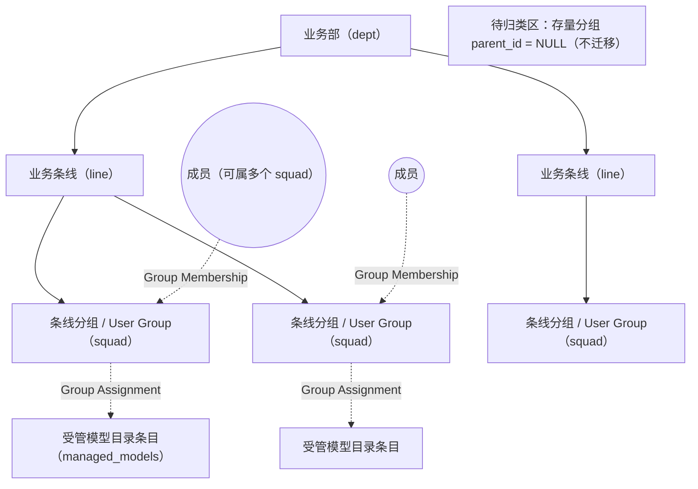
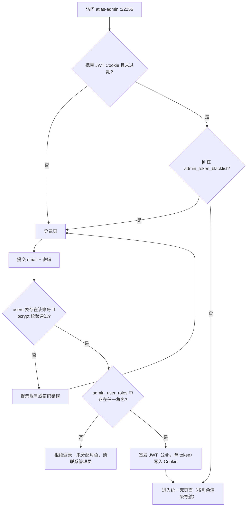
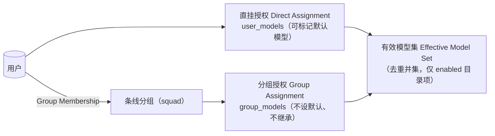

# atlas-admin 管理系统 — 需求分析文档

| 项 | 内容 |
|---|---|
| 项目名称 | atlas-admin 管理系统（独立管理工程） |
| 文档版本 | v1.1（需求确认稿：9 项待澄清问题已闭环，新增 FR-030/FR-031） |
| 编制日期 | 2026-08-20 |
| 需求分析流程状态 | 需求收集（八轮 grill + 补充轮 + 文档分析 + 现有代码查证）→ 需求整理与分析 → 需求评审 → **需求确认（第 12.4 节 9 项决议）** → 需求基线（本稿即为基线） |
| 事实来源 | `docs/atlas-admin-redesign.md`（八轮 grill 共识，下称"共识文档"）；`services/atlas-server/CONTEXT.md`（领域词典）；`docs/adr/0005-user-groups-org-tree.md`（ADR-0005）；atlas-server 现有代码（`internal/store/mysql.go`、`internal/store/user.go`、`internal/store/user_groups.go`、`internal/store/managed_model.go`、`internal/store/task_report.go`） |
| 术语权威 | 一律以 `services/atlas-server/CONTEXT.md` 为准，本文档不重复定义（见第 10 节术语表） |

---

## 1. 项目概述与范围

### 1.1 背景与定位

atlas-server 现有管理页（`/admin/users`、`/admin/groups`、`/admin/models`、`/admin/task-reports`，代码位于 `services/atlas-server/internal/admin/` 与 `services/atlas-server/web/admin/`）是扁平分组时代的产物，缺少组织层级、角色权限与条线化管理能力。本次新建 **atlas-admin 管理系统**：

- **全新独立 git 仓库**：`E:\work\mygit\architechure\atlas-admin`（远程仓库待用户创建），Go module `github.com/atlas-build/atlas-admin`。
- **独立进程**：监听 `:22256`（atlas-server 为 `:22255`），两系统并存、互不导航。
- **数据同源**：与 atlas-server 同一 MySQL 实例、同一 schema（`atlas` 库）直连读写，身份实时直读，无镜像同步。
- **atlas-server 一行代码不改**：现有 `/admin/*` 页面原样保留。

### 1.2 范围内（In Scope）

1. 独立登录与会话（JWT Cookie 24h、黑名单吊销、无角色拒登）。
2. 用户管理（增删改查、组织归属维护）。
3. 组织架构管理（三层树、待归类区、非空禁删、级联清理）。
4. 角色分配（五个固定角色、用户↔角色多对多）。
5. 条线负责人范围映射（负责人↔条线，独立映射表）。
6. 模型授权（沿用 `user_models` / `group_models` 语义，含 Effective Model Set 预览）。
7. 任务报告（列表 + 条线实时过滤 + 报告详情 + 稽核统计视图，Q7 决议）。
8. 首期六个页面与统一交互壳（详见第 8 节）。
9. 手工 SQL 迁移脚本（四张 `admin_` 前缀新表 + `user_groups` 加列，详见第 7 节）。

### 1.3 排除范围（Out of Scope，共识文档第 8 节）

首期 **明确不做**：

| 编号 | 排除项 | 说明 |
|---|---|---|
| OS-1 | 不改 atlas-server 任何代码/表结构 | 唯一例外：`user_groups` 加列由 atlas-admin 迁移脚本执行（ADR-0005） |
| OS-2 | 不做 SSO | 仅本地账号密码登录，复用 `users` 表 |
| OS-3 | 不做角色增删 | 五个固定角色（admin/line_lead/developer/tester/ba），`admin_roles` 仅预置记录 |
| OS-4 | 不做组织树继承授权 | 成员与模型授权只挂条线分组（squad）层，无跨层继承 |
| OS-5 | 不做批量操作与树拖拽 | 列为二期 |
| OS-6 | 不做系统设置页 | 当前无真实可管理配置项 |
| OS-7 | 不做普通用户自助门户 | 无 end-user 自助功能 |

以上排除项在优先级体系中统一标注为 **P3（Won't Have，本期不实现）**。

---

## 2. 干系人与角色

### 2.1 干系人

| 干系人 | 关注点 | 参与方式 |
|---|---|---|
| 系统管理员（admin） | 全量账号、组织、授权、报告管理 | 主要使用者 |
| 条线负责人（line_lead） | 本条线成员归属、分组管理、授权、任务报告 | 主要使用者 |
| 开发人员（developer） | 查看自己相关的授权与任务报告 | 受限使用者 |
| 测试人员（tester）/ BA | 只读查看组织与任务报告 | 只读使用者 |
| 部署运维人员 | 手工迁移、首个管理员 SQL 引导、双进程（22255/22256）并存部署 | 部署相关方 |
| atlas-server 维护者 | atlas-server 零改动承诺不被破坏 | 约束相关方 |

### 2.2 角色定义（固定五个，不可增删）

| 角色 key | 名称 | 定位 |
|---|---|---|
| `admin` | 管理员 | 全量管理：用户、组织、模型授权、任务报告、角色分配 |
| `line_lead` | 条线负责人 | 管辖范围由 `admin_line_leads` 映射决定（可与成员关系解耦） |
| `developer` | 开发人员 | 最小自助查看 |
| `tester` | 测试人员 | 只读观察 |
| `ba` | BA | 只读观察 |

角色通用规则（共识文档第 3 节）：

- 角色全局生效（按用户维度，不按组织节点维度）。
- 仅管理员可分配角色。
- **允许一人多角色**（如同一人既是 `line_lead` 又是 `developer`，权限取并集）。
- 登录时查询角色，**未分配任何角色的用户拒绝登录**。

### 2.3 权限矩阵（页面 × 角色）

| 功能区域 | admin | line_lead | developer | tester | ba |
|---|---|---|---|---|---|
| 登录 / 登出 | ✓ | ✓ | ✓ | ✓ | ✓ |
| 用户管理 | 全部（增删改查） | 仅本条线成员**归属维护** | 仅自己（能力边界见待澄清 Q2） | 不可见 | 不可见 |
| 组织架构 | 全部管理 | 本条线及以下分组管理 | 只读 | 只读 | 只读 |
| 角色分配（用户↔角色） | 全部 | 不可见 | 不可见 | 不可见 | 不可见 |
| 条线负责人范围映射 | 全部 | 不可见 | 不可见 | 不可见 | 不可见 |
| 模型授权 | 全部 | 本条线（本人负责条线下的条线分组及其成员） | 只读 | 不可见 | 不可见 |
| 任务报告 | 全部报告 | 本条线（实时过滤，见 FR-029） | 仅自己 | 只读（范围见待澄清 Q9） | 只读（范围见待澄清 Q9） |

> 越权访问（页面或接口）一律拒绝并返回无权提示；权限判定在服务端执行（FR-005）。

---

## 3. 总体业务流程

### 3.1 组织架构模型（三层树）



规则（ADR-0005 + 共识文档第 4 节）：

- 层级：业务部（dept）→ 业务条线（line）→ 条线分组（squad）。
- 成员（Group Membership）与模型授权（Group Assignment）**只挂 squad 层**，无跨层继承。
- 一个用户可属多个条线分组。
- 存量分组不迁移，`parent_id = NULL` 显示为"待归类"。

### 3.2 登录与会话流程



### 3.3 Effective Model Set 构成（授权语义，沿用现状）



---

## 4. 功能需求

编号规则：`FR-序号`，按模块分组。每条需求含：描述、来源、优先级（P0 Must / P1 Should / P2 Could）、适用角色范围、验收标准、依赖。

### 4.1 模块 A：登录与会话

**用户故事**

```
作为 任一已分配角色的用户
我想要 使用 atlas-server 同一账号密码登录独立的管理系统，并获得 24 小时有效的会话
以便于 无需新开账号即可获得受角色约束的管理入口
```

#### FR-001 独立登录与身份校验（P0）

- **描述**：提供 atlas-admin 独立登录页；身份复用 atlas-server `users` 表（实时直读，无镜像同步）。登录提交 email + 密码，服务端按 `users.password_hash` 进行 bcrypt 校验（与 atlas-server 同算法：`bcrypt.GenerateFromPassword` / `bcrypt.CompareHashAndPassword`，`bcrypt.DefaultCost`）。
- **来源**：共识文档 §2；代码事实 `internal/store/mysql.go`（`HashPassword`/`CheckPassword`）、`internal/store/user.go`。
- **适用范围**：全部角色（未登录用户仅可访问登录页）。
- **验收标准**：
  - [ ] 使用 atlas-server 中存在的账号 + 正确密码可登录成功，进入统一壳首页。
  - [ ] 密码错误时提示"账号或密码错误"，不区分"账号不存在"与"密码错误"两种情形的对外提示（防账号枚举）。
  - [ ] 登录过程直读 `users` 表，atlas-server 中新建/改密后的账号在 atlas-admin 立即可用（无同步延迟）。
  - [ ] 不修改 `users` 表任何既有行即可完成登录校验。
- **依赖**：D-1（迁移脚本已执行，`admin_user_roles` 表存在）。

#### FR-002 无角色拒登（P0）

- **描述**：登录成功校验密码后，查询 `admin_user_roles`；该用户未分配任何角色时拒绝登录，明确提示"未分配角色，请联系管理员"。
- **来源**：共识文档 §2。
- **适用范围**：全部用户。
- **验收标准**：
  - [ ] `users` 表存在、密码正确、但 `admin_user_roles` 无记录的用户，登录被拒绝并看到"未分配角色，请联系管理员"提示。
  - [ ] 拒登不签发 JWT、不建立会话。
  - [ ] 为该用户插入任一角色后（无需重启服务），再次登录即可成功。
- **依赖**：FR-001。

#### FR-003 JWT Cookie 会话（P0）

- **描述**：登录成功签发**单 token JWT**，有效期 **24 小时**，通过 Cookie 下发；后续请求凭该 Cookie 识别会话，无需再次登录。
- **来源**：共识文档 §2。
- **适用范围**：全部角色。
- **验收标准**：
  - [ ] 登录响应写入会话 Cookie；24 小时内重复访问免登录。
  - [ ] 超过 24 小时后访问任一受保护页面被重定向到登录页。
  - [ ] 会话 Cookie 属性（HttpOnly 等）按 NFR-007 安全要求设置。
- **依赖**：FR-001、FR-002。

#### FR-004 登出与令牌吊销（P0）

- **描述**：提供登出入口；登出时将当前 JWT 写入 `admin_token_blacklist`（记录 jti/payload 与过期时间）。被吊销 token 即使未满 24 小时也立即失效。
- **来源**：共识文档 §2、§5。
- **适用范围**：全部角色。
- **验收标准**：
  - [ ] 点击"登出"后，原 Cookie 访问任一受保护页面被重定向到登录页。
  - [ ] 登出前签发的同一 token 在登出后无法通过直接携带 Cookie 的方式访问任何受保护资源。
  - [ ] 黑名单中的过期记录不再影响新签发的 token（jti 不同）。
- **依赖**：FR-003、D-1。

#### FR-005 服务端统一访问控制（P0）

- **描述**：所有页面与操作按第 2.3 节权限矩阵在**服务端**判定；无权页面不出现在导航中，直接访问 URL 或提交请求均返回拒绝。角色为全局属性（按用户），一人多角色时权限取并集。
- **来源**：共识文档 §3。
- **适用范围**：全部角色。
- **验收标准**：
  - [ ] tester 直接输入用户管理 URL 访问被拒绝（403 或等价无权页），不泄露页面内容。
  - [ ] developer 请求 admin 才有的接口（如角色分配写操作）被服务端拒绝，即使伪造前端请求也无效。
  - [ ] 同时具有 line_lead + developer 双角色的用户，可见功能为两者并集。
  - [ ] 每个受保护页面/操作在未登录时重定向登录页。
- **依赖**：FR-003。

### 4.2 模块 B：用户管理

**用户故事**

```
作为 管理员
我想要 在一个页面对用户执行增删改查、维护其角色入口与条线分组归属
以便于 集中管理账号全生命周期，替代零散的手工 SQL 操作
```

#### FR-006 用户列表与查看（P0）

- **描述**：用户列表展示账号基础信息（userId、email、姓名、machine_code、创建时间，对齐 `users`/`ListUsersDetail` 字段）及关联信息（角色、条线分组归属）。支持搜索/筛选/分页/排序（第 8.2 节列表增强）。
- **来源**：共识文档 §6；代码事实 `internal/store/mysql.go`（`users` 表、`ListUsersDetail`）。
- **适用范围**：admin（全部用户）；line_lead 仅可见本条线成员（按 FR-028 同口径的当前归属推导）；developer 仅自己；tester/ba 不可见。
- **验收标准**：
  - [ ] admin 可查看全部用户，列表含角色与条线分组归属列。
  - [ ] line_lead 列表仅含本人负责条线下任一 squad 的当前成员。
  - [ ] developer 仅能看到自己一行。
  - [ ] 按邮箱/姓名关键字搜索、按创建时间排序、分页均可用。
- **依赖**：D-1、FR-005。

#### FR-007 创建用户（P0）

- **描述**：弹窗表单创建用户，写入 `users` 表；密码以 bcrypt（`bcrypt.DefaultCost`）哈希后存入 `password_hash`，不落明文。email 唯一（沿用 `users` 表唯一约束）。
- **来源**：共识文档 §2、§6；代码事实 `users.email UNIQUE`。
- **适用范围**：admin。
- **验收标准**：
  - [ ] 创建成功后新用户出现在列表，且能用该密码登录 atlas-server（同库同哈希验证）。
  - [ ] 重复 email 提交被行内校验/服务端拒绝并提示"邮箱已存在"。
  - [ ] 新建用户未分配角色前登录 atlas-admin 被 FR-002 拒绝。
  - [ ] 数据库中 `password_hash` 为 bcrypt 哈希（$2 前缀），无明文。
- **依赖**：FR-006、NFR-001。

#### FR-008 编辑用户与重置密码（P0）

- **描述**：弹窗编辑用户资料（姓名等非身份键字段）；支持重置密码（同样 bcrypt 哈希写入 `password_hash`）。
- **来源**：共识文档 §6。
- **适用范围**：admin。developer 对"仅自己"的可编辑能力见待澄清 Q2，首期按最小实现（至少只读查看）。
- **验收标准**：
  - [ ] 编辑姓名后列表即时更新。
  - [ ] 重置密码后，旧密码无法登录 atlas-server 与 atlas-admin，新密码可以。
  - [ ] 重置密码操作本身需要 admin 权限，非 admin 请求被拒绝。
- **依赖**：FR-006。

#### FR-009 删除用户与级联清理（P0）

- **描述**：删除用户时级联清理其**组织关系与角色映射**：`group_members`（Group Membership）、`user_models`（直挂授权）随 `users` 行删除而清理；`admin_user_roles`、`admin_line_leads` 映射同步清理。删除前弹窗确认。
- **来源**：共识文档 §4（"删除用户级联清理其组织关系与角色映射"）；代码事实：`group_members`/`user_models` 对 `users` 已有 `ON DELETE CASCADE` 外键。
- **适用范围**：admin。
- **验收标准**：
  - [ ] 删除后 `users`、`group_members`、`user_models`、`admin_user_roles`、`admin_line_leads` 中均无该 user_id 残留。
  - [ ] 删除曾任条线负责人的用户后，其 `admin_line_leads` 映射一并清理，不影响条线节点本身。
  - [ ] 删除操作需二次确认，取消则不产生任何变更。
  - [ ] 被删用户的存量 Task Report 处理口径见待澄清 Q1（首期按"报告保留、Report User 字符串照旧展示"理解，待确认）。
- **依赖**：FR-006、D-1。

#### FR-010 用户组织归属维护（P0）

- **描述**：在用户管理页维护用户的条线分组（squad）归属：可将用户加入/移出 squad，**一个用户可属多个 squad**（Group Membership 多对多）。
- **来源**：共识文档 §4、§6。
- **适用范围**：admin（全部用户）；line_lead 仅对本条线下 squad 的成员归属做维护（共识"用户管理=本条线成员归属"）。
- **验收标准**：
  - [ ] 可将同一用户同时挂到两个不同条线的 squad，两处均正确显示。
  - [ ] 从全部 squad 移出后，该用户组织归属为空，条线过滤不再命中其报告（FR-028）。
  - [ ] line_lead 只能操作本人负责条线下 squad 的成员归属，对其他条线 squad 的写请求被拒绝。
- **依赖**：FR-006、FR-011。

### 4.3 模块 C：组织架构管理

**用户故事**

```
作为 管理员
我想要 以 业务部→业务条线→条线分组 三层树管理组织，并把存量分组归位
以便于 组织结构与授权范围一致，条线数据可按树过滤
```

#### FR-011 组织树展示（P0）

- **描述**：树形展示组织架构：业务部（dept）→ 业务条线（line）→ 条线分组（squad），节点显示名称、类型、成员数、分组授权数（沿用 `UserGroupBrief` 口径）。数据来自 `user_groups` 加列后的 `parent_id` / `node_type`。
- **来源**：共识文档 §4、§6；ADR-0005；代码事实 `internal/store/user_groups.go`。
- **适用范围**：admin/line_lead 管理；developer/tester/ba 只读。
- **验收标准**：
  - [ ] 树按 dept→line→squad 三层正确渲染，层级关系与 `parent_id` 一致。
  - [ ] 每个节点展示成员数与分组授权数。
  - [ ] 只读角色可见整棵树但无操作按钮（或按钮禁用）。
- **依赖**：D-1（`user_groups` 加列完成）。

#### FR-012 待归类区（P0）

- **描述**：`parent_id = NULL` 的存量分组不迁移，单独显示在"待归类"区域，等待管理员归位。
- **来源**：共识文档 §4；ADR-0005。
- **适用范围**：同 FR-011。
- **验收标准**：
  - [ ] 存量分组（迁移前已存在、未设置 parent_id）出现在待归类区，不出现在树中。
  - [ ] 待归类节点的既有成员与分组授权数据保持可见且不变。
  - [ ] 归位后节点从待归类区消失并出现在树上（见 FR-014）。
- **依赖**：FR-011。

#### FR-013 节点创建与重命名（P0）

- **描述**：支持创建三类节点（dept/line/squad，`node_type` 必须正确设置）与重命名（沿用名称大小写不敏感唯一约束 `uk_user_groups_name`）。
- **来源**：共识文档 §4、§6；代码事实 `user_groups` UNIQUE(name)、`UpdateUserGroup`。
- **适用范围**：admin 全部层级；line_lead 仅本条线及以下（新建 squad、重命名，见 FR-017）；其余角色只读。
- **验收标准**：
  - [ ] 可分别创建 dept、line、squad 三类节点，`node_type` 落库正确。
  - [ ] 创建/重命名时名称与既有节点重复（不区分大小写）被拒绝并提示。
  - [ ] 创建 line 时可指定其上级 dept；创建 squad 时可指定其上级 line。
  - [ ] line_lead 在本人负责条线下创建的 squad 正确挂到该条线。
- **依赖**：FR-011。

#### FR-014 节点归类与移动（P0 归类 / P1 树上移动）

- **描述**：将待归类节点挂到树上（指定父节点，归位后成为其父 line 下的 squad）；树上已有节点的**单点**跨父移动（如 squad 从条线 A 移到条线 B）为 P1。批量与拖拽交互为二期（OS-5）。
- **来源**：ADR-0005（"until an admin places them"）；树上移动未在共识中明确，列为 P1 并入待澄清 Q3。
- **适用范围**：admin；line_lead 移动操作仅限本人负责条线内部。
- **验收标准**：
  - [ ] 待归类节点归位后 `parent_id` 指向目标 line 节点，树上位置正确，成员与分组授权不丢失。
  - [ ] 归位操作拒绝把节点挂到非法父级（dept 只能作为根、line 的父必须是 dept、squad 的父必须是 line）。
  - [ ] （P1）树上单点移动仅更新 `parent_id`，不改变成员与授权。
- **依赖**：FR-011、FR-012。

#### FR-015 非空禁删（P0）

- **描述**：**有子节点、有成员（Group Membership）、有分组授权（Group Assignment）的组织节点禁止删除**。删除仅允许作用于"空"节点。
- **来源**：共识文档 §4。
- **适用范围**：admin；line_lead 限本条线及以下。
- **验收标准**：
  - [ ] 含子节点的 dept/line 删除请求被拒绝，提示"存在子节点"。
  - [ ] 含成员的 squad 删除请求被拒绝，提示"存在成员"。
  - [ ] 含 `group_models` 授权的 squad 删除请求被拒绝，提示"存在模型授权"。
  - [ ] 清空成员与授权、无子节点后可删除，删除后待归类/树正确刷新。
- **依赖**：FR-011。

#### FR-016 squad-only 授权挂载约束（P0）

- **描述**：成员（Group Membership）与模型授权（Group Assignment）**只允许挂在 squad 层**；dept/line 节点不提供成员与授权操作入口，服务端同样拒绝该类写入（无跨层继承）。
- **来源**：共识文档 §4；ADR-0005；CONTEXT.md（Group Assignment 条目）。
- **适用范围**：全部可写角色。
- **验收标准**：
  - [ ] dept/line 节点详情无"添加成员/添加授权"入口。
  - [ ] 直接向服务端提交"把用户加入 line 节点"或"给 line 节点配 group_models"的请求被拒绝。
  - [ ] 某用户的有效模型集仅由其直挂授权 + 所在 squad 的分组授权构成，与所在 line/dept 无关（与 FR-026 预览一致）。
- **依赖**：FR-011、FR-024、FR-025。

#### FR-017 line_lead 组织管理范围（P0）

- **描述**：条线负责人的组织管理范围限定为**本人负责条线及其以下的条线分组**：可新建/重命名/归位成员到本条线 squad、删除本条线空 squad；不可创建/修改/删除 dept 与其他条线。
- **来源**：共识文档 §3（"组织=本条线及以下分组管理"）。
- **适用范围**：line_lead。
- **验收标准**：
  - [ ] line_lead 可在本人负责条线下新建 squad 并维护成员。
  - [ ] line_lead 对其他条线的任何写操作（改名/删除/移动）被拒绝。
  - [ ] line_lead 不能新建 line 或 dept，也不能把 squad 挂到其他条线下。
- **依赖**：FR-013、FR-014、FR-015、FR-021。

### 4.4 模块 D：角色分配

**用户故事**

```
作为 管理员
我想要 给用户分配一个或多个固定角色，并通过手工 SQL 引导出首个管理员
以便于 权限体系冷启动与日常授权都有明确入口
```

#### FR-018 用户角色分配（P0）

- **描述**：角色分配页面维护用户↔角色：仅 admin 可操作；角色集合固定为五个（展示自 `admin_roles` 预置记录）；允许一人多角色（多行映射）。分配与回收立即生效（下次请求按新角色判定）。
- **来源**：共识文档 §3、§6。
- **适用范围**：admin（页面与操作）；其他角色不可见该页面。
- **验收标准**：
  - [ ] 可为用户分配多个角色（如 line_lead + developer），登录后权限为并集。
  - [ ] 回收用户全部角色后，其现有会话按 FR-023 处理；再次登录被 FR-002 拒绝。
  - [ ] 非 admin 用户访问角色分配页面/接口被拒绝。
  - [ ] 界面无法发起新增/删除角色本体的操作（OS-3）。
- **依赖**：D-1、FR-005。

#### FR-019 首个管理员 SQL 引导（P0）

- **描述**：冷启动无任何角色数据时，通过**手工 SQL** 向 `admin_user_roles` 插入第一个 admin 记录。迁移脚本/部署说明须提供可直接执行的 INSERT 示例（含注释说明目标用户）。
- **来源**：共识文档 §2、§5。
- **适用范围**：部署运维人员。
- **验收标准**：
  - [ ] `scripts/migrate.sql`（或配套部署说明）包含首个管理员的 INSERT 示例与步骤说明。
  - [ ] 空库执行迁移 + 引导 SQL 后，目标账号可登录 atlas-admin 并获得 admin 全部权限。
  - [ ] 未执行引导 SQL 前，任何账号都无法通过登录进入系统（全部被 FR-002 拒绝）。
- **依赖**：D-1、D-2。

#### FR-020 角色变更生效（P0）

- **描述**：角色与范围映射的变更**实时生效**，无需重启服务或等待会话过期；已登录会话的权限按最新角色数据判定。
- **来源**：共识文档 §3（"角色全局生效"）推导；会话令牌不携带过期权限快照。
- **验收标准**：
  - [ ] 回收某在线用户的 line_lead 角色后，该用户刷新页面即失去条线相关页面（无需重新登录）。
  - [ ] 新增某用户的角色后，该用户刷新页面即可见新功能入口。
- **依赖**：FR-005、FR-018。

### 4.5 模块 E：条线负责人范围映射

**用户故事**

```
作为 管理员
我想要 用独立映射表指定每个条线负责人负责哪些业务条线
以便于 授权范围与组织成员关系解耦，一人可负责多条线
```

#### FR-021 负责人↔条线映射维护（P0）

- **描述**：在角色分配页维护 `admin_line_leads` 映射：仅 admin 可操作；映射目标是 `node_type = 'line'` 的组织节点；**一个用户可负责多条线**；映射与该用户是否为条线成员**无关（解耦）**。
- **来源**：共识文档 §3、§5。
- **适用范围**：admin。
- **验收标准**：
  - [ ] 可将同一用户映射到两个不同 line 节点，两线数据均对其可见（组织管理、授权、报告过滤同时生效）。
  - [ ] 映射目标下拉仅列出 `node_type = 'line'` 的节点。
  - [ ] 移除映射后，该用户即刻失去对应条线的可见范围（刷新即生效，FR-020）。
  - [ ] 非映射 line 的数据对其保持不可见。
- **依赖**：FR-011、FR-018。

#### FR-022 映射与成员关系解耦（P0）

- **描述**：`admin_line_leads` 是独立的范围映射，不依赖、不隐含任何 Group Membership；成为负责人不需要加入该条线任何 squad，退出 squad 也不影响负责人身份。
- **来源**：共识文档 §3。
- **适用范围**：admin / line_lead。
- **验收标准**：
  - [ ] 未加入某条线任何 squad 的用户被设为该线负责人后，立即可管理该线及以下 squad、查看该线报告。
  - [ ] 将负责人移出其条线全部 squad 后，其负责人权限不变。
- **依赖**：FR-021。

### 4.6 模块 F：模型授权

**用户故事**

```
作为 管理员/条线负责人
我想要 沿用直挂授权与分组授权两套语义维护模型可见范围，并预览用户的有效模型集
以便于 与 atlas-server 运行时行为完全一致，不产生两套口径
```

> 本模块**沿用** `user_models`（直挂授权，含默认模型标记）与 `group_models`（分组授权，仅 squad）的现有语义，仅重做页面交互；不改变任何表结构与 atlas-server 判定逻辑（OS-1）。

#### FR-023 受管模型目录读取（P0）

- **描述**：授权页面从 `managed_models` 读取可授权的目录条目（id、名称、enabled 状态等），作为直挂/分组授权的选择数据源。Effective Model Set 按词典定义**仅计入 enabled 目录项**。
- **来源**：共识文档 §5；CONTEXT.md（Effective Model Set、Managed Catalog Mode）；代码事实 `managed_models` 表。
- **适用范围**：admin 全部；line_lead 本条线；developer 只读。
- **验收标准**：
  - [ ] 授权选择列表来自 `managed_models` 实时数据，包含 enabled 标记。
  - [ ] 在 atlas-server 侧新增/停用目录条目后，atlas-admin 授权页刷新即反映最新状态。
  - [ ] 停用条目的处理不改变 Effective Model Set 判定口径（仅 enabled 计入，与 CONTEXT.md 一致）。
- **依赖**：NFR-001。

#### FR-024 用户直挂授权（P0）

- **描述**：维护用户的 Direct Assignment（`user_models`）：可为用户挂/摘目录条目，并可**标记其中一个为该用户默认模型**（`is_default`，与现有语义一致：一个用户至多一个默认）。
- **来源**：共识文档 §5；CONTEXT.md（Direct Assignment）；代码事实 `user_models(user_id, model_id, is_default)`、`SetUserModels(userID, modelIDs, defaultID)`。
- **适用范围**：admin 全部用户；line_lead 仅本条线成员。
- **验收标准**：
  - [ ] 直挂多个模型后，`user_models` 中该用户行数正确。
  - [ ] 标记默认模型后，仅一个 `is_default = 1`（换标时旧默认自动取消）。
  - [ ] 摘除全部直挂授权后，若用户无分组授权，其按 Managed Catalog Mode 语义回退 probe/upstream/builtin 行为（与 atlas-server 一致）。
  - [ ] line_lead 只能操作本人负责条线成员的直挂授权。
- **依赖**：FR-023、FR-016。

#### FR-025 分组授权（P0）

- **描述**：维护条线分组（仅 squad）的 Group Assignment（`group_models`）：为 squad 配置目录条目集合；**分组授权不设默认模型、不跨层继承**，仅贡献可见性。
- **来源**：共识文档 §5；CONTEXT.md（Group Assignment）；代码事实 `group_models(group_id, model_id)`、`SetGroupModels`。
- **适用范围**：admin 全部；line_lead 仅本条线下 squad。
- **验收标准**：
  - [ ] 为 squad 配置模型后，其全部当前成员的有效模型集包含这些条目（去重后）。
  - [ ] dept/line 节点无法配置分组授权（FR-016）。
  - [ ] 分组授权界面无"默认模型"选项。
  - [ ] squad 授权变化后，新加入成员自动获得该分组授权，退出成员自动失去（成员关系驱动，无继承）。
- **依赖**：FR-023、FR-016。

#### FR-026 Effective Model Set 预览（P0）

- **描述**：在授权页面提供用户维度预览：展示该用户有效模型集的**去重并集**、每个条目的来源（direct / group + 所属条线分组）以及默认模型（仅直挂授权可标记）。判定口径与 atlas-server 运行时及 CONTEXT.md 定义**完全一致**。
- **来源**：共识文档 §5、§6；CONTEXT.md（Effective Model Set）；代码事实 `ListEffectiveModels`（direct ∪ group，source 标注，default 取自 direct）。
- **适用范围**：admin 全部用户；line_lead 本条线成员；developer 只读（自己）。
- **验收标准**：
  - [ ] 预览模型数 = 去重后的直挂 ∪ 分组授权并集，无重复条目。
  - [ ] 每个条目标注来源：direct 或 group（含条线分组名称）。
  - [ ] 默认模型仅可能来自直挂授权；无直挂默认时默认模型显示为空。
  - [ ] 同一用户在 atlas-server `/v1/models` 的实际返回（Managed Catalog Mode）与预览集合一致（抽查验证）。
- **依赖**：FR-024、FR-025。

### 4.7 模块 G：任务报告

**用户故事**

```
作为 条线负责人
我想要 查看本条线成员上报的任务报告列表，范围按上报人当前组织归属实时推导
以便于 掌握本条线工作情况，且无需维护历史快照
```

#### FR-027 任务报告列表（P0）

- **描述**：以列表展示 Task Report（`task_reports` 表）：每条任务的使用记录，按 Report User（报告体内的 userId/email，非令牌推导）归属。支持搜索/筛选/分页/排序；明细列与筛选字段（Q7 决议）：时间、Report User、subagent_type、model、status/success、时长、tokens；筛选：日期范围、Report User、状态。
- **来源**：共识文档 §6、§7；CONTEXT.md（Task Report、Report User、Client Version）；代码事实 `task_reports` 表字段。
- **适用范围**：admin 全部；line_lead 本条线；developer 仅自己；tester/ba 只读。
- **验收标准**：
  - [ ] 列表分页展示报告明细，行数与 `task_reports` 实际数据一致（按可见范围）。
  - [ ] 同一报告只归属其 Report User（以报告体 userId 为准），不受浏览者推断影响。
  - [ ] developer 仅看到 Report User 为自己的报告。
  - [ ] tester/ba 只读：无任何写入口（本页全角色均只读）。
- **依赖**：NFR-001、FR-005。

#### FR-028 条线实时过滤（P0）

- **描述**：条线负责人可见范围按上报人**当前**组织归属**实时**推导：Report User 挂在某条线下任一 squad 即算该条线的人；**跨多条线用户的报告在其所属每条线负责人的视图中均可见**；**历史报告不做条线快照**（用户调动条线后，其历史报告随当前归属出现在新条线，从旧条线消失）。
- **来源**：共识文档 §7。
- **适用范围**：line_lead。
- **验收标准**：
  - [ ] 负责人 A 负责条线 L1：Report User 挂在 L1 下任一 squad 的报告对 A 可见；只挂 L2 的报告不可见。
  - [ ] Report User 同时挂在 L1、L2 的 squad 时，L1 与 L2 的负责人都能看到其全部报告。
  - [ ] 将用户从 L1 的 squad 移到 L2 的 squad 后，刷新即见其历史报告出现在 L2 负责人视图、不再出现在 L1 负责人视图（无快照）。
  - [ ] 无任何 squad 归属的用户报告，对任何 line_lead 不可见（仅 admin/tester/ba/本人按各自范围可见）。
  - [ ] 过滤为查询期实时联查推导，不写入报告表任何冗余字段（OS-1）。
- **依赖**：FR-010、FR-027、D-1。

#### FR-029 报告数据只读（P0）

- **描述**：任务报告页面为纯只读查询页（全部角色）；不提供编辑、删除报告的操作。
- **来源**：共识文档 §6（"列表 + 条线过滤"）；OS-1（不改 atlas-server 表数据语义）。
- **验收标准**：
  - [ ] 页面与接口层均无报告写操作入口。
  - [ ] 伪造写请求被服务端拒绝。
- **依赖**：FR-027。

#### FR-030 报告详情（P1，Q7 决议新增）

- **描述**：任务报告明细行可进入详情视图，展示报告完整字段，含 prompt、error 等敏感内容。
- **来源**：需求评审补充轮 Q7 决议（B + 稽核统计视图）。
- **适用范围**：admin 全部详情；line_lead 本条线范围内详情；developer 仅自己的报告详情；tester/ba 全部报告详情。
- **验收标准**：
  - [ ] 明细行点击可进入详情，字段与报告落库内容一致。
  - [ ] 详情可见范围与列表可见范围一致（条线过滤同样作用于详情）。
  - [ ] tester/ba 可查看全部报告详情，但无任何写操作。
- **依赖**：FR-027、FR-028。

#### FR-031 稽核统计视图（P1，Q7 决议新增）

- **描述**：任务报告页提供聚合统计视图：按 Report User / 业务条线 / 日期维度聚合报告量、tokens、时长等指标；可见范围与明细列表一致（条线过滤作用于聚合）。
- **来源**：需求评审补充轮 Q7 决议（B + 稽核统计视图）。
- **适用范围**：同 FR-027/FR-028 的角色范围。
- **验收标准**：
  - [ ] 聚合数字与按相同筛选条件查库的聚合 SQL 结果一致。
  - [ ] line_lead 的聚合仅统计本条线范围。
  - [ ] developer 聚合仅统计自己。
- **依赖**：FR-027、FR-028、FR-030。

---

### UC-LOGIN-001 登录 atlas-admin

| 字段 | 说明 |
|------|------|
| 用例名称 | 登录 atlas-admin |
| 用例编号 | UC-LOGIN-001 |
| 参与者 | 任一已分配角色的用户 |
| 前置条件 | 迁移脚本已执行；用户存在于 `users` 表且在 `admin_user_roles` 有至少一条角色记录 |
| 后置条件 | 用户获得 24h JWT Cookie 会话，进入统一壳首页，导航按角色渲染 |
| 基本流程 | 1. 用户访问 `:22256` → 2. 未登录重定向登录页 → 3. 输入 email/密码提交 → 4. 服务端 bcrypt 校验通过 → 5. 查询 `admin_user_roles` 命中角色 → 6. 签发 JWT 写 Cookie → 7. 进入首页 |
| 备选流程 | 4a. 密码错误 → 提示"账号或密码错误"，停留登录页；5a. 无任何角色 → 提示"未分配角色，请联系管理员"，不签发 token |
| 业务规则 | 身份实时直读 `users`；未分配角色一律拒登（FR-002）；token 24h（FR-003） |

### UC-USER-001 删除用户

| 字段 | 说明 |
|------|------|
| 用例名称 | 删除用户 |
| 用例编号 | UC-USER-001 |
| 参与者 | admin |
| 前置条件 | admin 已登录；目标用户存在于列表 |
| 后置条件 | `users` 无该行；其 Group Membership、直挂授权、`admin_user_roles`、`admin_line_leads` 映射全部清理 |
| 基本流程 | 1. admin 在用户列表点击删除 → 2. 弹窗确认 → 3. 服务端执行级联删除 → 4. 列表刷新 |
| 备选流程 | 2a. 取消确认 → 无变更；3a. 级联清理失败 → 整体回滚，提示错误 |
| 业务规则 | 删除用户级联清理组织关系与角色映射（FR-009）；存量报告归属口径见待澄清 Q1 |

### UC-ORG-001 归类"待归类"节点

| 字段 | 说明 |
|------|------|
| 用例名称 | 归类待归类节点 |
| 用例编号 | UC-ORG-001 |
| 参与者 | admin |
| 前置条件 | 迁移加列完成；待归类区存在存量分组 |
| 后置条件 | 节点 `parent_id` 指向目标 line，树上显示为其下 squad；成员与分组授权不变 |
| 基本流程 | 1. 打开组织架构页 → 2. 在待归类区选择节点 → 3. 选择目标父级（line）→ 4. 确认归位 → 5. 节点移入树 |
| 备选流程 | 3a. 选择了非 line 父级 → 拒绝并提示合法父级规则 |
| 业务规则 | 存量数据不迁移、只归位（ADR-0005）；父级类型合法性校验（FR-014）；成员与授权只挂 squad（FR-016） |

### UC-ORG-002 删除组织节点

| 字段 | 说明 |
|------|------|
| 用例名称 | 删除组织节点 |
| 用例编号 | UC-ORG-002 |
| 参与者 | admin / line_lead（限本条线及以下） |
| 前置条件 | 目标节点存在 |
| 后置条件 | 节点从树/待归类区移除 |
| 基本流程 | 1. 选择节点点击删除 → 2. 服务端检查子节点/成员/分组授权均为空 → 3. 弹窗确认 → 4. 删除并刷新 |
| 备选流程 | 2a. 存在子节点/成员/授权 → 拒绝删除，分别提示原因 |
| 业务规则 | 非空禁删（FR-015）；line_lead 范围限制（FR-017） |

### UC-ROLE-001 分配角色与条线范围

| 字段 | 说明 |
|------|------|
| 用例名称 | 分配角色与条线范围 |
| 用例编号 | UC-ROLE-001 |
| 参与者 | admin |
| 前置条件 | admin 已登录；目标用户存在 |
| 后置条件 | 用户角色与（若为 line_lead）负责条线映射生效，实时生效 |
| 基本流程 | 1. 打开角色分配页 → 2. 选择用户 → 3. 勾选一个或多个固定角色 → 4. 若含 line_lead，选择负责条线（可多选）→ 5. 保存 |
| 备选流程 | 4a. 未选择任何条线 → 保存成功但该负责人暂无可见范围（映射为空） |
| 业务规则 | 仅 admin 可分配（FR-018）；角色固定五个不可增删（OS-3）；映射与成员关系解耦、一人可多条线（FR-021/FR-022） |

### UC-MODEL-001 维护模型授权并预览有效模型集

| 字段 | 说明 |
|------|------|
| 用例名称 | 维护模型授权并预览有效模型集 |
| 用例编号 | UC-MODEL-001 |
| 参与者 | admin（line_lead 限本条线） |
| 前置条件 | 受管模型目录（`managed_models`）已有条目 |
| 后置条件 | 直挂授权/分组授权落库；用户有效模型集按词典口径更新 |
| 基本流程 | 1. 打开模型授权页 → 2. 选择用户（直挂）或条线分组（分组授权）→ 3. 从目录勾选条目（直挂可选默认模型）→ 4. 保存 → 5. 打开该用户预览，核对并集与来源 |
| 备选流程 | 3a. 直挂选择第二个"默认" → 自动替换旧默认，保持至多一个 |
| 业务规则 | 沿用 `user_models`/`group_models` 语义，不改表结构（OS-1）；分组授权仅 squad、无默认、无继承（FR-016/FR-025）；预览与 atlas-server 运行时一致（FR-026） |

### UC-RPT-001 条线负责人查看本条线任务报告

| 字段 | 说明 |
|------|------|
| 用例名称 | 条线负责人查看本条线任务报告 |
| 用例编号 | UC-RPT-001 |
| 参与者 | line_lead |
| 前置条件 | line_lead 已登录且已映射负责条线 |
| 后置条件 | 无数据变更（只读） |
| 基本流程 | 1. 打开任务报告页 → 2. 系统按其负责条线自动过滤 → 3. 实时推导：Report User 当前挂在任一所属 squad 即计入 → 4. 列表分页浏览 |
| 备选流程 | 3a. Report User 跨多条线 → 该报告在每条所属线的负责人视图均出现；3b. Report User 无 squad 归属 → 对 line_lead 不可见 |
| 业务规则 | 按当前归属实时推导、无历史快照（FR-028）；Report User 取报告体 userId/email（CONTEXT.md） |

---

## 6. 非功能需求

| 编号 | 类别 | 需求 | 优先级 | 验收标准 |
|---|---|---|---|---|
| NFR-001 | 数据架构 | 与 atlas-server **同一 MySQL 实例、同一 schema（`atlas` 库）直连读写**；身份实时直读，无镜像、无同步任务、无双写 | P0 | atlas-admin 所有用户/组织/授权/报告数据均直接读写 `atlas` 库；在 atlas-server 侧的变更（新用户、新目录条目）无需任何同步动作即可在 atlas-admin 可见 |
| NFR-002 | 零改动承诺 | **atlas-server 一行代码不改**：不改代码、不改既有表结构；现有 `/admin/*` 页面原样保留并与新 admin 并存、互不导航。唯一例外：`user_groups` 加列由 atlas-admin 迁移脚本执行 | P0 | 部署 atlas-admin 前后 atlas-server 代码库无 diff；atlas-server 现有管理页与 API 功能回归通过；`user_groups` 加列不影响 atlas-server 既有 SQL（ADR-0005 论证成立） |
| NFR-003 | 技术栈 | Go + 服务端渲染 HTML（无前端框架），工程风格与 atlas-server 一致；module `github.com/atlas-build/atlas-admin` | P0 | 构建产物为单一 Go 服务；页面为服务端渲染输出，不引入前端框架依赖 |
| NFR-004 | 部署形态 | 独立进程监听 **`:22256`**（atlas-server 为 `:22255`）；独立仓库 `E:\work\mygit\architechure\atlas-admin` | P0 | 双进程同时运行互不干扰；atlas-admin 通过 22256 端口访问 |
| NFR-005 | 配置管理 | TOML 配置文件 `atlas-admin.toml`；`ATLAS_ADMIN_*` 环境变量可覆盖配置项 | P0 | 修改环境变量无需改配置文件即可覆盖对应配置（如 DSN、监听地址）；配置加载优先级：环境变量 > 配置文件 |
| NFR-006 | 数据迁移 | 建表/加列走**手工 SQL 脚本**（仓库 `scripts/migrate.sql`），服务启动**不自动迁移** | P0 | 未执行脚本的库上服务可启动但功能不可用并给出明确错误提示；脚本可重复执行不出错（幂等） |
| NFR-007 | 安全 | ① 密码校验用 bcrypt（与 atlas-server 同算法同 cost），密码明文不落库、不写日志；② JWT Cookie 会话，Cookie 需 HttpOnly（其余属性如 Secure/SameSite 由详细设计确定）；③ 黑名单吊销即时生效；④ 权限矩阵服务端强制执行；⑤ 未分配角色拒登 | P0 | 见 FR-001~FR-005、FR-007 验收标准；日志与数据库中检索不到任何明文密码 |
| NFR-008 | 性能 | 常规管理操作（用户/组织/授权 CRUD）服务端处理 < 200ms；任务报告等复杂列表查询（分页 + 条线过滤）< 1s（对齐规范性能指标） | P1 | 常规操作 P95 < 200ms；报告列表页（万级报告量、分页）P95 < 1s |
| NFR-009 | 界面语言 | 全中文界面 | P0 | 全部页面文案为中文 |

---

## 7. 数据需求

### 7.1 新增表（`admin_` 前缀，四张）

> 以下为**需求级意图**（字段口径与级联规则），具体 DDL 由详细设计（Role 3）产出并落入 `scripts/migrate.sql`。新表外键列的字符集/排序规则需与 `users.user_id` 保持一致（参照 `mysql.go` 中 `migrateUserGroups` 的 collation 实践）。

| 表 | 用途 | 关键内容（意图级） | 级联/约束要求 |
|---|---|---|---|
| `admin_roles` | 预置 5 个固定角色记录，**仅为外键引用与展示** | 5 行预置数据（admin / line_lead / developer / tester / ba） | 应用不提供对该表的增删操作（OS-3）；迁移脚本负责预置 |
| `admin_user_roles` | 用户↔角色映射 | user_id → 角色；一人多角色 = 多行 | 删除用户时级联清理（FK CASCADE 或事务保证，与 FR-009 口径一致）；同一(user, role) 唯一 |
| `admin_line_leads` | 条线负责人范围映射 | user_id → line 类型组织节点（`user_groups.group_id` 且 `node_type='line'`）；一人多条线 = 多行 | 删除用户时级联清理；映射目标须为 line 节点；line 节点被删时的处理见待澄清 Q5 |
| `admin_token_blacklist` | JWT 吊销黑名单 | jti / payload + 过期时间 | 登出写入（FR-004）；过期记录可清理（清理策略属详细设计）；查询按 jti 精确匹配 |

### 7.2 `user_groups` 加列（引用 ADR-0005）

| 项 | 要求 |
|---|---|
| 加列方式 | **增量加列**，两列均可空/带默认：`parent_id`（可空、自引用 `user_groups.group_id`）、`node_type`（dept / line / squad） |
| 存量数据 | **不迁移**：既有行 `parent_id = NULL`，界面显示为"待归类" |
| 兼容性 | atlas-server 既有 SQL 不受影响（成员与授权只挂 squad、无跨层继承，既有 JOIN 结论不变，ADR-0005 论证） |
| 回滚 | 删除两列即可回滚，授权数据不受影响（ADR-0005） |
| 执行方 | atlas-admin 仓库 `scripts/migrate.sql` 手工执行，atlas-server 代码零改动（OS-1） |

### 7.3 沿用表（不新建、不改结构）

| 表 | 用途 | atlas-admin 操作 |
|---|---|---|
| `users` | 身份与账号 | 读写（登录校验、用户 CRUD） |
| `user_models` | 直挂授权（含 `is_default`） | 读写 |
| `group_members` | Group Membership | 读写 |
| `group_models` | Group Assignment | 读写 |
| `user_groups` | 组织节点（加列后为树） | 读写（含 `parent_id`/`node_type`） |
| `managed_models` | 受管模型目录 | 只读 |
| `task_reports` | 任务报告 | 只读（条线过滤为查询期实时推导，不写冗余字段） |

### 7.4 迁移脚本要求（`scripts/migrate.sql`）

1. **手工执行**：服务启动不自动迁移（NFR-006）。
2. 内容覆盖：四张 `admin_` 新表建表与 `admin_roles` 预置数据、`user_groups` 两列加列、首个管理员 `INSERT` 示例（注释说明，FR-019）。
3. **幂等**：可重复执行不出错（已存在的表/列跳过）。
4. 附执行与回滚说明（回滚 = 删 `admin_*` 表 + 删两列，ADR-0005）。

### 7.5 依赖与约束清单

| 编号 | 依赖/约束 | 影响的需求 |
|---|---|---|
| D-1 | `scripts/migrate.sql` 已在 `atlas` 库执行（含 `user_groups` 加列） | 全部功能需求 |
| D-2 | 首个管理员引导 SQL 已执行 | FR-018、FR-019 及全部需登录的功能 |
| D-3 | atlas-server 零改动承诺（OS-1/NFR-002） | 全部写操作不得破坏既有表语义 |
| D-4 | 领域判定口径以 `services/atlas-server/CONTEXT.md` 为准 | FR-023~FR-028 |

---

## 8. 页面与交互需求

### 8.1 首期页面清单（六页，全量重做）

| # | 页面 | 核心内容 | 主要角色 | 对应需求 |
|---|---|---|---|---|
| 1 | 登录页 | email + 密码；无角色拒登提示 | 全部 | FR-001~FR-002 |
| 2 | 用户管理 | 用户增删改查、角色分配入口、组织归属维护 | admin（line_lead/developer 受限） | FR-006~FR-010 |
| 3 | 组织架构 | 树形展示（业务部→条线→条线分组）+ 待归类区 | admin/line_lead 管理；其余只读 | FR-011~FR-017 |
| 4 | 角色分配 | 用户↔角色；条线负责人↔条线范围 | admin | FR-018~FR-022 |
| 5 | 模型授权 | 用户直挂 / 条线分组授权 + Effective Model Set 预览 | admin/line_lead；developer 只读 | FR-023~FR-026 |
| 6 | 任务报告 | 列表 + 条线实时过滤 + 详情 + 稽核统计视图 | 按矩阵范围只读 | FR-027~FR-031 |

### 8.2 交互要求（三项，首期）

1. **统一壳**：左侧导航 + 顶栏（当前用户信息 + 登出）；导航项按角色权限矩阵动态渲染（无权页面不出现）。
2. **列表增强**：全部列表页支持搜索、筛选、分页、排序。
3. **弹窗表单**：编辑类操作采用弹窗 + 行内校验（如必填、email 重复、名称重复即时提示）。

### 8.3 视觉基调

- 中文界面（NFR-009）。
- **蓝色系（#1976d2 家族）**、卡片 + 表格布局，延续现有管理页风格。

### 8.4 二期预留（本期不做，OS-5）

- 批量操作（批量调角色/授权/移动）。
- 组织树拖拽交互。

---

## 9. 需求追溯矩阵

| 需求 | 来源 | 需求 | 来源 | 需求 | 来源 |
|---|---|---|---|---|---|
| FR-001 登录校验 | 共识§2 + mysql.go/user.go | FR-011 组织树 | 共识§4/§6 + ADR-0005 | FR-021 范围映射 | 共识§3/§5 |
| FR-002 无角色拒登 | 共识§2 | FR-012 待归类 | 共识§4 + ADR-0005 | FR-022 解耦规则 | 共识§3 |
| FR-003 JWT 24h | 共识§2 | FR-013 节点创建/重命名 | 共识§4/§6 + user_groups.go | FR-023 目录读取 | 共识§5 + CONTEXT.md + managed_model.go |
| FR-004 吊销黑名单 | 共识§2/§5 | FR-014 归类与移动 | ADR-0005 + Q3 | FR-024 直挂授权 | 共识§5 + CONTEXT.md + user_models |
| FR-005 访问控制 | 共识§3 | FR-015 非空禁删 | 共识§4 | FR-025 分组授权 | 共识§5 + CONTEXT.md + group_models |
| FR-006 用户列表 | 共识§6 + mysql.go | FR-016 squad-only | 共识§4 + ADR-0005 + CONTEXT.md | FR-026 EMS 预览 | 共识§5/§6 + CONTEXT.md + user_groups.go |
| FR-007 创建用户 | 共识§2/§6 | FR-017 line_lead 范围 | 共识§3 | FR-027 报告列表 | 共识§6/§7 + CONTEXT.md + task_reports |
| FR-008 编辑/重置密码 | 共识§6 | FR-018 角色分配 | 共识§3/§6 | FR-028 条线实时过滤 | 共识§7 |
| FR-009 删除级联 | 共识§4 + mysql.go(CASCADE) | FR-019 首个管理员 | 共识§2/§5 | FR-029 报告只读 | 共识§6 + OS-1 |
| FR-010 归属维护 | 共识§4/§6 | FR-020 变更实时生效 | 共识§3 推导 | NFR-001~009 | 共识§1/§5/§6 + 规范性能指标 |

---

## 10. 术语表

全部术语以 `services/atlas-server/CONTEXT.md` 为唯一权威定义，本文档**不重复定义**，仅给出本文档使用的中文表述与词典条目的对应关系：

| 本文档用词 | 词典条目（见 CONTEXT.md） |
|---|---|
| 组织节点（业务部/业务条线/条线分组 统称） | Org Node |
| 条线分组（squad 层叶子节点） | User Group |
| 直挂授权（用户直接挂模型，可标默认） | Direct Assignment |
| 分组授权（挂条线分组的模型集合） | Group Assignment |
| 有效模型集（去重并集，仅 enabled 目录项） | Effective Model Set |
| 受管目录模式（非空返回受管集合，空则回退） | Managed Catalog Mode |
| 组成员关系（用户↔条线分组多对多） | Group Membership |
| 任务报告 | Task Report |
| 上报人（报告体内的 userId/email） | Report User |
| 客户端版本（上报进程的 CLI 版本） | Client Version |

> 遵守词典 Avoid 列表：不使用"部门单元 / OU / 团队 / 组内角色 / Trace / 遥测事件"等禁用近义词。`admin_roles` 中的"角色"指**管理系统权限角色**（admin/line_lead 等），与 Group Membership 无关（词典明确 membership 不承载角色语义），二者在文档中不混用。

---

## 11. 需求评审检查清单（自查）

- [x] 需求描述是否清晰无歧义 —— 全部 FR 均可验证；第 12.4 节 9 项待澄清问题已于 2026-08-20 全部闭环并形成决议
- [x] 是否包含验收标准 —— 每条 FR/NFR 均附验收标准
- [x] 是否标注优先级 —— 全部需求标注 P0/P1/P3（排除项 P3）
- [x] 是否识别依赖关系 —— 第 7.5 节 D-1~D-4 + 各 FR 依赖字段
- [x] 是否考虑异常场景 —— 各用例备选流程 + 拒登/禁删/越权/重名/级联失败等
- [x] 是否符合业务规则 —— 权限矩阵、squad-only、无继承、非空禁删均来自共识/ADR/词典
- [x] 是否与现有功能冲突 —— 与 atlas-server 并存（NFR-002）；唯一表结构变更经 ADR-0005 论证无冲突
- [x] 技术可行性是否确认 —— 全部基于已查证的现有表结构与代码语义（同库直连、bcrypt、既有 CASCADE）
- [x] 是否有安全合规风险 —— NFR-007 覆盖；任务报告含敏感内容（prompt/error），以权限矩阵为边界，无权角色不可见（FR-005/FR-027/FR-028）

---

## 12. 澄清记录

### 12.1 已澄清事项（来自共识文档 / ADR / 代码查证，不再开放）

1. 独立仓库/进程/端口/配置形态（共识§1）；atlas-server 零改动并存（共识§1、§8）。
2. 登录机制、JWT 24h 单 token、黑名单吊销、无角色拒登、首个管理员手工 SQL（共识§2）。
3. 五角色固定、全局生效、一人多角色、仅 admin 分配、line_lead 范围走独立映射表（共识§3）。
4. 三层组织树、squad-only 挂载、无跨层继承、待归类不迁移、非空禁删、删用户级联清理（共识§4 + ADR-0005）。
5. 四张 `admin_` 新表、手工迁移、模型授权沿用 `user_models`/`group_models` 语义（共识§5）。
6. 六页面清单与交互/视觉基调（共识§6）。
7. 条线过滤按当前归属实时推导、无历史快照（共识§7）。
8. 代码事实修正：身份表实际为 `users`（`password_hash` 列，bcrypt/DefaultCost）；`user_models` 含 `is_default`；`task_reports` 的 Report User 字段无外键约束。

### 12.2 确认的假设

| 假设 | 依据 | 影响范围 |
|---|---|---|
| A-1 组织树当前为"单一业务部根 + 多条线 + 多分组"的常见形态，但模型上允许多个 dept 根（见 Q8） | ADR-0005 未限定根节点唯一性 | FR-011、FR-014 |
| A-2 被删用户的存量任务报告保留（`task_reports` 无外键、不清理），Report User 按字符串照旧展示 | `task_reports.user_id` 为可空无 FK 的代码事实 | FR-009（待 Q1 确认） |
| A-3 tester/ba 的"任务报告只读"范围为**全部报告**（矩阵未限定范围） | 共识§3 字面 | FR-027（待 Q9 确认） |
| A-4 JWT Cookie 采用 HttpOnly；token 内含 jti 以支撑黑名单 | FR-004 黑名单机制的必要前提，属性细节归详细设计 | FR-003、FR-004 |

### 12.3 排除范围

见第 1.3 节 OS-1 ~ OS-7（共识文档第 8 节原文纳入）。

### 12.4 待澄清问题（已于 2026-08-20 父会话 grill 闭环，决议如下）

| 编号 | 问题 | 决议 |
|---|---|---|
| Q1 | **删除用户后其存量 Task Report 的处理**（`task_reports.user_id` 无外键，删除后成孤儿） | **保留报告，Report User 按字符串展示**（假设 A-2 转正）。删除用户级联清理组织关系与角色映射（admin_ 新表），不动 `task_reports`。 |
| Q2 | **developer"用户管理=仅自己"的能力边界** | **只读查看自己的资料**（最小实现）。改密码走 atlas-server 现有入口，admin 首期不做自助资料编辑。 |
| Q3 | **树上节点的单点跨父移动** | **支持，非拖拽、表单选择父级**。FR-014 维持 P1。 |
| Q4 | **最后一个 admin 保护** | **禁止移除自己的 admin 角色或最后一个 admin 角色**。 |
| Q5 | **`admin_line_leads` 指向的 line 节点被删除时** | **禁止删除仍有负责人映射的条线**，须先清映射再删（与"非空禁删"前置校验风格一致）。 |
| Q6 | **登录防爆破** | **首期不做**（仅 bcrypt 校验 + 通用日志）。后续有安全要求再立项。 |
| Q7 | **任务报告列表首期范围** | **明细列表 + 基础筛选（日期范围、Report User、状态）+ 报告详情（含 prompt/error 敏感字段，仅 admin/line_lead 按条线范围可见）+ 稽核统计视图**（按 Report User / 条线 / 日期聚合）。 |
| Q8 | **组织树根节点数量** | **允许多个 dept 根并列**（假设 A-1 转正），UI 根列表平铺。 |
| Q9 | **tester/ba 任务报告只读范围** | **全部报告**（假设 A-3 转正）。 |

---

> 本文档为需求确认稿（2026-08-20）。第 12.4 节 9 项待澄清问题已全部闭环并形成决议；对应 FR 按决议口径理解。
